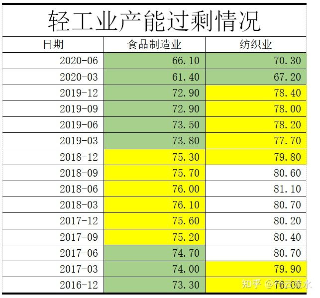

## 经济发展之内循环、外循环

一、什么是"内循环"？

"内循环"不是什么新的理念，而是早就开始使用的一种发展经济的手段，但是最近几年效果正在减弱。

我个人认为从2002年至今，中国的经济发展可以划分为两个阶段：第一阶段是2002年至2009年，外循环+内循环的经济增长模式；第二阶段是2010年至今的内循环为主的经济增长模式。其中第一阶段也可是说是出口+投资的经济增长模式，第二阶段是负债+投资的经济增长模式。无论是外循环、内循环、外循环+内循环的模式都是凯恩斯主义的产物，最终都有潮水褪去的一天。

二、第一阶段的经济发展

一个产品被生产出来后，一般有两种结局，一是售出，二是再加工。在经济学中将"再加工"可以称为投资。售出因为购买的对象不同，再次被细分为消费和出口，其中消费是指本国消费者购买，出口是指外国消费者购买。那么该如何衡量一个国家的经济发展水平呢？------GDP。其实GDP就是指用货币来对消费、投资和净出口进行计量，可以简单理解为GDP=消费+投资+净出口。

一个企业生产出的产品，国内消费者不购买，无法进行再加工，国外消费者也不购买，那这个企业就要出现危机了。将这个道理推广到一个国家也是一样的，一个国家的多个"产品"不能消费、出口或投资，那这个国家就要出现经济危机。因此经济危机大多数时候是因为产能过剩、消费力下降导致的。

中国1996年的时候开始出现了产能过剩，如果任由其发展，必然造成经济危机。解决经济危机的方法至今也只有一招，就是将过剩的产品销售出去。详细区分可以分为国内销售和出口国外，当时政府的办法是在1998年开启房改，提振国内消费需求，同时在2001年加入WTO，增加出口，在这两剂良药的作用下，我国1996年的经济危机成功的得到了延缓。

三、外循环和内循环

外部循环中最重要的环节是出口。

我国将产品出口欧美，再用获得的外汇储备购买美债，让美国股市得到发展，美国股市的上涨，带来了经济的繁荣，美国人有钱了，然后开始购买中国产品，拉动中国经济增长。

内循环最重要的是消费和投资。

中国内循环最重要的投资方式是城镇化，最重要的消费方式是房地产。老百姓将钱存入银行，银行将这些钱通过土地开发、土地交易和房产交易三种方式贷款给房地产市场。因此老百姓通过存款支撑房地产市场，再通过贷款去消化房价的上涨。

在消费方面，出口导致需求增长，企业开始扩招，工人们有工资，然后银行存款增加，房地产市场得到更充分的支撑，房价开始不断上涨，同时城镇化的推进导致需求的进一步增强。因此，可以判断我国的消费是由出口和投资来引领的，并不是像欧美国家由消费引领出口和投资。\
这两个循环开起来很美好，但是终究是"永动机"设想。如果想要两个循环能够不断的运行，就需要美国的股市和中国的房市永远上涨，绝不下跌。但是2008年美国爆发次贷危机，导致外循环熄火。

四、内循环

2008年的时候，美国的次贷危机爆发了两年，欧美国家的经济发展受到阻碍，手里没有钱了，自然要减少购买或者赊购，中国的出口开始减少，最终很多企业因为资金链断裂破产。因此出口对中国GDP的贡献从之前的10%下降到2.7%，在2009年进一步降低为-42.9%，从此我国外汇开始减少。

企业不挣钱了，自然会开始缩减生产规模，进行裁员。记得在2009年的时候香港的电视台还拍摄过广州火车站春节返乡的纪录片，大规模的人员开始返乡，国家如果再不出手，经济问题就会转化为社会问题。

既然外循环不行了，那就只能想办法提升内循环了，因此4万亿的基建来了，中国的经济发展也开始正式步入内循环发展阶段，其中2008年和2009年两年是一个过渡期。在2010年至今，你会发现中国修公路、建高铁、搞农村基础设施、建保障房，在这个过程中一旦经济开始下滑就房款房地产贷款和购房政策，努力挖掘房地产市场潜力，通过投资和消费带动工业需求，最终盘活了中国的经济。

但是通过政府为主，银行为辅，企业借款的方式大规模开启基建的方式提振内循环，将会导致3个知名的缺点。

五、我国内循环引发的三个主要问题

问题1：基建是有周期的，大规模的刺激导致企业不计后果的加杠杆进行生产扩能，最终出现更大规模的产能过剩。

例如：进行高铁线路建设需要购买大量的钢材，这样消耗了当前过剩的钢材，并且产生了更大的钢材需求，但是高铁线路修完后呢？更大规模的产能过剩出现了，再修一条，继续推高产能过剩？即使这样，你要明白，高铁总有修完的一天，并且你修建的高铁如果不能盈利，会对国家的财政造成极大的负担（这就是为什么国家批准高铁公司上市）。这样就开始进入恶性循环，最终这个气球会有兜不住的一天，在违背所有人的期望下"嘭"的炸开（日本的泡沫破碎、美国的次贷危机）。

问题2：所有的企业都害怕自己错过大放水，拼命的加杠杆，造成企业债台高筑。

这个问题中说的企业，狭义指城建，广义指所有房地产相关企业。

企业的钱从哪里来，当然是银行提供的，银行提供的贷款可不是白用的。正所谓欠债还钱天经地义，借的钱总是要还的，可是我国很多基建不能产生收益啊，一个小县城负债7个亿就不提了。北京的高速、地铁等很多项目都是赔钱的，更何况其它二三四五线城市的基建。城建没钱了，怎么办呢？一般是有三种办法，第一继续加大杠杆发行衍生品种（本系列的文章不讨论此方法）；第二借更多的钱，这就像吸毒，停不下来；第三直接搞破，说我破产了，钱不还了（政府信用破灭，会引发更加严重的危机）。城建只能越借越多，最后多到利息都还不上了，然后其它提供原材料的企业因为无法收款，导致资金链断裂，开始破产、裁员，情况又向糟糕的方向发展了。中国的企业债务有多少呢？这个没有明确的答案，人大在2015年的时候做过一次调查研究，最后得出的结论是98%发债企业的利润根本无法偿还债务利息，在中国买债券，你是在赌博。

问题3：实体经济受到致命打击，经济开始脱离实际，向虚拟化发展。

这个问题大家应该很清楚了，制造业产能过剩，利润大幅下滑，房地产业高歌猛进，银行越来越不愿意将钱借给制造业，特别喜欢将钱借给"房"，这样房地产业进一步繁荣，制造业被扼杀。所有人都在想着怎么买房，如何将钱弄到房地产业中。这就造成了更加严重的产能过剩、负债高企、脱实就虚，内循环是一剂可行的药方，但副作用很可怕。因此2018年国家提出供给侧改革，已经是到了不改不行的阶段，不改就要出现社会动荡了。

后面还有一章，谈谈目前中国经济的情况。

六、当前的的经济情况

目前中国的经济情况是：外需不振、内需萎靡、投资下滑。

目前中国经济面临的三个问题出现时，可以通过外循环+内循环或者内循环的方式来平滑或者过渡吗？带动经济开始新的增长。

先说答案：恐怕不行。

接下来详细分析一下目前中国经济的状况。首先中国的产能过剩到底严重到什么程度，为什么我们没有直观的感受到物价下滑反而感觉物价在上涨呢？

翻一翻统计的数据可以知道，从2016年12月至2020年6月，中国重化工业就不存在不过剩的行业。既然原材料过剩这么多，那么跟我们生活积极相关的行业又怎么样呢？从图1-1中可以看出也是严重过剩。

图1-1 轻工业产能过剩情况

产品过剩了怎么办？前文我们已经给出了解决方案。无非是消费、投资和出口（不知道看到这里，你是不是能明白为什么一带一路了）。但是本节开篇就说了目前中国的经济情况是外需不振、内需萎靡、投资下滑。

现在的经济是什么情况呢？外需萎靡，内需不振，投资下滑。

七、出口、消费、投资

出口对应的是外贸，消费对应的是内需，投资对应基建。

首先我们分析一下出口。

从2008年的全球金融危机开始，这几年国际上就动荡不断，美国刚稳定了，欧洲债务危机又开始了，好不容易发达的国家消停了，结果新兴市场开始作妖了，在2017年终于可以出口气了，结果中国要顶不住了。美国衰退、川普上台后的神操作，导致我国从2009年至今出口都很低迷，国家眼看外循环不行，开始不断的强调提振内需。可是回头一看，差点没吓死，房地产业这个脱缰的野马差点将整个中国带入万丈深渊。

其次我们分析一下投资。

收到投资就不得不讲基建、城镇化。2009年之后，我们开启了大搞基建的内循环拉动经济，城镇化的进程也进一步加快，每个人都长出了一口气，中国的经济危机过去了，经济又开始突飞猛进。可是就在大家都在欢庆的时候，却忘了内循环的三大问题

从统计局公布的数据，我们可以看出，全社会固定资产投资的70%以上是制造业投资、基建投资和房地产投资，因此这三个投资能够增长，中国的经济才可以平稳健康的发展。

2008年就面临产品过剩的经济危机，国家4万亿的放水，也只是掩盖了问题，造就了虚假的繁荣，从2001年开始，制造业投资增速开始转向，从30%开始逐渐降低到2019年的3.1%，从数据可以看出，制造业投资对经济的增长，作用越来越小了。

基建就不用多说了，相信大家都已经经过城投债的普及了，目前基建对经济的拉动作用也越来越小了。既然制造业、基建都不行了，那我们就搞房地产吧，继续推动炒房来带动经济增长。目前中国的城镇化已经快要结束，此外我国的抚养比（老龄化问题）开始快速增长，现在房屋价格已经是富人的游戏了，跟普通消费者关系不大了，并且从2019年开始我国房地产投资增速也突破10%，加上城镇化的减缓，接下来房地产对经济的增长的作用，也将越来越小。

在上述三种困境前，国家提出了新基建希望能够发现新的经济增长引擎。但是新基建的放水规模远大于08年，但是其规模体量太小了。新能源、医药和尖端科技的规模体量都远超制造业、基建和房地产，但是这三个行业不是短时间可以开启的，需要经年累月的研发和积累，目前我国还有太多的路要走，可以说这三个也是远水解不了近渴。

八、消费可以化解目前中国的经济困境吗？

有经济学家提出：欧美国家的消费开始转移到自己国家内，那么我国可以通过增加本国国民的消费来拉动经济增长。说起来容易，做起来千难万难。

前文讲过，我国的消费是被动的，不像欧美国家是主动的，所以我们拉动消费需要出口和投资，这样就进入了一个死循环。

其实从2015年开始我们的人均实际可支配收入就长时间低于人均实际GDP增长率。换句话说，就是工资在降低，失业人员增加，全社会可供消费的工资总量增速加速下滑（这里如果再考虑贫富差距，结果会更可怕），但是我国的房价和房租要么横盘，要么增长，进一步挤压消费。总的来说，就是我国消费萎靡，无法消耗过剩产能。

九、总结

大家都知道我国大量放水，但是我国的CPI为什么没有大幅增长？因为统计局将房子移出统计范围了。因为我国有200多万亿的超发货币（绝对的世界之最，即使美国的无线QE也没有超过中国）被圈在房地产市场里面，甚至有人将房地产称为人民币的锚。正是因为房地产留住了大量的钱，所以中国没有中产，社会才能保持稳定。从这个角度说政府最希望的是房地产横盘，所以房地产下跌到一定程度就放点水滋润一下房地产让其暴涨一波。这种方式也早就了房地产神话，让所有的人都相信中国的房子不会下跌，大家会想尽一切办法，加杠杆将资金投入房地产，这样投资和消费会进一步萎缩。

泡沫终有破灭的时候，到时我们面临的不但是经济增长的停滞，还有巨量的货币涌向市场导致的通货膨胀，从而导致中国的经济出现滞胀。

