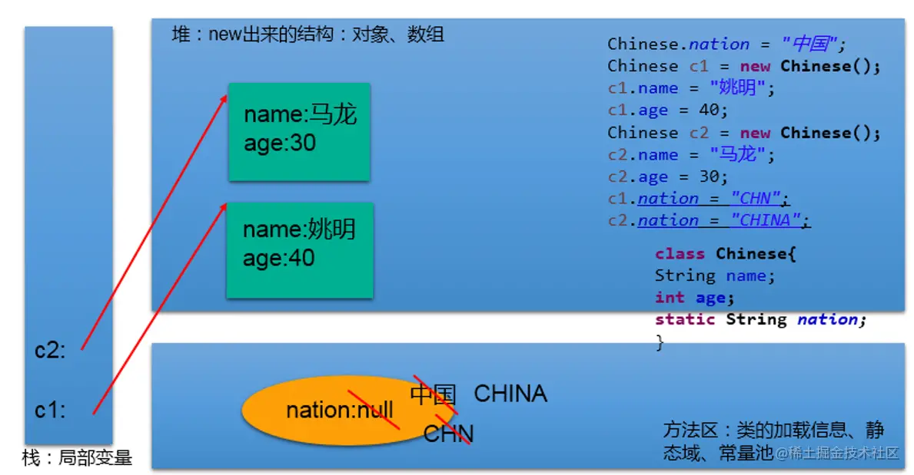

# 一、java基础

java 语言的特点：**跨平台性**：**一次编译,到处运行write once,run anywhere**。java程序是运行在jvm中的，不能操作体统有着不同平台的jvm.

jdk 包含了jre+开发工具集

jre 包含了jvm +javaSE标准类库


API：Application Programming Interface,应用程序编程接口。

## 1.1、基本语法

应用程序 = 算法 + 数据结构


## 1.2、数组

> 数组的理解

数组Array,是多个相同类型数据按一定顺序排列的集合。并使用一个名字命名，通过编号的方式对这些数据进行统一管理

> 数组特点

- 数组是有序排列的
- 数组属于引用数据类型的变量，数组的元素可以是基本数据类型，也可以是引用数据类型
- 创建数组对象会在内存中开辟一整块连续的内存空间
- 数组长度一旦确定，就不能修改

> 数组的分类

- 按照维数：一维数组、二维数组……
- 按照数组元素类型：基本数据类型元素的数组、引用数据类型的数组

> 数据结构

1、数据与数据之间的逻辑关系：集合、一对一、一对多（二叉树）、多对多（社交网络）

2、数据的存储结构：线性表（比如：数组）、链表、栈、队列、树形结构：二叉树

### 1.2.1一维数组

**一维数组的声明和初始化**

```java
int num;//声明
num = 10;//初始化
int id = 1001;//声明 + 初始化		
int[] ids;//声明
//1.1 静态初始化:数组的初始化和数组元素的赋值操作同时进行
ids = new int[]{1001,1002,1003,1004};
//1.2动态初始化:数组的初始化和数组元素的赋值操作分开进行
String[] names = new String[5];
int[] arr4 = {1,2,3,4,5};//类型推断

//错误方式
//int[] arr1 = new int[];
//int[5] arr2 = new int[5];
//int[] arr3 = new int[3]{1,2,3};
```

**一维数组元素的引用**

通过角标的方式调用

```java
//数组的角标（或索引从0开始的，到数组的长度-1结束。
names[0] = "王铭";
names[1] = "王赫";
names[2] = "张学良";
names[3] = "孙居龙";
names[4] = "王宏志";//charAt(0)
```

**数组的属性：length**

```java
System.out.println(names.length);//5
System.out.println(ids.length);
```

> 说明： 数组一旦初始化，其长度就是确定的。arr.length 数组长度一旦确定，就不可修改

**一维数组遍历**

```java
for(int i = 0;i < names.length;i++){
	System.out.println(names[i]);
}
```

**一维数组元素默认初始化值**

- 数组元素是整型：0
- 数组元素是浮点型：0.0
- 数组元素是char型：0或'\u0000'，而非'0'
- 数组元素是boolean型：false
- 数组元素是引用数据类型：null

**一维数组的内存结构**


### 1.2.2、二维数组

数组属于引用数据类型 数组的元素也可以是引用数据类型 一个一维数组A的元素如果还是一个一维数组类型的，则，此数组A称为二维数组。

**二维数组的声明和初始化**

```java
int[] arr = new int[]{1,2,3};//一维数组
//静态初始化
int[][] arr1 = new int[][]{{1,2,3},{4,5},{6,7,8}};
//动态初始化1
String[][] arr2 = new String[3][2];
//动态初始化2
String[][] arr3 = new String[3][];
//也是正确的写法：
int[] arr4[] = new int[][]{{1,2,3},{4,5,9,10},{6,7,8}};
int[] arr5[] = {{1,2,3},{4,5},{6,7,8}};//类型推断

//错误方式
//String[][] arr4 = new String[][4];
//String[4][3] arr5 = new String[][];
//int[][] arr6 = new int[4][3]{{1,2,3},{4,5},{6,7,8}};
```

**调用二维数组元素**

```java
//参数说明：0：第几个元素，1：该元素下标
System.out.println(arr1[0][1]);//2
System.out.println(arr2[1][1]);//null
		
arr3[1] = new String[4];
System.out.println(arr3[1][0]);//null
System.out.println(arr3[0]);//null
```

**遍历二维数组**

```java
for(int i = 0;i < arr4.length;i++){
			
	for(int j = 0;j < arr4[i].length;j++){
		System.out.print(arr4[i][j] + "  ");
	}
	System.out.println();
}
```

**二维数组元素的默认初始化值**

```java
 * 	规定：二维数组分为外层数组的元素，内层数组的元素
 * 		int[][] arr = new int[4][3];
 * 		外层元素：arr[0],arr[1]等
 * 		内层元素：arr[0][0],arr[1][2]等
 * 
 *   ⑤ 数组元素的默认初始化值 
 *   针对于初始化方式一：比如：int[][] arr = new int[4][3];
 *      外层元素的初始化值为：地址值
 *      内层元素的初始化值为：与一维数组初始化情况相同
 *      
 *   针对于初始化方式二：比如：int[][] arr = new int[4][];
 *   	外层元素的初始化值为：null
 *      内层元素的初始化值为：不能调用，否则报错。
```

**二维数组内存结构**

 

### 1.2.3、数组的常见算法

1、数组的创建于元素的赋值

杨辉三角（二维数组）、回形数（二维数组）、6个数，1-30之间随机生成且不重复。

> 杨辉三角

```java
// 1.新建二位数组，动态初始化
int[][] yangHui = new int[10][];
// 2.为二维数组赋值
for (int i = 0; i < yangHui.length; i++) {
    yangHui[i] = new int[i + 1];
    // 2.1为首末元素赋值
    yangHui[i][0] = yangHui[i][i] = 1;
    // 2.2为其余元素赋值
    for (int j = 1; j < yangHui[i].length - 1; j++) {//
        yangHui[i][j] = yangHui[i - 1][j - 1] + yangHui[i - 1][j];
    }

}
// 3.打印输出二维数组
for (int i = 0; i < yangHui.length; i++) {
    for (int j = 1; j < yangHui[i].length; j++) {// 第0个位置没有元素
        System.out.print(yangHui[i][j] + " ");
    }
    System.out.println();
}
```

2、对于数值型的数组

最大值、最小值、总和、平均数等

```java
// 1.找到数组中的最大值
int maxArr = arr[0];
for (int i = 0; i < arr.length; i++) {
    if (maxArr < arr[i]) {
        maxArr = arr[i];
    }
}
System.out.println("数组中的最大值为：" + maxArr);

// 2.找到数组中的最小值

int minArr = arr[0];
for (int i = 0; i < arr.length; i++) {
    if (minArr > arr[i]) {
        minArr = arr[i];
    }
}
System.out.println("数组中的最小值为：" + minArr);

// 3.找到数组中的平均数
int num = 0;
for (int i = 0; i < arr.length; i++) {
    num += arr[i];
}
System.out.println("数组的平均数为：" + (num / arr.length));

// 4.求总和
int num1 = 0;
for (int i = 0; i < arr.length; i++) {
    num1 += arr[i];
}
System.out.println("数组的总和为：" + num1);
```

3、数组的赋值与复制

```java
		String[] str = {"aa","bb","cc"};
        // 1.数组的赋值
        String[] str1 = new String[5];
        str1 = str;
        str1[2] = "AA";
        for (int i = 0; i < str1.length; i++) {
            System.out.print(str[i] + " ");//aa bb AA
        }
```

**赋值**

将array1保存的数组的地址值赋给了array2，使得array1和array2共同指向堆空间中的同一个数组实体。

 

**复制**

```java
// 1.1数组的复制
for (int i = 0; i < str1.length; i++) {
    str1[i] = str[i];
    System.out.print(str1[i] + " ");
}
```

我们通过new的方式，给array2在堆空间中新开辟了数组的空间。将array1数组中的元素值一个一个的赋值到array2数组中。

 

**4、数组元素的反转**

```java
//方法一：
for(int i = 0;i < arr.length / 2;i++){
    String temp = arr[i];
    arr[i] = arr[arr.length - i -1];
    arr[arr.length - i -1] = temp;
}

//方法二：
for(int i = 0,j = arr.length - 1;i < j;i++,j--){
    String temp = arr[i];
    arr[i] = arr[j];
    arr[j] = temp;
}
```

**5、数组中指定元素的查找：**

**线性查找**

实现思路：通过遍历的方式，一个一个的数据进行比较、查找。 适用性：具有普遍适应性

**二分查找**

实现思路：每次比较中间值，折半的方式检索。 适用性：（前提：数组必须有序）

### 1.2.4、排序算法

> 十大排序算法

- 选择排序：
  - 直接选择排序、堆排序
- 交换排序：
  - 冒泡排序、快速排序
- 插入排序：
  - 直接插入排序、折半插入排序、希尔排序
- 归并排序
- 桶排序
- 基数排序

理解：

 1）衡量排序算法的优劣：

 时间复杂度、空间复杂度、稳定性

2）排序的分类：内部排序 与 外部排序（需要借助磁盘）

3）不同排序算法的时间复杂度

 

> 冒泡排序的实现
>
> **需经过n-1轮排序**


```java
        int[] arr = new int[] { 21, 43, 64, 76, 878, 432, 21 };
        for (int i = 0; i < arr.length-1; i++) {
            for (int j = 0; j < arr.length - i -1; j++) {
                if (arr[j] > arr[j + 1]) {//对比前后值大小，满足条件后交换位置
                    int temp = arr[j];
                    arr[j] = arr[j + 1];
                    arr[j + 1] = temp;
                }
            }
        }
```


> 选择排序
>
> 每一次从待排序的数据元素中选出最小的一个元素，存放在序列的起始位置，然后再从剩余未排序元素中寻找到最小元素，然后放到已排序序列的末尾，以此类推
>
> **特点：**在排序中每一轮比较会把最小的数移到最前，所以相互比较的次数每一轮都会比前一轮少一次。


### 1.2.5、数据结构


### 1.2.6、Arrays工具类的使用

> ① 定义在java.util包下。 ② Arrays:提供了很多操作数组的方法。

> 使用

```java
int arr1[] = new int[] { 21, 43, 542, 432, 4, 2, 5, 1 };
int arr2[] = new int[] { 32, 43, 4, 1, 4, 76, 54, 68, 4 };

// 1.Arrays.equals(arr1, arr2):判断数组是否相等
System.out.println(Arrays.equals(arr1, arr2));
// 2.Arrays.toString(arr1):输出数组信息
System.out.println(Arrays.toString(arr1));

// 3.Arrays.fill(arr1, 2):将指定值填充到数组中
Arrays.fill(arr1, 2);
System.out.println(Arrays.toString(arr1));
// 4.Arrays.sort(arr2):对数组进行排序
Arrays.sort(arr2);
System.out.println(Arrays.toString(arr2));
// 5.Arrays.binarySearch(arr2, 1):堆排序好的数组用二分法检索指定值
int index = Arrays.binarySearch(arr2, 1);
System.out.println(index);
```

### 1.2.7、数组常见异常

**1、数组角标越界异常：ArrayIndexOutOfBoundsException**

**2、空指针异常：NullPointerException**


## 1.3、面向对象三大特征

#### 1.3.1、封装

我们程序设计追求“高内聚，低耦合”

- 高内聚：类的内部数据操作细节自己完成，不允许外部干涉
- 低耦合：仅对外暴露少量的方法用于使用。

**隐藏对象内部的复杂性，只对外公开简单的接口。**便于外界调用，从而提高系统的可扩展性、可维护性。通俗的说，把该隐藏的隐藏起来，该暴露的暴露岀来。这就是封装性的设计思想。

> **封装性思想具体代码的体现**
>
> 1、将类的属性xxx私化(private),同时，提供公共的(public)方法来获取(getXxx)和设置(setXxx)此属性的值

```java
//private属性私有化
private double radius;
public void setRadius(double radius){
	this.radius = radius;
}
public double getRadius(){
	return radius;
}
```

> 2、不对外暴露的私有的方法
>
> 3、单例模式（将构造器私有化）
>
> 4、如果不希望类在包外被调用，可以将类设置为缺省的。

**Java规定的四种权限修饰符**

通过对不同的方法属性设置不同的权限修饰符来达到对类进行封装的目的。

- 权限从小到大顺序为：private < 缺省 < protected < public
- 具体的修饰范围：

| 修饰符    | 类内部 | 同一个包 | 不同包的子类 | 同一个工程 |
| :-------- | ------ | -------- | ------------ | :--------- |
| private   | Yes    |          |              |            |
| （缺省）  | Yes    | Yes      |              |            |
| protected | Yes    | Yes      | Yes          |            |
| public    | Yes    | Yes      | Yes          | Yes        |

 

**权限修饰符可用来修饰的结构说明**：

- 4种权限都可以用来修饰**类的内部结构**：属性、方法、构造器、内部类
- **修饰类**，只能使用：缺省、public

#### 1.3.2、继承

> 引入继承的好处：

- 减少了代码的冗余，提高了代码的复用性
- 便于功能的扩展
- 为之后多态性的使用，提供了前提

 

> 继承性的格式

```java
class A extends B{}
 *    A:子类、派生类、subclass
 *    B:父类、超类、基类、superclass
```

判断是否要进行继承：A is a B,若成立，则B继承A

> 子类继承父类后有哪些不同

- 子类A继承父类B以后，子类A中就获取了父类B中声明的所有的属性和方法。特别的，父类中声明为private的属性或方法，子类继承父类以后，仍然认为获取了父类中私的结构。只因为封装性的影响，使得子类不能直接调用父类的结构而已。

- 子类继承父类以后，还可以声明自己特有的属性或方法：实现功能的拓展。子类和父类的关系，不同于子集和集合的关系。

> 继承性说明

1. 一个类可以被多个子类继承。
2. Java中类的单继承性：一个类只能有一个父类
3. 子父类是相对的概念。
4. 子类直接继承的父类，称为：直接父类。间接继承的父类称为：间接父类
5. 子类继承父类以后，就获取了直接父类以及所间接父类中声明的属性和方法

 

**Object类**

是Java中所有类的父类，类似于二叉树中的根节点，定义了一些通用的方法。

1. 如果我们没显式的声明一个类的父类的话，则此类继承于java.lang.Object类
2. 所的java类（除java.lang.Object类之外都直接或间接的继承于java.lang.Object类
3. 意味着，所的java类具有java.lang.Object类声明的功能。
4. java.lang.Object类中定义的一些方法

 

> java.lang.Object

1. Object类是所Java类的根父类
2. 如果在类的声明中未使用extends关键字指明其父类，则默认父类为java.lang.Object类
3. Object类中的功能(属性、方法)就具通用性。

- 属性：无

- 方法：equals() / toString() / getClass() /hashCode() / clone() / finalize()

  wait() 、 notify()、notifyAll()

1. Object类只声明了一个空参的构造器
2. 数组也作为 Object类的子类出现，可以调用 Object类中声明的方法

> equals()

- 是一个方法，而非运算符
- 只能适用于引用数据类型

```java
public boolean equals(Object obj) {
	        return (this == obj);
	  }
```

**使用说明**

Object类中定义的equals()和==的作用是相同的：比较两个对象的地址值是否相同.即两个引用是否指向同一个对象实体

像==String、Date、File、包装类==等都重写了Object类中的equals()方法。==重写==以后，比较的不是两个引用的地址是否相同，而是==比较两个对象的"实体内容"是否相同==。

通常情况下，我们自定义的类如果使用equals()的话，也通常是比较两个对象的"实体内容"是否相同。那么，我们就需要对Object类中的equals()进行重写.

重写的原则：比较两个对象的实体内容是否相同.

**== ：运算符**

1. 可以使用在基本数据类型变量和引用数据类型变量中

2. 如果比较的是基本数据类型变量：

   比较两个变量保存的数据是否相等。（不一定类型要相同）

3. 如果比较的是引用数据类型变量：

   比较两个对象的地址值是否相同,即两个引用是否指向同一个对象实体

> toString()方法

当我们输出一个对象的引用时，实际上就是调用当前对象的toString()方法

Object类中toString()的定义：

```java
public String toString() {
        return getClass().getName() + "@" + Integer.toHexString(hashCode());
}
```

像String、Date、File、包装类等都重写了Object类中的toString()方法。使得在调用对象的toString()时，返回"实体内容"信息。

自定义类也可以重写toString()方法，当调用此方法时，返回对象的"实体内容"

```java
	//自动实现
	@Override
	public String toString() {
		return "Customer [name=" + name + ", age=" + age + "]";
	}
```

> 子类对象实例化的全过程

**从结果上看：继承性**

子类继承父类以后，就获取了父类中声明的属性或方法。 创建子类的对象，在堆空间中，就会加载所父类中声明的属性。

**从过程上看：**

当我们通过子类的构造器创建子类对象时，我们一定会直接或间接的调用其父类的构造器，进而调用父类的父类的构造器，...直到调用了java.lang.Object类中空参的构造器为止。正因为加载过所的父类的结构，所以才可以看到内存中父类中的结构，子类对象才可以考虑进行调用。

 

**强调说明：**

虽然创建子类对象时，调用了父类的构造器，但是自始至终就创建过一个对象，即为new的子类对象。

 

#### 1.3.3、多态

> 多态性的理解

可以理解为一个事物的多种形态。比如数据库的连接方式，我们定义好了数据库的连接，也规定了连接时的步骤，但是我们并不知道用户会采用什么数据库，在没有多态以前我们只能针对不同的数据库写不同的连接方法，而有了多态以后我们只需要定义好数据库的类并书写好连接方法，让所有的数据库继承数据库类并重写数据库连接方法。

这样我们在调用的时候只需要通过声明数据库类并指向数据库的子类的方式，**（即数据库类的引用指向继承了数据库类的具体实现类的对象）**就可以进行数据库连接。而不是需要针对不同的数据库书写不同的连接方式。

> 何为多态

对象的多态性：父类的引用指向子类的对象（或子类的对象赋给父类的引用）

编译时和运行时类型不一致，产生了多态

```java
Person p = new Man();
Object obj = new Date();
```

> 多态性的使用

有了对象的多态性以后，我们在编译期，只能调用父类中声明的方法，但在运行期，我们实际执行的是子类重写父类的方法。

总结：编译，看左边；运行，看右边。

对象的多态：在Java中，子类的对象可以替代父类的对象使用

- 一个变量只能有一种确定的数据类型
- 一个引用类型变量可能指向（引用）多种不同类型的对象

> ==多态性的使用前提==

**① 类的继承关系 **

**② 方法的重写**

> 多态应用举例

```java
举例一：
	public void func(Animal animal){//Animal animal = new Dog();
		animal.eat();
		animal.shout();
	}
举例二：
public void method(Object obj){
		
	}
举例三：
class Driver{
	
	public void doData(Connection conn){//conn = new MySQlConnection(); / conn = new OracleConnection();
		//规范的步骤去操作数据
//		conn.method1();
//		conn.method2();
//		conn.method3();
		
	}
	
}
```

> 多态性使用注意点

- 对象的多态性，只适用于方法，不适用于属性（编译和运行都看左边）
- 一个引用类型变量如果声明为父类的类型，但实际引用的是子类对象，那么该变量就==不能==再访问子类中添加的属性和方法

```java
public class User {
    private int id;
    private String username;
    private String date;
    private String sex;
    private String address;

    public void testUser(){
        System.out.println("User……");
    }
}
```

```java
public class Man extends User{

    public void manTest(){
        System.out.println("man……");
    }

    public static void main(String[] args) {
        Man man = new Man();
        man.testUser();
        man.manTest();

        //一个引用类型变量如果声明为父类的类型，但实际引用的是子类对象，那么该变量就==不能==再访问子类中添加的属性和方法
        User man2 = new Man();
        man2.testUser();
    }
}
```

> 多态使用总结

- 多态的作用：提高了代码的通用性，常称作接口重用

- 使用前提：①需要存在继承或者实现关系 ②有方法的重写

- 成员方法：
  - 编译时：要查看引用变量所声明的类中是否有所调用的方法
  - 运行时：调用实际new的对象所属的类中的重写方法

- 成员变量：不具备多态性，只看引用变量所声明的类

> 关于向上转型与向下转型

向上转型：多态

**为什么使用向下转型**

有了对象的多态性以后，内存中实际上是加载了子类特有的属性和方法的，但是由于变量声明为父类类型，导致编译时，只能调用父类中声明的属性和方法。子类特有的属性和方法不能调用。如何才能调用子类特的属性和方法？使用向下转型。

**如何实现：**

```java
//使用强制类型转换符：()
Person p = new Man();

Man m1=（Man）p2；//向下转型
```

**使用时的注意点：**

① 使用强转时，可能出现ClassCastException的异常。

② 为了避免在向下转型时出现ClassCastException的异常，我们在向下转型之前，先进行instanceof的判断，一旦返回true，就进行向下转型。如果返回false，不进行向下转型。

③ 只有对象A是B的子类实例化对象或者在下层的子类，才能向下转型

**instanceof的使用**

① a instanceof A:==判断对象a==是否是==类A的实例==。如果是，返回true；如果不是，返回false。

② 如果 a instanceof A返回true,则 a instanceof B也返回true.其中，类B是类A的父类。

③ 要求a所属的类与类A必须是子类和父类的关系，否则编译错误。

```java
        Man man = new Man();

        System.out.println(man instanceof Man);//true
        System.out.println(man instanceof User);//true
//说明User是Man的父类
```


## 1.4、异常处理

### 1.4.1、异常的定义

在Java语言中，将程序执行中发生的不正常情况称为“异常”。（开发过程中的语法错误和逻辑错误不是异常）

> 异常的体系结构

`Error`： Java虚拟机无法解决的严重问题。如：JVM系统内部错误、资源耗尽等严重情况。比如：堆栈溢出 `StackOverflowError` 和OOM。一般不编写针对性的代码进行处理。

`Exception`：其它因编程错误或偶然的外在因素导致的一般性问题，可以使用针对性的代码进行处理。如：

- 空指针访问
- 试图读取不存在的文件
- 网络连接中断
- 数组角标越界

```java
异常的体系结构
 * java.lang.Throwable
 * 		|-----java.lang.Error:一般不编写针对性的代码进行处理。
 * 		|-----java.lang.Exception:可以进行异常的处理
 * 			|------编译时异常(checked)不会生成字节码文件
 * 					|-----IOException
 * 						|-----FileNotFoundException
 * 					|-----ClassNotFoundException
 * 			|------运行时异常(unchecked,RuntimeException)
 * 					|-----NullPointerException//空指针异常
 * 					|-----ArrayIndexOutOfBoundsException//数组角标越界
 * 					|-----ClassCastException//类型转化异常
 * 					|-----NumberFormatException//编码格式异常
 * 					|-----InputMismatchException//输入不匹配
 * 					|-----ArithmeticException//算术异常
```

**java中异常类的继承关系**

 

> 按照异常发生的时间可以分成两类

- 编译时异常：执行 `javac.exe` 命令时，可能出现的异常：

  指编译器要求必须处置的异常。即程序在运行时由于外界因素造成的一般性异常。编译器要求Java程序必须捕获或声明所有编译时异常对于这类异常，如果程序不处理，可能会带来意想不到的结果。

- 运行时异常：执行 `java.exe` 命令时，出现的异常：

  指编译器不要求强制处置的异常。一般是指编程时的逻辑错误，是程序员应该积极避免其出现的异常。 `java. lang. Runtime Exception` 类及它的子类都是运行时异常。对于这类异常，可以不作处理，因为这类异常很普遍，若全处理可能会对程序的可读性和运行效率产生影响。

 

> 常见异常类型

```java
//******************以下是运行时异常***************************
//ArithmeticException
@Test
public void test6(){
    int a = 10;
    int b = 0;
    System.out.println(a / b);
}

//InputMismatchException
@Test
public void test5(){
    Scanner scanner = new Scanner(System.in);
    int score = scanner.nextInt();
    System.out.println(score);

    scanner.close();
}

//NumberFormatException
@Test
public void test4(){

    String str = "123";
    str = "abc";
    int num = Integer.parseInt(str);	
}

//ClassCastException
@Test
public void test3(){
    Object obj = new Date();
    String str = (String)obj;
}

//IndexOutOfBoundsException
@Test
public void test2(){
    //ArrayIndexOutOfBoundsException
    //		int[] arr = new int[10];
    //		System.out.println(arr[10]);
    //StringIndexOutOfBoundsException
    String str = "abc";
    System.out.println(str.charAt(3));
}

//NullPointerException
@Test
public void test1(){		
    //		int[] arr = null;
    //		System.out.println(arr[3]);

    String str = "abc";
    str = null;
    System.out.println(str.charAt(0));

}

//******************以下是编译时异常***************************
@Test
public void test7(){
    //		File file = new File("hello.txt");
    //		FileInputStream fis = new FileInputStream(file);
    //		
    //		int data = fis.read();
    //		while(data != -1){
    //			System.out.print((char)data);
    //			data = fis.read();
    //		}
    //		
    //		fis.close();

}
```

### 1.4.2、异常的处理

**过程一："抛"**程序在正常执行的过程中，一旦出现异常，就会在异常代码处生成一个对应异常类的对象。并将此对象抛出。一旦抛出对象以后，其后的代码就不再执行。

关于异常对象的产生：

- 系统自动生成的异常对象
- 手动的生成一个异常对象，并抛出（`throw`）

**过程二："抓"**可以理解为异常的处理方式：① `try-catch-finally` ② `throws`

> 2.异常处理方式一：try-catch-finally

```java
try{
    //可能出现异常的代码

}catch(异常类型1 变量名1){
    //处理异常的方式1
}catch(异常类型2 变量名2){
    //处理异常的方式2
}catch(异常类型3 变量名3){
    //处理异常的方式3
}
....
    finally{
        //一定会执行的代码
    }
```

**使用说明**

- `finally` 是可选的。

- 使用 `try` 将可能出现异常代码包装起来，在执行过程中，一旦出现异常，就会生成一个对应异常类的对象，根据此对象的类型，去 `catch` 中进行匹配

- 一旦 `try` 中的异常对象匹配到某一个 `catch` 时，就进入 `catch` 中进行异常的处理。一旦处理完成，就跳出当前的 `try-catch` 结构（在没写 `finally` 的情况。继续执行其后的代码）

- `catch`中的异常类型如果没子父类关系，则谁声明在上，谁声明在下无所谓；`catch`中的异常类型如果满足子父类关系，则要求子类一定声明在父类的上面。否则会报错

- 常用的异常对象处理的方式： ① `String getMessage()` ② `printStackTrace()`

- 在`try` 结构中声明的变量，再出了 `try` 结构以后，就不能再被调用

- `try-catch-finally` 结构可以嵌套

**如何看待代码中的编译时异常和运行时异常？**

- 使用 `try-catch-finally` 处理编译时异常，是得程序在编译时就不再报错，但是运行时仍可能报错。相当于我们使用 `try-catch-finally` 将一个编译时可能出现的异常，延迟到运行时出现。

- 开发中，由于运行时异常比较常见，所以我们通常就不针对运行时异常编写 `try-catch-finally` 了。但是针对于编译时异常，一定要考虑异常的处理。

**finally的再说明：**

- `finally` 是可选的

- `finally` 中声明的是一定会被执行的代码。即使catch中又出现异常了，`try` 中包含 `return` 语句，或者`catch`中 `return` 包含语句等情况，`finally` 中的代码也会被执行。

- 像数据库连接、输入输出流、网络编程Socket等资源，JVM是不能自动的回收的，我们需要自己手动的进行资源的释放。此时的资源释放的代码，就需要声明在 `finally` 中。

> 异常处理方式二

`throws + 异常类型` 写在方法的声明处。指明此方法执行时，可能会抛出的异常类型。 一旦当方法体执行时，出现异常，仍会在异常代码处生成一个异常类的对象，此对象满足 `throws` 后异常类型时，就会被抛出。异常代码后续的代码，就不再执行！

> 二者处理方式对比

`try-catch-finally` 真正的将异常给处理掉了。 `throws` 的方式只是将异常抛给了方法的调用者。并没真正将异常处理掉。

> 开发中如何选择两种处理方式

- 如果父类中被重写的方法没 `throws` 方式处理异常，则子类重写的方法也不能使用 `throws`，意味着如果子类重写的方法中异常，必须使用 `try-catch-finally` 方式处理。

- 执行的方法a中，先后又调用了另外的几个方法，这几个方法是递进关系执行的。我们建议这几个方法使用`throws` 的方式进行处理。而执行的方法a可以考虑使用 `try-catch-finally` 方式进行处理。

### 1.4.3、手动抛出异常对象

> 使用说明

在程序执行中，除了自动抛出异常对象的情况之外，我们还可以手动的 `throw` 一个异常类的对象。

> throw和throws的区别

`throw` 和 `throws`区别： `throw` 表示抛出一个异常类的对象，生成异常对象的过程。声明在方法体内。 `throws` 属于异常处理的一种方式，声明在方法的声明处。

```java
class Student{

    private int id;

    public void regist(int id) throws Exception {
        if(id > 0){
            this.id = id;
        }else{
            //手动抛出异常对象
            //			throw new RuntimeException("您输入的数据非法！");
            //			throw new Exception("您输入的数据非法！");
            throw new MyException("不能输入负数");

        }		
    }

    @Override
    public String toString() {
        return "Student [id=" + id + "]";
    }
}
```


### 1.4.4、自定义异常类

> 如何自定义异常类

- 继承于现的异常结构：`RuntimeException 、Exception`
- 提供全局常量：`serialVersionUID`（对类的唯一标识）
- 提供重载的构造器

```java
public class MyException extends Exception{

    static final long serialVersionUID = -7034897193246939L;

    public MyException(){

    }

    public MyException(String msg){
        super(msg);
    }
}
```

## 1.5、JAVA类

### 1.5.1、类和对象

类中主要包括五种结构：属性、方法、构造器、代码块、内部类

> 1、面向对象与面向过程

- 面向过程：强调的是功能行为，以函数为最小单位，考虑怎么做。
- 面向过程：强调具备了功能的对象，以类/对象为最小单位，考虑谁来做。

> 2、类和对象的关系

类：对一类事物的描述，是抽象的，概念上的定义

对象：是实际存在的该类事物的每个个体，因而也称为实例。

`面向对象程序设计的重点是类的设计，设计类就是设计类的成员。
二者的关系：对象，是由类new出来的，派生出来的`

> 3、面向对象思想实现的规则

1. 创建类，设计类的成员
2. 创建类的对象
3. 通过`对象.属性` 或 `对象.方法`调用对象的结构

**补充：**

- 属性 = 成员变量 = field = 域、字段
- 方法 = 成员方法 = 函数 = method
- 创建类的对象 = 类的实例化 = 实例化类

> 4、对象的创建与对象的内存解析

```java
Person p1 = new Person();
Person p2 = new Person();
Person p3 = p1;//没有新创建一个对象，共用一个堆空间中的对象实体。
/*说明：
*如果创建了一个类的多个对象，则每个对象都独立的拥有一套类的属性。（非static的）
*意味着：如果我们修改一个对象的属性a，则不影响另外一个对象属性a的值。
*/
```

**素组对象内存解析**：

 

**对象内存解析**

 

> 5、JVM内存结构

编译完源程序后，生成一个或多个字节码文件，我们使用JVM中类的加载器和解释器，对生成的字节码文件进行解释运行。意味着，需要将字节码文件对应的类加载到内存中，涉及到内存解析。


==虚拟机栈==：即为平时提到的栈结构。【我们将局部变量存储到栈结构中】

==虚拟机堆==：我们将new出来的结构【比如：数组，对象】加载到堆空间

**补充：**

对象的属性【非static的】加载在堆空间

方法区：类的加载信息、常量池、静态域

> 6、匿名对象

我们创建的对象，没有显示的赋给一个变量名，即为匿名对象

**特点：**匿名对象只能调用一次

```java
new Phone().sendEmail();
new Phone().playGame();
        
new Phone().price = 1999;
new Phone().showPrice();//0.0
```

适用场景：

```java
PhoneMall mall = new PhoneMall();

//匿名对象的使用
mall.show(new Phone());
其中，
class PhoneMall{
    public void show(Phone phone){
        phone.sendEmail();
        phone.playGame();
    }
}
```

> 7、万物皆对象

在Java语言范畴中，我们将功功能、结构等封装到类中，通过类的实例化，来调用具体功能的结构。

- Scanner,String等
- 文件：File
- 网络资源：URL

涉及到Java语言与前端HTML,后端数据库交互时，前后端的结构在JAVA层面交互时，都体现为类、对象。

### 1.5.2、类的结构之一：属性

> 1、属性vs局部变量
>
> > 相同点
>
> - 定义变量的格式：数据类型 变量名 = 变量值
> - 先声明，后使用
> - 变量都其对应的作用域
>
> > 不同点：
>
> 1.2.1 在类中声明的位置的不同
>
> - 属性：直接定义在类的一对{}内
> - 局部变量：声明在方法内、方法形参、代码块内、构造器形参、构造器内部的变量。
>
> 1.2.2 关于权限修饰符的不同
>
> - 属性：可以在声明属性时，指明其权限，使用权限修饰符。
>   - 常用的权限修饰符：private、public、缺省、protected --->封装性
>   - 目前，声明属性时，使用缺省就可以。
> - 局部变量：不可以使用权限修饰符。
>
> 1.2.3 默认初始化值的情况：
>
> - **属性**：类的属性，根据其类型，都默认初始化值。
>   - 整型（byte、short、int、long：0）
>   - 浮点型（float、double：0.0）
>   - 字符型（char：0 （或'\u0000'））
>   - 布尔型（boolean：false）
>   - 引用数据类型（类、数组、接口：null）
> - **局部变量**：没默认初始化值。
>   - 意味着，我们在调用局部变量之前，一定要显式赋值。
>   - 特别地：形参在调用时，我们赋值即可。
>
> 1.2.4 在内存中加载的位置：
>
> - 属性：加载到堆空间中 （非static）
> - 局部变量：加载到栈空间

****

> 变量的分类

- 方式一：按照数据类型
  - 基本数据类型
  - 引用数据类型

 

- 方式二：按照在类中声明的位置
  - 成员变量
  - 局部变量

 

### 1.5.3、类的结构之二：方法

定义：描述类应该具有的功能。

> 1、方法举例

**1.1 JDK中的方法：**

- Math类：`sqrt()` `random()` ...

- ```
  Scanner类：`nextXxx()` ...
  
  复制代码
  ```

- ```
  Arrays类：`sort()`    `binarySearch()`    `toString()`     `equals()`   ...
  
  复制代码
  ```

**1.2 自定义的方法：**

```java
 public void eat(){
     System.out.printly("我要吃饭！！！");
 }

 public String getNation(String nation){
     System.out.printly("当前地点为" + nation);
 }

复制代码
```

**1.3 方法的声明：**

```txt
权限修饰符 返回值类型  方法名(形参列表){

方法体

}
```

> 2、方法的说明

- 返回值类型：

**如果方法有返回值**，则必须在方法声明时，指定返回值的类型。同时，方法中，需要使用return关键字来返回指定类型的变量或常量：`return 数据`。

**如果方法没返回值**，则方法声明时，使用void来表示。通常，没返回值的方法中，就不需要使用return。如果使用的话，只能使用 `return;` 表示结束此方法的意思。

- 命名规范
  - 属于标识符，遵循标识符的规则和规范，“见名知意”
  - 方法名应遵循小驼峰命名 `aaaBbbCcc`
  - 方法名最好使用英文单词，不要使用拼音或者缩写
  - 更多规范要求请参考《Java开发手册》

- 形参列表

  - 方法可以声明0个，1个，或多个形参。

    也可以使用可变形参，但可变形参必须放到最后，详细说明请查看本章第五部分。

    格式：`数据类型1 形参1` `数据类型2 形参2` .....

- 方法体

是方法中功能的体现，通过循环分支、条件判断等语句完成复杂的逻辑关系。

方法中可以调用其他方法，同类中可以直接调用，不同类中通过类的实例化对象调用。

> 3、方法的使用

- 同类中的方法可以直接调用当前类的属性或方法，不同类中通过类的实例化对象调用。
- 特殊的：方法A中又调用了自身---递归方法。（自身调用）

> 4、重载

**概念**：在同一个类中，允许存在一个以上的同名方法，只要它们的==参数个数==或者==参数类型==不同即可。

**构成重载实例：**

```java
// 举例一：Arrays类中重载的sort() / binarySearch()；PrintStream中的println()
// 举例二：
// 如下的4个方法构成了重载
public void getSum(int i,int j){
    System.out.println("1");
}

public void getSum(double d1,double d2){
    System.out.println("2");
}

public void getSum(String s ,int i){
    System.out.println("3");
}

public void getSum(int i,String s){
    System.out.println("4");
}
```

**==不==构成重载实例**

```java
// 如下的3个方法不能与上述4个方法构成重载
public int getSum(int i,int j){
    return 0;
}
    
public void getSum(int m,int n){
        
}
    
private void getSum(int i,int j){
    
}
```

**重载方法判断**：

**如何判断是否构成方法重载？**

严格按照定义判断：两同一不同。跟方法的权限修饰符、返回值类型、形参变量名、方法体都没关系！

**如何确定类中某一个方法的调用：**

①方法名 ---> ②参数列表

> 5、可变个数形参方法

JDK 5.0新增的内容

JDK 5.0以前：采用数组形参来定义方法，传入多个同一类型变量

```
public static void test(int a， String[] books);
```

JDK 5.0以后：采用可变个数形参来定义方法，传入多个同一类型变量

```
public static void test(int a， String ... books);
```

可变个数形参的格式：`数据类型 ... 变量名`

当调用可变个数形参的方法时，传入的参数个数可以是：0个，1个,2个，.....

可变个数形参的方法与本类中方法名相同，形参不同的方法之间构成重载

可变个数形参的方法与本类中方法名相同，形参类型也相同的数组之间不构成重载。换句话说，二者不能共存。

可变个数形参在方法的形参中，***必须声明在末尾。***

可变个数形参在方法的形参中***,最多只能声明一个可变形参***。

**举例说明：**

```java
public void show(int i){

}

public void show(String s){
    System.out.println("show(String)");
}

public void show(String ... strs){
    System.out.println("show(String ... strs)");

    for(int i = 0;i < strs.length;i++){
        System.out.println(strs[i]);
    }
}
// 不能与上一个方法同时存在
//  public void show(String[] strs){
//      
//  }
// 调用时：可变形参与数组类似
test.show("hello");
test.show("hello","world");
test.show();

test.show(new String[]{"AA","BB","CC"});
```

> 6、java值传递机制

**针对==方法内==变量的赋值举例**

```java
System.out.println("***********基本数据类型：****************");
int m = 10;
int n = m;

System.out.println("m = " + m + ", n = " + n);

n = 20;

System.out.println("m = " + m + ", n = " + n);

System.out.println("***********引用数据类型：****************");

Order o1 = new Order();
o1.orderId = 1001;

Order o2 = o1;//赋值以后，o1和o2的地址值相同，都指向了堆空间中同一个对象实体。

System.out.println("o1.orderId = " + o1.orderId + ",o2.orderId = " +o2.orderId);

o2.orderId = 1002;

System.out.println("o1.orderId = " + o1.orderId + ",o2.orderId = " +o2.orderId);
```

> 说明：如果变量是基本数据类型，此时赋值的是变量所保存的数据值。 如果变量是引用数据类型，此时赋值的是变量所保存的数据的地址值。

****

**针对于==方法==的参数概念**

形参：***方法定义时***，声明的小括号内的参数 

实参：***方法调用时***，实际传递给形参的数据

****

**Java中参数传递机制：值传递机制**

**规则：**

- 如果参数是***基本数据类型***，此时实参赋给形参的是实参真实存储的数据值。
- 如果参数是***引用数据类型***，此时实参赋给形参的是实参存储数据的地址值。

**推广：**

- 如果变量是基本数据类型，此时赋值的是变量所保存的数据值。
- 如果变量是引用数据类型，此时赋值的是变量所保存的数据的地址值。

****

**内存解析**

- 内存结构：栈（局部变量），==堆【对象、数组、非static成员变量(属性)】==
- 变量：成员变量（类变量，实例变量(不以static修饰)）vs 局部变量（方法体内，方法形参变量，构造器，构造器形参，代码块）

举例一：


举例二： 

 

****

> 7、递归方法

递归方法：一个方法体内调用它自身。

方法递归包含了一种隐式的循环，它会重复执行某段代码，但这种重复执行无须循环控制。 **递归一定要向已知方向递归，否则这种递归就变成了无穷递归，类似于死循环**。

例子：

```java
// 例1：计算1-n之间所自然数的和
public int getSum(int n) {// 3

    if (n == 1) {
        return 1;
    } else {
        return n + getSum(n - 1);
    }

}

// 例2：计算1-n之间所自然数的乘积:n!
public int getSum1(int n) {

    if (n == 1) {
        return 1;
    } else {
        return n * getSum1(n - 1);
    }

}

//例3：已知一个数列：f(0) = 1,f(1) = 4,f(n+2)=2*f(n+1) + f(n),
//其中n是大于0的整数，求f(10)的值。
public int f(int n){
    if(n == 0){
        return 1;
    }else if(n == 1){
        return 4;
    }else{
        //          return f(n + 2) - 2 * f(n + 1);
        return 2*f(n - 1) + f(n - 2);
    }
}

//例4：斐波那契数列

//例5：汉诺塔问题

//例6：快排
```

****

> 8、方法的重写

**什么是方法的重写(override 或 overwrite)？**、

​	子类继承父类以后，可以对父类中同名同参数的方法，进行覆盖操作.

**重写应用**：

重写以后，当创建子类对象以后，通过子类对象调用子父类中的同名同参数的方法时，实际执行的是子类重写父类的方法

**举例：**

```java
// 父类
class Circle{
public double findArea(){}//求面积
}
// 子类
class Cylinder extends Circle{
public double findArea(){}//求表面积
}
**********************************************
// 父类
class Account{
public boolean withdraw(double amt){}
}
// 子类
class CheckAccount extends Account{
public boolean withdraw(double amt){}
}
```

****

**重写规则**

```java
权限修饰符  返回值类型  方法名(形参列表) throws 异常的类型{
    //方法体
}
```

约定俗称：子类中的叫重写的方法，父类中的叫被重写的方法

1. 子类重写的方法的方法名和形参列表与父类被重写的方法的方法名和形参列表相同
2. 子类重写的方法的权限修饰符不小于父类被重写的方法的权限修饰符

**特殊情况**：子类不能重写父类中声明为private权限的方法

- **返回值类型**：
  - 父类被重写的方法的返回值类型是void，则子类重写的方法的返回值类型只能是void
  - 父类被重写的方法的返回值类型是A类型，则子类重写的方法的返回值类型可以是A类或A类的子类
  - 父类被重写的方法的返回值类型是基本数据类型(比如：double)，则子类重写的方法的返回值类型必须是相同的基本数据类型(必须也是double)

**补充：**子类重写的方法抛出的异常类型不大于父类被重写的方法抛出的异常类型

**说明：**子类和父类中的同名同参数的方法要么都声明为非static的（考虑重写），要么都声明为static的（不是重写)。

开发中一般保持子父类一致

****

**区分方法的重写和重载？**

1. 二者的概念：

- 方法的**重写**：**子类继承父类以后**，可以对父类中==同名同参数==的方法，进行覆盖操作.
- 方法的**重载**：**在同一个类中**，允许存在一个以上的同名方法，只要它们的参数个数或者参数类型不同即可。

1. 重载和重写的具体规则：重载：两同一不同，重写
2. 重载：不表现为多态性。 重写：表现为多态性。
3. 从编译和运行的角度看：

- 重载，是指允许存在多个同名方法，而这些方法的参数不同。编译器根据方法不同的参数表，对同名方法的名称做修饰。对于编译器而言，这些同名方法就成了不同的方法。它们的调用地址在编译期就绑定了。Java的重载是可以包括父类和子类的，即子类可以重载父类的同名不同参数的方法。
- 所以对于重载而言，在方法调用之前，编译器就已经确定了所要调用的方法，这称为“早绑定”或“静态绑定”；
- 而对于多态，只等到方法调用的那一刻，解释运行器才会确定所要调用的具体方法，这称为“晚绑定”或“动态绑定”。

****

### 1.5.4、类的结构之三：构造器

> 1、构造器（构造方法）：Constructor

- 构造器的作用：（只要造对象就得用到构造器）
  - 创建对象
  - 初始化对象信息

****

> 2、使用说明

- 如果没显式的定义类的构造器的话，则系统默认提供一个空参的构造器

- 定义构造器的格式：`权限修饰符 类名(形参列表){ }`
- 一个类中定义的***多个构造器***，彼此构成重载
- 一旦我们显式的定义了类的构造器之后，系统就不再提供默认的空参构造器
- 一个类中，***至少会有一个构造器***。

****

> 3、构造器举例

```java
//构造器不等于方法
public Person(){
    System.out.println("Person().....");
}

public Person(String n){
    name = n;

}

public Person(String n,int a){
    name = n;
    age = a;
}
```

- 构造器默认权限和类的权限一致

****

> 4、属性赋值顺序

总结：属性赋值的先后顺序

① 默认初始化

② 显式初始化

③ 构造器中初始化

④ 通过"对象.方法" 或 "对象.属性"的方式，赋值

以上操作的先后顺序：① - ② - ③ - ④

****

> 5、JavaBean的概念

所谓JavaBean，是指符合如下标准的Java类：

- 类是公共的
- 一个***无参***的公共的构造器
- 属性，且对应的get、set方法

****

### 1.5.5、类的结构之四：代码块

代码块（初始化块）

> 1、代码块的作用

初始化类、对象的信息

> 2、分类

静态代码块 vs 非静态代码块

> 3、区别

**静态代码块：**

- 内部可以输出语句
- ==随着类的加载而执行,而且只执行一次==
- ==作用：初始化类的信息==
- 如果一个类中定义了多个静态代码块，则按照声明的先后顺序执行
- 静态代码块的执行要优先于非静态代码块的执行
- 静态代码块内只能调用静态的属性、静态的方法，不能调用非静态的结构

**非静态代码块：**

- 内部可以输出语句
- ==随着对象的创建而执行==
- ==每创建一个对象，就执行一次非静态代码块==
- ==作用：可以在创建对象时，对对象的属性等进行初始化==
- 如果一个类中定义了多个非静态代码块，则按照声明的先后顺序执行
- 非静态代码块内可以调用静态的属性、静态的方法，或非静态的属性、非静态的方法

**注意：**实例化子类对象时，涉及到父类、子类中静态代码块、非静态代码块、构造器的加载顺序：由父及子，静态先行。如下图

 

****

> 属性的赋值顺序

① 默认初始化

② 显式初始化/⑤在代码块中赋值

③ 构造器中初始化

④ 有了对象以后，可以通过"对象.属性"或"对象.方法"的方式，进行赋值

执行的先后顺序：① - ② / ⑤ - ③ - ④

****

### 1.5.6、类的结构之五：内部类

> 1、定义：

Java中允许将一个类A声明在另一个类B中，则类A就是内部类，类B称为外部类。

> 2、分类：

- 成员内部类（静态、非静态）
- 局部内部类（方法内、代码块内、构造器内）

> 3、成员内部类的理解

**一方面，作为外部类的==成员==：**

- 调用外部类的结构
- 可以被static修饰
- 可以被4种不同的权限修饰

**另一方面，作为一个==类==：**

- 类内可以定义属性、方法、构造器等
- 可以被final修饰，表示此类不能被继承。言外之意，不使用final，就可以被继承
- 可以被abstract修饰

****

> 4、成员内部类

**创建成员内部类对象**(静态&非静态)

```java
// 创建静态的Dog内部类的实例(静态的成员内部类):
Person.Dog dog = new Person.Dog();

// 创建非静态的Bird内部类的实例(非静态的成员内部类):
// Person.Bird bird = new Person.Bird();//错误的
Person p = new Person();
Person.Bird bird = p.new Bird();
```

**在成员内部类调用外部类结构**

```java
class Person{
    String name = "小明";
    public void eat(){
    }
    //非静态成员内部类
    class Bird{
        String name = "杜鹃";
        public void display(String name){
            System.out.println(name);//方法的形参
            System.out.println(this.name);//内部类的属性
            System.out.println(Person.this.name);//外部类的属性
            //Person.this.eat();
        }
    }
}
```

**局部内部类的使用**

```java
//返回一个实现了Comparable接口的类的对象
public Comparable getComparable(){

    //创建一个实现了Comparable接口的类:局部内部类
    //方式一：
    //      class MyComparable implements Comparable{
    //
    //          @Override
    //          public int compareTo(Object o) {
    //              return 0;
    //          }
    //          
    //      }
    //      
    //      return new MyComparable();

    //方式二：
    return new Comparable(){

        @Override
        public int compareTo(Object o) {
            return 0;
        }
    };
}
```

**总结：**

成员内部类和局部内部类，在编译以后，都会生成字节码文件。 格式：成员内部类：`外部类$内部类名.class` 局部内部类：`外部类$数字 内部类名.class`

****

## 1.6、Java关键字的使用

### 1、return--跳出

- 使用在方法体中，用于：① 结束方法② 针对于返回值类型的方法，使用"return 数据"方法返回所要的数据。

- return关键字后面不可以声明执行语句。

- 在异常处理中try-catch-finally的结构中，如果try或catch中的结构中写了return，但是finally中的结构仍会执行。

### 2、this--本类的

>**概述：**

this理解为：当前对象 或 当前正在创建的对象，可以调用的结构：***属性、方法；构造器***

> 使用

**2.1 this调用属性、方法：**

- 在类的方法中，我们可以使用"this.属性"或"this.方法"的方式，调用当前对象属性或方法。但是，通常情况下，我们都择省略"this."。特殊情况下，如果***方法的形参和类的属性同名时***，我们必须显式的使用"this.变量"的方式，表明此变量是属性，而非形参。
- 在类的构造器中，我们可以使用"this.属性"或"this.方法"的方式，调用当前正在创建的对象属性或方法。但是，通常情况下，我们都择省略"this."。特殊情况下，如果***构造器的形参和类的属性同名***时，我们必须显式的使用"this.变量"的方式，表明此变量是属性，而非形参。

**2.2 this调用构造器：**

① 我们在类的构造器中，可以显式的使用***"this(形参列表)"***方式，调用本类中指定的其他构造器

② 构造器中不能通过"this(形参列表)"方式调用自己

③ 如果一个类中有n个构造器，则最多有 n - 1构造器中使用了"this(形参列表)"

④ 规定："this(形参列表)"***必须声明在当前构造器的首行***

⑤ **构造器内部，最多只能声明一个"this(形参列表)"**，用来调用其他的构造器

### 3、super--父类的

> 概述

super 关键字可以理解为：父类的，可以用来调用的结构：***属性、方法、构造器***

- 尤其当子父类出现同名成员时，可以用supe表明调用的是父类中的成员
- super的追溯不仅限于直接父类
- super和this的用法相像，this代表本类对象的引用， super代表父类的内存空间的标识

> super使用

**2.1super调用属性、方法：**

与this关键字使用方式相同，只不过调用的是父类的属性

**2.2 在子类的方法或构造器中使用**

通过使用"super.属性"或"super.方法"的方式，显式的调用父类中声明的属性或方法。但是，通常情况下，我们习惯省略"super."

**特殊情况**

- 当子类和父类中定义了同名的属性时，我们要想在子类中调用父类中声明的属性，则必须显式的使用"super.属性"的方式，表明调用的是父类中声明的属性。
- 当子类重写了父类中的方法以后，我们想在子类的方法中调用父类中被重写的方法时，则必须显式的使用"super.方法"的方式，表明调用的是父类中被重写的方法。

**super调用构造器**

我们可以在子类的构造器中显式的使用"super(形参列表)"的方式，调用父类中声明的指定的构造器

"super(形参列表)"的使用，必须声明在子类构造器的首行！

我们在类的构造器中，针对于"this(形参列表)"或"super(形参列表)"只能二选一，不能同时出现

在构造器的首行，没显式的声明"this(形参列表)"或"super(形参列表)"，则默认调用的是父类中空参的构造器：super()

在类的多个构造器中，至少一个类的构造器中使用了"super(形参列表)"，调用父类中的构造器

**this和super区别**

| 区别点     | this                                                   | super                                    |
| ---------- | ------------------------------------------------------ | ---------------------------------------- |
| 访问属性   | 访问本类中的属性，如果本类没有此属性则从父类中继续查找 | 直接访问父类中的属性                     |
| 调用方法   | 访问本类中的方法，如果本类没有此方法则从父类中继续查找 | 直接访问父类中的方法                     |
| 调用构造器 | 调用本类构造器，必须放在构造器的首行                   | 调用父类构造器，必须放在子类构造器的首行 |

### 4、package/import

> package
>
> 概述

1. 为了更好的实现项目中类的管理，提供包的概念
2. 使用package声明类或接口所属的包，声明在源文件的首行
3. 包，属于标识符，遵循标识符的命名规则、规范(xxxyyyzzz)、“见名知意”
4. 每"."一次，就代表一层文件目录

> 包结构应用举例

**MVC设计模式：**

 ==

> ==JDK中主要的包介绍==

- java. lang--包含一些Java语言的核心类，如 String、Math、 integer、 System和Thread，提供常用功能
- java. net--包含执行与网络相关的操作的类和接口
- java.io--包含能提供多种输入/输出功能的类

- java util--包含一些实用工具类，如定义系统特性、接口的集合框架类、使用与日期日历相关的函数。

- java. text--包含了一些java格式化相关的类

- java.sql--包含了java进行JDBC数据库编程的相关类/接口

- java. awt--包含了构成抽象窗口工具集 (abstract window toolkits）的多个类，这些类被用来构建和管理应用程序的图形用户界面GU）。 B/S C/S

> import的使用

在源文件中显式的使用import结构导入指定包下的类、接口

声明在包的声明和类的声明之间

如果需要导入多个结构，则并列写出即可

可以使用"xxx.*"的方式，表示可以导入xxx包下的所结构

如果使用的类或接口是java.lang包下定义的，则可以省略import结构

如果使用的类或接口是本包下定义的，则可以省略import结构

如果在源文件中，使用了不同包下的同名的类，则必须至少一个类需要以全类名的方式显示。

使用"xxx.*"方式表明可以调用xxx包下的所结构。但是如果使用的是xxx子包下的结构，则仍需要显式导入

import static:导入指定类或接口中的静态结构:属性或方法。

### 5、static--静态的

> 概述

static主要用来修饰类的内部结构，如：属性、方法、代码块、内部类

> 使用

>**修饰属性：静态变量（类变量）**

属性是否使用static修饰，可分为：静态属性 vs 非静态属性(实例变量)

- 实例变量：我们创建了类的多个对象，每个对象都独立的拥一套类中的非静态属性。当修改其中一个对象中的非静态属性时，不会导致其他对象中同样的属性值的修改。
- 静态变量：我们创建了类的多个对象，多个对象共享同一个静态变量。当通过某一个对象修改静态变量时，会导致其他对象调用此静态变量时，是修改过了的。

**static修饰属性的其他说明**

- ==静态变量随着类的加载而加载==。可以通过"类.静态变量"的方式进行调用
- 静态变量的加载要早于对象的创建。
- 由于==类只会加载一次==，则静态变量在内存中也只会存在一份：存在方法区的静态域中。

静态属性举例：`System.out;Math.PI`

**静态变量内存解析：**

 

> 修饰方法：静态方法、类方法

- 随着类的加载而加载，可以通过"类.静态方法"的方式进行调用
- 静态方法中，只能调用静态的方法或属性
- 非静态方法中，既可以调用非静态的方法或属性，也可以调用静态的方法或属性

**使用的注意点：**

- 在静态的方法内，不能使用this关键字、super关键字
- 关于静态属性和静态方法的使用，大家都从生命周期的角度去理解。

> 如何判定属性和方法应该使用static关键字

**关于属性：**

- 属性是可以被多个对象所共享的，不会随着对象的不同而不同的。
- 类中的常量也常常声明为static

**关于方法：**

- 操作静态属性的方法，通常设置为static的
- 工具类中的方法，习惯上声明为static的。 比如：Math、Arrays、Collections

**使用举例：**记录创建的圆的个数

```java
class Circle{
	
	private double radius;
	private int id;//自动赋值
	
	public Circle(){
		id = init++;
		total++;
	}
	
	public Circle(double radius){
		this();
//		id = init++;
//		total++;
		this.radius = radius;
		
	}
	
	private static int total;//记录创建的圆的个数
	private static int init = 1001;//static声明的属性被所对象所共享
	
	public double findArea(){
		return 3.14 * radius * radius;
	}

	public double getRadius() {
		return radius;
	}

	public void setRadius(double radius) {
		this.radius = radius;
	}

	public int getId() {
		return id;
	}

	public static int getTotal() {
		return total;
	}

}
```

> 单例模式

#### **设计模式的说明：**

设计模式是在大量的实践中总结和理论化之后优化的代码结构、编程风格、以及解决问题的思考方式

**常用设计模式**--23种经典设计模式**（标黄表示接触过的）**

- 创建型模式，5种：工厂方法模式、抽象工厂模式、==单例模式==【饿汉+懒汉】、建造者模式、原型模式。
- 结构型模式，7种：适配器模式、装饰器模式、==代理模式==【AOP】、外观模式、桥接模式、组合模式、享元模式。
- 行为型模式，11种：策略模式、==模板方法模式==【抽象类,JDBCTemlate】、观察者模式、迭代器模式、责任链模式、命令模式、备忘录模式、状态模式、访问者模式、中介者模式、解释器模式。

**单例模式：**

采取一定的方法保证在整个软件系统中，对某个类只能存在一个实例

```
思想：(静态变量随着类的加载而加载，用static修饰属性，由于类只会加载一次，则静态变量在内存中也只会存在一份：存在方法区的静态域中。)
```

```java
饿汉式1：
class Bank{
	
	//1.私化类的构造器
	private Bank(){
		
	}
	
	//2.内部创建类的对象
	//4.要求此对象也必须声明为静态的
	private static Bank instance = new Bank();
	
	//3.提供公共的静态的方法，返回类的对象
	public static Bank getInstance(){
		return instance;
	}
}

饿汉式2：使用了静态代码块
class Order{
	
	//1.私化类的构造器
	private Order(){
		
	}
	
	//2.声明当前类对象，没初始化
	//4.此对象也必须声明为static的
	private static Order instance = null;

	static{
		instance = new Order();
 	}
	
	//3.声明public、static的返回当前类对象的方法
	public static Order getInstance(){
		return instance;
	}
	
}

//懒汉式：
class Order{
	
	//1.私化类的构造器
	private Order(){
		
	}
	
	//2.声明当前类对象，没初始化
	//4.此对象也必须声明为static的
	private static Order instance = null;
	
	//3.声明public、static的返回当前类对象的方法
	public static Order getInstance(){
		
		if(instance == null){
			
			instance = new Order();
			
		}
		return instance;
	}
	
}
```

**饿汉和懒汉方式的对比**

- 饿汉式：上来就创建对象（对象创建在类中，类一加载则就会创建对象）
  - 坏处：对象加载时间过长。
  - 好处：饿汉式是线程安全的
- 懒汉式：什么时候用什么时候造对象（对象不初始化，定义为null先）
  - 好处：延迟对象的创建。
  - 目前的写法坏处：线程不安全。--->到多线程内容时，再修改

### 6、final--最终的

**可以用来修饰：类、方法、变量**

- final 用来修饰一个类:此类不能被其他类所继承。
  - 比如：String类、System类、StringBuffer类

- final 用来修饰方法：表明此方法不可以被重写
  - 比如：Object类中getClass();

- final 用来修饰变量：此时的"变量"就称为是一个常量
  - final修饰属性：可以考虑赋值的位置：显式初始化、代码块中初始化、构造器中初始化
  - final修饰局部变量：尤其是使用final修饰形参时，表明此形参是一个常量。当我们调用此方法时，给常量形参赋一个实参。一旦赋值以后，就只能在方法体内使用此形参，但不能进行重新赋值。

- static final 用来修饰属性：全局常量

### 7、abstract--抽象的

> abstract概述

abstract: 抽象的，可以用来修饰：类、方法

> 使用

**abstract修饰类：抽象类**

- ==此类不能实例化==
- ==抽象类中一定有构造器==，便于子类实例化时调用（涉及：子类对象实例化的全过程）
- 开发中，都会提供抽象类的子类，==让子类对象实例化==，完成相关的操作 --->==抽象的使用前提：继承性==

 **abstract修饰方法：抽象方法**

- 抽象方法==只有方法的声明，没方法体==
- 包含抽象方法的类，一定是一个抽象类。反之，抽象类中可以没有抽象方法的。
- 若子类重写了父类中的所的抽象方法后，此子类方可实例化
- 若子类没重写父类中的所的抽象方法，则此子类也是一个抽象类，需要使用abstract修饰

>**注意点：**

- abstract不能用来修饰：属性、构造器等结构
- abstract不能用来修饰私有方法、静态方法（==静态方法不能被重写，抽象方法不能调用==）、final的方法、final的类
- ==抽象方法权限修饰符不能为private==

**应用举例**

```java
//交通工具父类
public abstract class Vehicle{//抽象类
public abstract double calcFuelEfficiency();//计算燃料效率的抽象方法
public abstract double calcTripDistance();//计算行驶距离的抽象方法
}
//卡车子类
public class Truck extends Vehiclel{
public double calcFuelEfficiency( ){//写出计算卡车的燃料效率的具体方法}
public double calcTripDistance( ){//写出计算卡车行驶距离的具体方法}
}
//驳船子类
public class RiverBarge extends Vehicle{
public double calcFuelEfficiency( ){//写出计算驳船的燃料效率的具体方法}
public double calcTripDistance( ){//写出计算驳船行驶距离的具体方法}
}
```

```java
abstract class GeometricObject{//抽象类
public abstract double findArea();
}
class Circle extends GeometricObject{
private double radius;
public double findArea(){
		return 3.14 * radius * radius;
};
}
```

> IO流中设计到的抽象类：InputStream/OutputStream / Reader /Writer。在其内部定义了抽象的read()、write()方法。

****

> 模板方法设计模式

**解决的问题：**

在软件开发中，实现一个算法时，整体步骤固定、通用，这些步骤在父类已经写好了，但是某些部分易变，那么这些易变的部分就可以抽象出来，供不同子类实现。这就是一种模板模式。

**应用举例：**

```java
abstract class Template{
	
	//计算某段代码执行所需要花费的时间
	public void spendTime(){
		
		long start = System.currentTimeMillis();
		
		this.code();//不确定的部分、易变的部分
		
		long end = System.currentTimeMillis();
		
		System.out.println("花费的时间为：" + (end - start));
		
	}
	
	public abstract void code();
	
}

class SubTemplate extends Template{

	@Override
	public void code() {
		
		for(int i = 2;i <= 1000;i++){
			boolean isFlag = true;
			for(int j = 2;j <= Math.sqrt(i);j++){
				
				if(i % j == 0){
					isFlag = false;
					break;
				}
			}
			if(isFlag){
				System.out.println(i);
			}
		}

	}
}

	//test
    public static void main(String[] args) {
        TestTemplate testTemplate = new TestTemplate();
        //调用父类抽象类中的普通公用方法
        testTemplate.spendTime();
    }
```

> 应用场景

模板方法设计模式是编程中经常用得到的模式。各个框架、类库中都有他的影子，比如常见的有

- 数据库访问的封装
- Junt单元测试
- JavaWeb的 Servlet中关于 doGet/doPost方法调用
- Hibernate中模板程序
- Spring中 JDBCTemlate、 Hibernate Template等

****

### 8、interface--接口

> 概述

- 接口使用Interface定义
- Java中，接口和类是并列的两个结构

> Interface关键字使用说明

- 如何定义接口：定义接口中的成员

- 接口中不能定义构造器的！意味着接口不可以实例化。

- Java开发中，接口通过让类去实现(implements)的方式来使用.
  - 如果实现类覆盖了接口中的所抽象方法，则此实现类就可以实例化
  - 如果实现类没覆盖接口中所的抽象方法，则此实现类仍为一个抽象类

- ==Java类可以实现多个接口 --->弥补了Java单继承性的局限性==
  - 格式：class AA extends BB implements CC,DD,EE

- 接口与接口之间可以继承，而且可以多继承

- ==接口的具体使用，体现多态性==【类的继承关系，方法的重写】

- 接口，实际上可以看做是一种规范

**应用举例：**不同的设备通过USB口接入电脑

```java
class Computer{
	
	public void transferData(USB usb){
        //USB usb = new Flash();
        USB usb = new Printer();
		usb.start();
		
		System.out.println("具体传输数据的细节");
		
		usb.stop();
	}
	
	
}

interface USB{
	//常量：定义了长、宽、最大最小的传输速度等
	
	void start();
	
	void stop();
	
}

class Flash implements USB{

	@Override
	public void start() {
		System.out.println("U盘开启工作");
	}

	@Override
	public void stop() {
		System.out.println("U盘结束工作");
	}
	
}

class Printer implements USB{
	@Override
	public void start() {
		System.out.println("打印机开启工作");
	}

	@Override
	public void stop() {
		System.out.println("打印机结束工作");
	}
	
}
```

**使用总结**

1. 接口使用上也满足多态性
2. 接口，实际上就是定义了一种规范
3. 开发中，体会面向接口编程！

> 面向接口编程思想

 

面向接口编程：我们在应用程序中，调用的结构都是JDBC中定义的接口，不会出现具体某一个 数据库厂商的API。

> Java8关于接口的新规范

JDK7及以前：只能定义全局常量和抽象方法

- 全局常量：public static final的，书写时可以省略不写
- 抽象方法：public abstract的

JDK8：除了定义全局常量和抽象方法之外，还可以定义静态方法、默认方法

- Java8中，可以为接口添加静态方法和默认方法。从技术角度来说，这是完全合法的，只是它看起来违反了接口作为一个抽象定义的理念。

- 静态方法：使用 static关键字修饰。

  可以通过接口直接调用静态方法，并执行其方法体。我们经常在相互一起使用的类中使用静态方法。你可以在标准库中找到像 Collection/co| ections或者Path/ Paths这样成对的接口和类。

- 默认方法：默认方法使用 default关键字修饰。

- 可以通过实现类对象来调用。我们在已有的接口中提供新方法的同时，还保持了与旧版本代码的兼容性比如：java8API中对 Collection、List、 Comparator等接口提供了丰富的默认方法。

> 总结

知识点1：接口中定义的静态方法，只能通过接口来调用。

知识点2：通过实现类的对象，可以调用接口中的默认方法。

如果实现类重写了接口中的默认方法，调用时，仍然调用的是重写以后的方法

知识点3：如果子类(或实现类)继承的父类和实现的接口中声明了同名同参数的默认方法，那么子类在没重写此方法的情况下，默认调用的是父类中的同名同参数的方法。-->类优先原则

知识点4：如果实现类实现了多个接口，而这多个接口中定义了同名同参数的默认方法，

那么在实现类没重写此方法的情况下，报错。-->接口冲突。

这就需要我们必须在实现类中重写此方法

知识点5：如何在子类(或实现类)的方法中调用父类、接口中被重写的方法：

```java
public void myMethod(){
		method3();//调用自己定义的重写的方法
		super.method3();//调用的是父类中声明的
		//调用接口中的默认方法
		CompareA.super.method3();
		CompareB.super.method3();
}
```

**抽象类和接口的异同？** 

相同点：==都不能实例化；都可以被继承；都可以包含抽象方法的。==

不同点：

​	抽象类：有构造器。接口：没有构造器

​	1）把抽象类和接口(java7,java8,java9)的定义、内部结构解释说明

​	2）类：单继承性；接口：多实现

> 代理模式

为其他对象提供一种代理，以控制对这个对象的访问

```java
interface NetWork{
	
	public void browse();
	
}

//被代理类
class Server implements NetWork{

	@Override
	public void browse() {
		System.out.println("真实的服务器访问网络");
	}

}
//代理类
class ProxyServer implements NetWork{
	
	private NetWork work;
	
	public ProxyServer(NetWork work){
		this.work = work;
	}
	

	public void check(){
		System.out.println("联网之前的检查工作");
	}
	
	@Override
	public void browse() {
		check();
		
		work.browse();
		
	}
}

//Test
    public static void main(String[] args) {
        ProxyServer proxyServer = new ProxyServer(new Server());
        proxyServer.browse();
    }
```

**应用场景**

- 安全代理：屏蔽对真实角色的直接访问
- 远程代理：通过代理类处理远程方法调用（RM）
- 延迟加载：先加载轻量级的代理对象，真正需要再加载真实对象 比如你要开发一个大文档查看软件，大文档中有大的图片，有可能一个图片有100MB，在打开文件时，不可能将所有的图片都显示出来，这样就可以使用代理模式，当需要查看图片时，用 proxy来进行大图片的打开。

**分类**

- 静态代理（静态定义代理类）
- 动态代理（动态生成代理类）JDK自带的动态代理，需要反射等知识

> 工厂设计模式

**解决的问题**

实现了创建者与调用者的分离，即将创建对象的具体过程屏蔽隔离起来，达到提高灵活性的目的。

**具体模式：**

- 简单工厂模式：用来生产同一等级结构中的任意产品。（对于增加新的产品，需要修改已有代码）
- 工厂方法模式：用来生产同一等级结构中的固定产品。（支持增加任意产品)
- 抽象工厂模式：用来生产不同产品族的全部产品。（对于增加新的产品，无能为力；支持增加产品族)

****

# 二、java高级

## 2.1、枚举类&注解

### 2.2.1、枚举类的使用

> 枚举类说明

1. 枚举类的理解：类的对象只有有限个，确定的。我们称此类为枚举类

2. 当需要定义一组常量时，强烈建议使用枚举类

3. 枚举类的实现：

   JDK 5.0以前需要自定义

   JDK 5.0后新增enum关键字用于定义枚举类

4. 如果枚举类中只一个对象，则可以作为单例模式的实现方式。

5. 枚举类的属性：

   枚举类对象的属性不应允许被改动，所以应该使用 private final修饰 枚举类的使用 private final修饰的属性应该在构造器中为其赋值 若枚举类显式的定义了带参数的构造器，则在列出枚举值时也必须对应的传入参数

> 自定义枚举类

**步骤：**

1. ==私有化构造器，保证**不能在类的外部创建其对象**==；
2. 在类的内部创建枚举类的示例。声明为：public static final；
3. 对象如果有实例变量，应该声明为private final，并在构造器中初始化；

**代码示例**

```java
//自定义枚举类
class Season{
    //1.声明Season对象的属性:private final修饰
    private final String seasonName;
    private final String seasonDesc;

    //2.私化类的构造器,并给对象属性赋值
    private Season(String seasonName,String seasonDesc){
        this.seasonName = seasonName;
        this.seasonDesc = seasonDesc;
    }

    //3.提供当前枚举类的多个对象：public static final的
    public static final Season SPRING = new Season("春天","春暖花开");
    public static final Season SUMMER = new Season("夏天","夏日炎炎");
    public static final Season AUTUMN = new Season("秋天","秋高气爽");
    public static final Season WINTER = new Season("冬天","冰天雪地");

    //4.其他诉求1：获取枚举类对象的属性
    public String getSeasonName() {
        return seasonName;
    }

    public String getSeasonDesc() {
        return seasonDesc;
    }
    //4.其他诉求1：提供toString()
    @Override
    public String toString() {
        return "Season{" +
            "seasonName='" + seasonName + '\'' +
            ", seasonDesc='" + seasonDesc + '\'' +
            '}';
    }
}
```

**Test:**

```java
public class EnumTest {
    public static void main(String[] args) {
        System.out.println(SeasonEnum.SPRING);//SeasonEnum{seasonName='春天', seasonDesc='春暖花开'}
        System.out.println(SeasonEnum.SPRING.getSeasonDesc());
        System.out.println(SeasonEnum.SPRING.getSeasonName());
        System.out.println(SeasonEnum2.AUTUMN.toString());
    }
}
```


> JDK5.0新增使用enum定义枚举类

**使用说明：**

- 使用enum定义的枚举类默认继承了 `java.lang.Enum` 类，因此不能再继承其他类
- 枚举类的==构造器只能使用private权限修饰符==
- 枚举类的所有实例必须在枚举类中显式列出(`,` 分隔 `;` 结尾)。列出的实例系统会自动添加`public static final` 修饰
- ==必须在枚举类的第一行声明枚举类对象==

```JAVA
//使用enum关键字枚举类
enum Season1 {
    //1.提供当前枚举类的对象，多个对象之间用","隔开，末尾对象";"结束
    SPRING("春天","春暖花开"),
    SUMMER("夏天","夏日炎炎"),
    AUTUMN("秋天","秋高气爽"),
    WINTER("冬天","冰天雪地");

    //2.声明Season对象的属性:private final修饰
    private final String seasonName;
    private final String seasonDesc;

    //2.私化类的构造器,并给对象属性赋值

    private Season1(String seasonName,String seasonDesc){
        this.seasonName = seasonName;
        this.seasonDesc = seasonDesc;
    }

    //4.其他诉求1：获取枚举类对象的属性
    public String getSeasonName() {
        return seasonName;
    }

    public String getSeasonDesc() {
        return seasonDesc;
    }

}
```

```java
public class EnumTest {
    public static void main(String[] args) {
        System.out.println(SeasonEnum2.SPRING);
        System.out.println(SeasonEnum2.AUTUMN);
    }
}
```

**Enum类的常用方法**

`values()`方法：返回枚举类型的对象数组。该方法可以很方便地遍历所有的枚举值。

`valueOf(String str)`：可以把一个字符串转为对应的枚举类对象。要求字符串必须是枚举类对象的“名字”.如不是，会有运行时异常 `IllegalArgumentException`

`toString()`：返回当前枚举类对象常量的名称

```java
Season1 summer = Season1.SUMMER;
//toString():返回枚举类对象的名称
System.out.println(summer.toString());

//        System.out.println(Season1.class.getSuperclass());
System.out.println("****************");
//values():返回所的枚举类对象构成的数组
Season1[] values = Season1.values();
for(int i = 0;i < values.length;i++){
    System.out.println(values[i]);
}
System.out.println("****************");
Thread.State[] values1 = Thread.State.values();
for (int i = 0; i < values1.length; i++) {
    System.out.println(values1[i]);
}

//valueOf(String objName):返回枚举类中对象名是objName的对象。
Season1 winter = Season1.valueOf("WINTER");
//如果没objName的枚举类对象，则抛异常：IllegalArgumentException
//        Season1 winter = Season1.valueOf("WINTER1");
System.out.println(winter);
```

**用Enum类定义的枚举类对象分别实现接口：**

1. 和普通Java类一样，==枚举类可以实现一个或多个接口==
2. 若每个枚举值在调用实现的接口方法呈现相同的行为方式，则只要统一实现该方法即可。
3. 若需要每个枚举值在调用实现的接口方法呈现出不同的行为方式，则可以让每个枚举值分别来实现该方法

```java
interface Info{
    void show();
}

//使用enum关键字枚举类
enum Season1 implements Info{
    //1.提供当前枚举类的对象，多个对象之间用","隔开，末尾对象";"结束
    SPRING("春天","春暖花开"){
        @Override
        public void show() {
            System.out.println("春天在哪里？");
        }
    },
    SUMMER("夏天","夏日炎炎"){
        @Override
        public void show() {
            System.out.println("宁夏");
        }
    },
    AUTUMN("秋天","秋高气爽"){
        @Override
        public void show() {
            System.out.println("秋天不回来");
        }
    },
    WINTER("冬天","冰天雪地"){
        @Override
        public void show() {
            System.out.println("大约在冬季");
        }
    };
}
```

### 2.2.2、注解的使用

> 注解的理解

① jdk 5.0 新增的功能

② Annotation 其实就是代码里的特殊标记, 这些标记可以在编译, 类加载, 运行时被读取, 并执行相应的处理。通过使用 Annotation,程序员可以在不改变原逻辑的情况下, 在源文件中嵌入一些补充信息。

③ Annotation可以像修饰符一样使用，可以用来修饰包、类、构造器、方法、成员变量、参数、局部变量的声明，这些信息被保存在Annotation的 `name = value` 对中。

④ 在JavaSE中，注解的使用目的比较简单，例如标记过时的功能，忽略警告等。在JavaEE/Android 中注解占据了更重要的角色，例如用来配置应用程序的任何切面，代替JavaEE旧版中所遗留的繁冗 代码和XML配置等。

⑤==框架 = 注解 + 反射机制 + 设计模式==

> 注解的使用示例

使用 Annotation时要在其前面增加 `@` 符号，并把该 Annotation当成个修饰符使用。用于修饰它支持的程序元素

**示例一：生成文档相关的注解**

- `@author` 标明开发该类模块的作者，多个作者之间使用，分割 `@version` 标明该类模块的版本；
- `@see` 参考转向，也就是相关主题；
- `@since` 从哪个版本开始增加的；
- `@param` 对方法中某参数的说明，如果没有参数就不能写 ` @return` 对方法返回值的说明，如果方法的返回值类型是 `void` 就不能写 `@exception` 对方法可能抛出的异常进行说明，如果方法没有用 `throws` 显式抛出的异常就不能写；

- 其中 `@param` 、 `@return` 和 `@exception` 这三个标记都是只用于方法的。
- `@param` 的格式要求：`@param` 形参名形参类型形参说明；

- `@return` 的格式要求：`@return` 返回值类型返回值说明；

- `@exception` 的格式要求：`@exception` 异常类型异常说明；

- `@param` 和 `@exception` 可以并列多个；

**代码示例**

```java
/**
 * @author bruce
 * @project_name JavaSenior
 * @package_name com.bruce.java
 * @create 2020-04-26 10:58
 */
public class AnnotationTest {
    /**
     *程序的主方法
     * @param args 传入命令行参数
     */
    public static void main(String[] args) {

    }

    /**
     * 求圆形面积
     * @param radius 所求面积的半径
     * @return 面积值
     */
    public static double getArea(double radius){
        return Math.PI * radius * radius;
    }
}
```

**示例二：在编译时进行格式检查(JDK内置的个基本注解)**

- `@Override`: 限定重写父类方法, 该注解只能用于方法；
- `@Deprecated`: 用于表示所修饰的元素(类, 方法等)已过时。通常是因为所修饰的结构危险或存在更好的择；
- `@SuppressWarnings`: 抑制编译器警告；

```java
public class AnnotationTest{
    public static void mian (String [] args){
        @SuppressWarning("unused")
        int a = 0;
    }
    @Deprecated
    public void print(){
        System.out.print("过时的方法");
    }
    @Override
    public String toString(){
        return "重写的toString方法";
    }
}
```

**示例三：跟踪代码依赖性，实现替代配置文件功能**

在使用Spring框架时会大量用到注解驱动开发。

> 自定义注解

**参照 `@SuppressWarnings` 定义**

1. 注解声明为：`@interface`
2. 内部定义成员，通常使用value表示
3. 可以指定成员的默认值，使用default定义
4. 如果自定义注解没成员，表明是一个标识作用。

**说明：**

- 如果注解有成员，在使用注解时，需要指明成员的值。
- 自定义注解必须配上注解的信息处理流程(使用反射)才意义。
- 自定义注解通过都会指明两个元注解：`@Retention`、`@Target`

**代码示例：**

```java
@Inherited
@Repeatable(MyAnnotations.class)
@Retention(RetentionPolicy.RUNTIME)
@Target({TYPE, FIELD, METHOD, PARAMETER, CONSTRUCTOR, LOCAL_VARIABLE,TYPE_PARAMETER,TYPE_USE})
public @interface MyAnnotation {

    String value() default "hello";
}
```

> 元注解

对现有的注解进行解释说明的注解。

JDK 5.0 提供的4种元注解：

`@Retention`：指定所修饰的 Annotation 的生命周期：SOURCE\CLASS（默认行为）\RUNTIME只有声明为RUNTIME生命周期的注解，才能通过反射获取。

`@Target`:用于指定被修饰的 Annotation 能用于修饰哪些程序元素 

 

`@Documented`:表示所修饰的注解在被javadoc解析时，保留下来。

`@Inherited`:被它修饰的 Annotation 将具继承性。

> 获取注解信息

通过发射来进行获取、调用。

前提：要求此注解的元注解Retention中声明的生命周期状态为：RUNTIME.

> JDK8.0中注解新特性

可重复注解、类型注解

**可重复注解：**

① 在MyAnnotation上声明 `@Repeatable`，成员值为 `MyAnnotations.class`

② MyAnnotation的Target和Retention等元注解与MyAnnotations相同。

**类型注解：**

`ElementType.TYPE_PARAMETER` 表示该注解能写在类型变量的声明语句中（如：泛型声明。）

`ElementType.TYPE_USE` 表示该注解能写在使用类型的任何语句中。

## 2.2、java集合

### 2.2.1、集合与数组

> 集合与数组存储数据概述

集合、数组都是对多个数据进行存储操作的结构，简称Java容器。 说明：此时的存储，==主要指的是**内存层面的存储**==，==不涉及到持久化的存储==（.txt,.jpg,.avi，数据库中)

> 数组的存储特点

一旦初始化以后，其长度确定；数组一旦定义好后，其元素类型确定；
我们只能操作制定类型的数据。

例如：`String[] str`、`int[] arr`、`Object[] arr2`

> 数组存储的弊端

1. 数组一旦初始化之后，长度不可修改
2. 数组提供的方法有限，对于添加，删除，插入数据等操作，非常不便，且效率不高
3. 获取数组中实际元素个数的需求，数组没有现成的方法可用
4. ==**数组**==存储的特点：==**有序、可重复**==；对无序不可重复的需求不能满足。

> 集合存储优点

- 解决数组存储数据的弊端

> 集合的分类

Java的集合可分为Collection和Map两种体系

- **Collection**接口：**单列数据**，定义了存储一组对象的方法的集合
  - **List**：元素==有序、可重复==的集合
  - **Set**：元素==无序、不可重复==的集合
- **Map**接口：**双列数据**，保存具有==映射关系“key-value键值对”==的集合

> 集合的框架结构

```java
|----Collection接口：单列集合，用来存储一个一个的对象
     |----List接口：存储有序的、可重复的数据。  -->“动态”数组
           |----ArrayList：作为List接口的主要实现类，线程不安全的，效率高;底层采用Object[] elementData数组存储
           |----LinkedList：对于频繁的插入删除操作，使用此类效率比ArrayList效率高底层采用双向链表存储
           |----Vector：作为List的古老实现类，线程安全的，效率低;底层采用Object[]数组存储
           
     |----Set接口：存储无序的、不可重复的数据   -->数学概念上的“集合”
           |----HashSet：作为Set接口主要实现类;线程不安全;可以存null值
           		|----LinkedHashSet：作为HashSet的子类;遍历其内部数据时，可以按照添加顺序遍历;对于频繁的遍历操作，LinkedHashSet效率高于HashSet.
           |----TreeSet：可以按照添加对象的指定属性，进行排序。


|----Map:双列数据，存储key-value对的数据   ---类似于高中的函数：y = f(x)
     |----HashMap:作为Map的主要实现类；线程不安全的，效率高；存储null的key和value
          |----LinkedHashMap:保证在遍历map元素时，可以照添加的顺序实现遍历。
                    原因：在原的HashMap底层结构基础上，添加了一对指针，指向前一个和后一个元素。
                    对于频繁的遍历操作，此类执行效率高于HashMap。
     |----TreeMap:保证照添加的key-value对进行排序，实现排序遍历。此时考虑key的自然排序或定制排序
                      底层使用红黑树
     |----Hashtable:作为古老的实现类；线程安全的，效率低；不能存储null的key和value
          |----Properties:常用来处理配置文件。key和value都是String类型

```

### 2.2.2、Collection接口

- Collection接口是List、Set和Queue接口的父接口，该接口里定义的方法既可用于操作Set集合，也可用于操作List和 Queue集合。

- JDK不提供此接口的任何直接实现，而是提供更具体的子接口（如：Set和List）实现。

- 在JDK 5.0之前，Java集合会丢失容器中所有对象的数据类型，把所有对象都当成 Object类型处理；从JDK 5.0增加了泛型以后，Java集合可以记住容器中对象的数据类型。

> 单列集合框架结构

```java
|----Collection接口：单列集合，用来存储一个一个的对象
     |----List接口：存储有序的、可重复的数据。  -->“动态”数组
           |----ArrayList：作为List接口的主要实现类，线程不安全的，效率高;底层采用Object[] elementData数组存储
           |----LinkedList：对于频繁的插入删除操作，使用此类效率比ArrayList效率高底层采用双向链表存储
           |----Vector：作为List的古老实现类，线程安全的，效率低;底层采用Object[]数组存储
           
     |----Set接口：存储无序的、不可重复的数据   -->数学概念上的“集合”
           |----HashSet：作为Set接口主要实现类;线程不安全;可以存null值
           		|----LinkedHashSet：作为HashSet的子类;遍历其内部数据时，可以按照添加顺序遍历;对于频繁的遍历操作，LinkedHashSet效率高于HashSet.
           |----TreeSet：可以按照添加对象的指定属性，进行排序。
```

图示：

 

> Collection接口常用方法

1. 添加
   - add(Object obj)
   - addAll(Collection coll)
2. 获取有效元素个数
   - int size()
3. 清空集合
   - void clear()
4. 是否为空集合
   - boolean isEmpty()
5. 是否包含某个元素
   - boolean contains(Object obj)：通过元素的equals()方法来判断是否是同一个对象
   - boolean contains(Collection coll)：也是调用元素的equals方法来比较的。用两个集合的元素逐一比较
6. 删除
   - boolean remove(Object obj)：通过元素的equals方法判断是否要删除的那个元素，只会删除找到的第一个元素
   - boolean removeAll(Collection coll)：取当前集合的差集
7. 取两个集合的交集
   - boolean retainAll(Collection coll)：把交集的结果存到当前集合中，不影响coll集合
8. 集合是否相等
   - boolean equals(Object obj)
9. 集合数组互转
   - 集合-->数组：`Object[] toArray();`
   - 数组-->集合：`Arrays.asList(new int[]{123, 345});`
10. 获取集合对象的哈希值
    - hashCode()
11. 遍历
    - iterator()：返回迭代器对象，用于集合遍历

**代码示例：**

```java
@Test
public void test1() {
    Collection collection = new ArrayList();
    //1.add(Object e):将元素添加到集合中
    collection.add("ZZ");
    collection.add("AA");
    collection.add("BB");
    collection.add(123);
    collection.add(new Date());
    //2.size():获取添加元素的个数
    System.out.println(collection.size());//5
    //3.addAll(Collection coll1):将coll1集合中的元素添加到当前集合中
    Collection collection1 = new ArrayList();
    collection1.add("CC");
    collection1.add(213);
    collection.addAll(collection1);
    System.out.println(collection.size());//9
    //调用collection1中的toString()方法输出
    System.out.println(collection);//[ZZ, AA, BB, 123, Tue Apr 28 09:22:34 CST 2020, 213, 213]
    //4.clear():清空集合元素
    collection1.clear();
    System.out.println(collection1.size());//0
    System.out.println(collection1);//[]
    //5.isEmpty():判断当前集合是否为空
    System.out.println(collection1.isEmpty());//true
}

@Test
public void test2() {
    Collection coll = new ArrayList();
    coll.add(123);
    coll.add(456);
    coll.add(new Person("Tom", 23));
    coll.add(new Person("Jarry", 34));
    coll.add(false);
    //6.contains(Object obj):判断当前集合中是否包含obj
    //判断时需要调用obj对象所在类的equals()方法
    System.out.println(coll.contains(123));//true
    System.out.println(coll.contains(new Person("Tom", 23)));//true
    System.out.println(coll.contains(new Person("Jarry", 23)));//false
    //7.containsAll(Collection coll1):判断形参coll1中的元素是否都存在当前集合中
    Collection coll1 = Arrays.asList(123, 4566);
    System.out.println(coll.containsAll(coll1));//flase
    //8.remove(Object obj):从当前集合中移除obj元素
    coll.remove(123);
    System.out.println(coll);//[456, Person{name='Tom', age=23}, Person{name='Jarry', age=34}, false]
    //9.removeAll(Collection coll1):差集：从当前集合中和coll1中所有的元素
    Collection coll2 = Arrays.asList(123, 456, false);
    coll.removeAll(coll2);
    System.out.println(coll);//[Person{name='Tom', age=23}, Person{name='Jarry', age=34}]
}

@Test
public void test3() {
    Collection coll = new ArrayList();
    coll.add(123);
    coll.add(456);
    coll.add(new Person("Tom", 23));
    coll.add(new Person("Jarry", 34));
    coll.add(false);
    //10.retainAll(Collection coll1):交集：获取当前集合和coll1集合的交集，并返回给当前集合
    Collection coll1 = Arrays.asList(123, 345, 456);
    boolean b = coll.retainAll(coll1);
    System.out.println(b);//true
    System.out.println(coll);//[123, 456]
    //11.equals(Object obj):返回true需要当前集合和形参集合的元素相同
    Collection coll2 = new ArrayList();
    coll2.add(123);
    coll2.add(456);
    System.out.println(coll.equals(coll2));//true
    //12.hashCode():返回当前对象的哈希值
    System.out.println(coll.hashCode());//5230
    //13.集合--->数组:toArray()
    Object[] array = coll.toArray();
    for (Object obj : array) {
        System.out.println(obj);
    }
    //14.数组--->集合:调用Arrays类的静态方法asList()
    List<int[]> ints = Arrays.asList(new int[]{123, 345});
    System.out.println(ints.size());//1
    List<String> strings = Arrays.asList("AA", "BB", "CC");
    System.out.println(strings);//[AA, BB, CC]
    //15.iteratoriterator():返回Iterator接口的实例，用于遍历集合元素。
            //迭代器遍历
        Iterator it = list1.iterator();//创建一个迭代器
        while (it.hasNext()){
            System.out.println(it.next());
        }
}
```

> Collection集合与数组间的转换

```java
//集合 --->数组：toArray()
Object[] arr = coll.toArray();
for(int i = 0;i < arr.length;i++){
    System.out.println(arr[i]);
}

//拓展：数组 --->集合:调用Arrays类的静态方法asList(T ... t)
List<String> list = Arrays.asList(new String[]{"AA", "BB", "CC"});
System.out.println(list);

List arr1 = Arrays.asList(new int[]{123, 456});
System.out.println(arr1.size());//1

List arr2 = Arrays.asList(new Integer[]{123, 456});
System.out.println(arr2.size());//2
```

**说明：**

使用 Collection 集合存储对象，要求对象所属的类满足：

- 向 Collection 接口的实现类的对象中添加数据 obj 时，要求 obj 所在类要重写 `equals()`。

### 2.2.3、Iterator接口和foreach的循环

> 遍历Collection的两种方式：

① 使用迭代器Iterator

② foreach循环（或增强for循环）

> java.utils包下定义的迭代器接口：iterator

**说明：**

Iterator对象称为迭代器(设计模式的一种)，主要用于遍历 Collection 集合中的元素。 GOF给迭代器模式的定义为：提供一种方法访问一个容器(container)对象中各个元素，而又不需暴露该对象的内部细节。迭代器模式，就是为容器而生。

**作用：**

遍历Collection集合元素

**如何获取实例：**

`coll.iterator()`：返回一个实例

**遍历代码实现：**

```java
Iterator iterator = coll.iterator();
//hasNext():判断是否还下一个元素
while(iterator.hasNext()){
    //next():①指针下移 ②将下移以后集合位置上的元素返回
    System.out.println(iterator.next());
}
```

**图示说明：**

 

**iterator中remove()方法的使用：**

- 测试Iterator中的 `remove()`

- 如果还未调用 `next()` 或在上一次调用 `next()` 方法之后已经调用了 `remove()` 方法，再调用 remove 都会报 `IllegalStateException`。

- 内部定义了 `remove()`,==可以**在遍历的时候**，删除集合中的元素==。此方法不同于集合直接调用`remove()`

代码示例：

```java
@Test
public void test3(){
    Collection coll = new ArrayList();
    coll.add(123);
    coll.add(456);
    coll.add(new Person("Jerry",20));
    coll.add("Tom"
            );
    coll.add(false);

    //删除集合中"Tom"
    Iterator iterator = coll.iterator();
    while (iterator.hasNext()){
        //            iterator.remove();
        Object obj = iterator.next();
        if("Tom".equals(obj)){
            iterator.remove();
            //                iterator.remove();
        }

    }
    //将指针重新放到头部，遍历集合
    iterator = coll.iterator();
    while (iterator.hasNext()){
        System.out.println(iterator.next());
    }
}
```

> JDK5.0新特性：增强for循环（foreach）

**1、遍历集合举例：**

```java
@Test
public void test1(){
    Collection coll = new ArrayList();
    coll.add(123);
    coll.add(456);
    coll.add(new Person("Jerry",20));
    coll.add(new String("Tom"));
    coll.add(false);

    //for(集合元素的类型 局部变量 : 集合对象)
    
    for(Object obj : coll){
        System.out.println(obj);
    }
}
```

**说明：**内部仍然调用了迭代器。

**2、遍历数组举例：**

```java
@Test
public void test2(){
    int[] arr = new int[]{1,2,3,4,5,6};
    //for(数组元素的类型 局部变量 : 数组对象)
    for(int i : arr){
        System.out.println(i);
    }
}
```


### 2.2.4、Collection子接口：List接口

> 存储数据特点：

存储==有序的、可重复==的数据

- 鉴于Java中数组用来存储数据的局限性，我们通常使用List替代数组

- List集合类中元素有序、且可重复，集合中的每个元素都有其对应的顺序索引。

- List容器中的元素都对应一个整数型的序号记载其在容器中的位置，可以根据序号存取容器中的元素。

- JDK AP中List接口的实现类常用的有：ArrayList、LinkedList和 Vector.

> 常用方法：

List除了从 Collection集合继承的方法外，List集合里添加了一些==根据索引来操作集合元素==的方法。

`void add(int index, Object ele)`:在index位置插入ele元素

`boolean addAll(int index, Collection eles)`:从index位置开始将eles中的所有元素添加进来

`Object get(int index)`:获取指定index位置的元素

`int indexOf(Object obj)`:返回obj在集合中首次出现的位置

`int lastIndexOf(Object obj)`:返回obj在当前集合中末次出现的位置

`Object remove(int index)`:移除指定index位置的元素，并返回此元素

`Object set(int index, Object ele)`:设置指定index位置的元素为ele

`List subList(int fromIndex, int toIndex)`:返回从fromIndex到toIndex位置的子集合

**总结：**

- 增：`add(Object obj)`

- 删：`remove(int index)` / `remove(Object obj)`

- 改：`set(int index, Object ele)`

- 查：`get(int index)`

- 插：`add(int index, Object ele)`

- 长度：`size()`

- 遍历： ① Iterator迭代器方式 ② foreach（增强for循环） ③ 普通的循环

**代码示例：**

```java
@Test
public void test2(){
    ArrayList list = new ArrayList();
    list.add(123);
    list.add(456);
    list.add("AA");
    list.add(new Person("Tom",12));
    list.add(456);
    //int indexOf(Object obj):返回obj在集合中首次出现的位置。如果不存在，返回-1.
    int index = list.indexOf(4567);
    System.out.println(index);

    //int lastIndexOf(Object obj):返回obj在当前集合中末次出现的位置。如果不存在，返回-1.
    System.out.println(list.lastIndexOf(456));

    //Object remove(int index):移除指定index位置的元素，并返回此元素
    Object obj = list.remove(0);
    System.out.println(obj);
    System.out.println(list);

    //Object set(int index, Object ele):设置指定index位置的元素为ele
    list.set(1,"CC");
    System.out.println(list);

    //List subList(int fromIndex, int toIndex):返回从fromIndex到toIndex位置的左闭右开区间的子集合
    List subList = list.subList(2, 4);
    System.out.println(subList);
    System.out.println(list);
}


@Test
public void test1(){
    ArrayList list = new ArrayList();
    list.add(123);
    list.add(456);
    list.add("AA");
    list.add(new Person("Tom",12));
    list.add(456);

    System.out.println(list);

    //void add(int index, Object ele):在index位置插入ele元素
    list.add(1,"BB");
    System.out.println(list);

    //boolean addAll(int index, Collection eles):从index位置开始将eles中的所有元素添加进来
    List list1 = Arrays.asList(1, 2, 3);
    list.addAll(list1);
    //        list.add(list1);
    System.out.println(list.size());//9

    //Object get(int index):获取指定index位置的元素
    System.out.println(list.get(0));

}
```

> 常用实现类：

```java
3. 常用实现类：
|----Collection接口：单列集合，用来存储一个一个的对象
  |----List接口：存储序的、可重复的数据。  -->“动态”数组,替换原的数组
      |----ArrayList：作为List接口的主要实现类；线程不安全的，效率高；底层使用Object[] elementData存储
      |----LinkedList：对于频繁的插入、删除操作，使用此类效率比ArrayList高；底层使用双向链表存储
      |----Vector：作为List接口的古老实现类；线程安全的，效率低；底层使用Object[] elementData存储
```

**ArrayList**

- ArrayList是List接口的典型实现类，主要实现类
- 本质上，ArrayList是对象引用的一个”可变长度“数组
- ArrayList的JDK1.8之前与之后实现的区别：
  - **JDK1.7**：ArrayList像饿汉式，**直接创建**一个初始容量为10的数组
  - **JDK 1.8**：ArrayList像懒汉式，**一开始创建一个长度为0的数组**，**当添加第一个元素时再创建一个始容量为10的数组**
- `Arrays.asList(...)`方法返回的List集合，既不是 ArrayList实例，也不是Vector实例。`Arrays.asList(...)`返回值是一个固定长度的List集合

**代码示例：**

```java
@Test
public void test1() {
    Collection coll = new ArrayList();
    coll.add(123);
    coll.add(345);
    coll.add(new User("Tom", 34));
    coll.add(new User("Tom"));
    coll.add(false);
    //iterator()遍历ArrayList集合
    Iterator iterator = coll.iterator();
    while (iterator.hasNext()) {
        System.out.println(iterator.next());
    }
}
```

**LinkedList**

- 对于频繁的**插入**【`add(int index, Object ele)`】和**删除**【`remove(int index)` / `remove(Object obj)`】元素操作，建议使用LinkedList类，效率更高
- 新增方法：
  - void addFirst(Object obj)
  - void addLast(Object obj)
  - Object getFirst()
  - Object getLast()
  - Object removeFirest()
  - Object removeLast()
- LinkedList：双向链表，内部没有声明数组，定义了Node类型的First、Last，用于记录首末元素，同时，定义内部类Node,作为LinkedList中保存的基本数据结构。Node除了保存数据，还定义了两个变量：
  - prev：记录前一个元素的位置
  - next：记录下一个元素的位置

**代码示例：**

```java
@Test
public void test3(){
    LinkedList linkedList = new LinkedList();
    linkedList.add(123);
    linkedList.add(345);
    linkedList.add(2342);
    linkedList.add("DDD");
    linkedList.add("AAA");
    
    Iterator iterator = linkedList.iterator();
    while (iterator.hasNext()){
        System.out.println(iterator.next());
    }
}
```

> 源码分析

**1、ArrayList源码分析**

**Jdk7.0情况下：**

```java
ArrayList list = new ArrayList();//底层创建了长度是10的Object[]数组elementData
list.add(123);//elementData[0] = new Integer(123);
...
list.add(11);//如果此次的添加导致底层elementData数组容量不够，则扩容。
```

- 默认情况下，扩容为原来容量的1.5倍，同时将原有数组中的数据复制到新的数组中。
- 结论：建议开发中使用带参的构造器：`ArrayList list = new ArrayList(int capacity)`

**jdk8.0中ArrayList的变化：**

```java
ArrayList list = new ArrayList();//底层Object[] elementData初始化为{}.并没创建长度为10的数组
list.add(123);//第一次调用add()时，底层才创建了长度10的数组，并将数据123添加到elementData[0]
...
```

后续的添加和扩容操作与JDK 7.0 无异。

**小结：**

JDK 7.0中的ArrayList的对象的创建类似于单例的饿汉式，
JDK 8.0中的ArrayList的对象的创建类似于单例的懒汉式，==延迟了数组的创建，节省内存。==

****

**2、LinkedList源码分析：**

```java
LinkedList list = new LinkedList(); //内部声明了Node类型的first和last属性，默认值为null
list.add(123);//将123封装到Node中，创建了Node对象。

//其中，Node定义为：体现了LinkedList的双向链表的说法
private static class Node<E> {
    E item;
    Node<E> next;
    Node<E> prev;

    Node(Node<E> prev, E element, Node<E> next) {
        this.item = element;
        this.next = next;
        this.prev = prev;
    }
}
```

****

**3、Vector的源码分析**

- Vector是一个古老的集合，JDK 1.0就有了。大多数操作与ArrayList相同，区别在于Vector是线程安全的

- 在各种list中，最好把ArrayList作为缺省选择。当插入、删除频繁时，使用LinkedList；Vector总是比ArrayList慢，所以尽量避免选择使用。

- JDK 7.0和JDK 8.0中通过Vector()构造器创建对象时，底层都创建了长度为10的数组。

- 在扩容方面，默认扩容为原来的数组长度的2倍。

> 存储元素的要求

添加的对象，所在的类要重写equals()；

> 面试题

请问 ArrayList/LinkedList/Vector的异同？谈谈你的理解？ArrayList底层是什么？扩容机制？ Vector和 ArrayList的最大区别？

- ArrayList和LinkedList的异同
  - 二者都是线程不安全的，相比线程安全的Vector，ArrayList执行效率高。
  - ArrayLists实现了基于动态数组的数据结构，LinkedList是基于链表的数据结构。
  - 对于随机访问get和set，ArrayList优于LinkedList，因为LinkedList要移动指针
  - 对于插入add和删除remove操作，LinkedList占优势，双向链表结构
- ArrayList和Vector的区别
  - 唯一区别在于Vector是同步类，线程安全
- Vector每次扩容请求是其大小的2倍空间，ArrayList是1.5倍。

### 2.2.5、Collection子接口：Set接口

- Set接口是Collection的子接口，set接口没有提供额外的方法

- Set集合不允许包含相同的元素，如果试把两个相同的元素加入同一个Set集合中，则添加操作失败。（多用于过滤操作，去掉重复数据）     

- Set判断两个对象是否相同不是使用==运算符，而是根据equals()方法

> 存储的数据特点

用于存放==无序的、不可重复==的元素

以HashSet为例说明：

1. 无序性：不等于随机性。存储的数据在底层数组中并非照数组索引的顺序添加，而是根据数据的哈希值决定的。
2. 不可重复性：保证添加的元素照equals()判断时，不能返回true.即：相同的元素只能添加一个。

### 2.2.6、Map接口


### 2.2.7、Collection工具类的使用


### 2.2.8、数据结构简述


## 2.3、泛型

## 2.4、IO流

## 2.5、多线程

### 2.5.1、程序、进程、线程

> 程序

概念：是为完成特定任务、用某种语言编写的一组指令的集合。即指一段静态的代码。

> 进程

概念：==程序的一次执行过程，或是正在运行的一个程序==。 说明：进程作为资源分配的单位，系统在运行时会为每个进程分配不同的内存区域。

> 线程

概念：进程可进一步细化为线程，是一个程序内部的一条执行路径。 说明：线程作为调度和执行的单位，每个线程拥独立的运行栈和程序计数器(pc)，线程切换的开销小。

 

**内存结构：**

 

**说明：**

进程可以细化为多个线程。 

- ==**每个**线程，拥有自己**独立**的：**栈、程序计数器**==

- ==**多个**线程，**共享**同一个进程中的结构：**方法区、堆**。==

### 2.5.2、并行与并发

> 单核CPU与多核CPU

- 单核CPU，其实是一种假的多线程，因为在一个时间单元内，也只能执行一个线程的任务。涉及到CPU处理线程的方式，CPU在单位时间（也就是说一个时间片内）内只能处理一个线程，于是就将其他的线程设置为阻塞状态，加入到阻塞队列中，等到处理完成当前线程后从就绪队列中取出新的线程进行处理，由于切换和处理时间很快用户感知不到于是用户便认为CPU在同一时间内处理多个线程。

- 多核CPU，才能更好的发挥多线程的效率。（现在的服务器都是多核的）

- 一个Java应用程序java.exe，其实至少三个线程：main()主线程，gc()垃圾回收线程，异常处理线程。当然如果发生异常，会影响主线程。

> 并行与并发的理解

并行：==多个==CPU==同时==执行==多个任务==。比如：多个人同时**做==不同==的事**。

并发：==一个==CPU（采用时间片）同时执行多个任务。比如：多个人同时**做==同一==件事**。

**为什么要使用多线程**

当我们在进行商品抢购的时候，在支付按钮上总是有个计时器在进行倒计时，但是我们此时仍然可以进行商品信息的查看，这个计时器和我们浏览商品信息的线程是同时进行的，这样也就实现了抢购场景，增加了用户的体验。

> 多线程程序优点

1. 提高应用程序的响应。对图形化界面更有意义，可增强用户体验。
2. 提高计算机系统CPU的利用率。
3. 改善程序结构。将既长又复杂的进程分为多个线程，独立运行，利于理解和修改。

> 应用场景

1. 程序需要**同时**执行两个或多个任务。
2. 程序需要实现一些需要等待的任务时，如用户输入、文件读写操作、网络操作、搜索等
3. 需要一些后台运行的程序时

### 2.5.3、Thread类

Java语言的JVM允许程序运行多个线程，它通过 java. lang.Thread类来体现

> Thread类特性

每个线程都是通过某个特定 Thread对象的run()方法来完成操作的，经常把run()方法的主体称为线程体 ==通过该 Thread对象的 **start()**方法来启动这个线程，而非直接调用run()；==

> 构造器

- Thread()：创建新的 Thread对象

- Thread（String threadName）：创建线程并指定线程实例名

- Thread（Runnable target）：指定创建线程的目标对象，它实现了 Runnable接口中的run方法

- Thread（Runnable target， String name）：创建新的 Thread对象

> 创建多线程的两种方式

**1、继承Thread类**

1. 创建一个继承于Thread类的子类
2. 重写Thread类的run() --> 将此线程执行的操作声明在run()中
3. 创建Thread类的子类的对象
4. 通过此对象调用start()：①启动当前线程 ② 调用当前线程的run()

**示例：**

```java
//1.继承Thread类
class MyThread extends Thread {
    public MyThread() {
    }

    //2.重run方法
    @Override
    public void run() {
        for (int i = 0; i < 100; i++) {
            if (i % 2 == 0) {
                System.out.println(i);
            }
        }
    }
}

public class ThreadTest {
    public static void main(String[] args) {
//3.新建Thread对象
        MyThread myThread = new MyThread();
        //4.调用start方法
        myThread.start();
    }
}
```

**注意点：**

1. 我们启动一个线程，==必须调用start()==，不能调用run()的方式启动线程。 如果再启动一个线程，必须重新创建一个Thread子类的对象，调用此对象的start().（注意后面的点）
2. 如果自己手动调用run()方法，那么就只是普通方法，没有启动多线程模式
3. ==run()方法由JVM调用，什么时候调用，执行的过程控制都有操作系统的CPU调度决定。==
4. 想要启动多线程，必须调用 start方法。
5. ==一个线程对象只能调用一次 start()方法启动==，如果重复调用了，则将抛出异常“lllegalThreadStateException”.

 

**2、实现Runnable接口**

1. 创建一个实现了Runnable接口的类
2. 实现类去实现Runnable中的抽象方法：run()
3. 创建实现类的对象
   `RunnableTest runnableTest = new RunnableTest();`
4. ==将此对象作为参数传递到Thread类的构造器中，创建Thread类的对象==
   `Thread thread = new Thread(runnableTest);`
5. 通过Thread类的对象调用start()
   `thread.start();`

**示例：**

```java
//1. 创建一个实现了Runnable接口的类
public class RunnableTest implements Runnable {
    // 2. 实现类去实现Runnable中的抽象方法：run()
    @Override
    public void run() {
        for (int i = 0; i < 100; i++) {
            System.out.println(i);
        }
    }
}

class test {
    public static void main(String[] args) {
        //3. 创建实现类的对象
        RunnableTest runnableTest = new RunnableTest();
        //4. 将此对象作为参数传递到Thread类的构造器中，创建Thread类的对象
        Thread thread = new Thread(runnableTest);
        //5. 通过Thread类的对象调用start()
        thread.start();

    }
}
```

**两种方式的对比：**

开发中优先选择：实现Runnable接口的方式

**原因：**

1. 实现的方式没类的单继承性的局限性
2.  实现的方式更适合来处理多个线程共享数据的情况。

**联系：**Thread类也是实现了Runnable接口的：`public class Thread implements Runnable`

**相同点：**两种方式都需要重写run(),将线程要执行的逻辑声明在run()中。 目前两种方式，要想启动线程，都是调用的Thread类中的start()。

> 采用创建匿名类的方式

```java
public class ThreadDemo {
    public static void main(String[] args) {

        //创建Thread类的匿名子类的方式
        new Thread() {
            @Override
            public void run() {
                for (int i = 0; i < 100; i++) {
                    if (i % 2 == 0) {
                        System.out.println(Thread.currentThread().getName() + ":" + i);
                    }
                }
            }
        }.start();

        new Thread() {
            @Override
            public void run() {
                for (int i = 0; i < 100; i++) {
                    if (i % 2 != 0) {
                        System.out.println(Thread.currentThread().getName() + ":" + i);
                    }
                }
            }
        }.start();


    }
}
```

> Thread类常用方法

**常用方法**

- start():启动当前线程；调用当前线程的run()，只有Thread类和他的子类才能调用start()方法

- run(): 通常需要重写Thread类中的此方法，将创建的线程要执行的操作声明在此方法中

- currentThread():静态方法，返回执行当前代码的线程
  - getName():获取当前线程的名字
  - setName():设置当前线程的名字

- yield():释放当前cpu的执行权

-  join():在线程a中调用线程b的join(),此时线程a就进入阻塞状态，直到线程b完全执行完以后，线程a才结束阻塞状态。

- stop():已过时。当执行此方法时，强制结束当前线程。

- sleep(long millitime):让当前线程“睡眠”指定的millitime毫秒。在指定的millitime毫秒时间内，当前线程是阻塞状态。

- isAlive():判断当前线程是否存活

**线程的优先级：**

- MAX_PRIORITY：10
- MIN _PRIORITY：1
- NORM_PRIORITY：5 -->默认优先级

获取和设置当前线程的优先级：

- getPriority():获取线程的优先级
- setPriority(int p):设置线程的优先级

**说明：**高优先级的线程要抢占低优先级线程CPU的执行权。但是只是从概率上讲，高优先级的线程高概率的情况下被执行。并不意味着只当高优先级的线程执行完以后，低优先级的线程才执行。

**线程通信**：wait() / notify() / notifyAll() :此三个方法定义在Object类中的。

**线程的分类**

- 守护线程，如：垃圾回收线程，依赖于主线程而存在
- 用户线程，如：main方法的线程

> Thread类的生命周期

**线程的五种状态**

- 新建：当一个Thread类或其子类的对象被声明并创建时，新生的线程对象处于新建状态。
- 就绪：处于新建状态的线程被start()后，将进入线程队列，等待CPU时间片，此时已经具备了运行条件，只是未分配到CPU资源。
- 运行：当就绪的线程被调度，并获得CPU资源时，并进入运行状态，run()方法定义了线程的操作和功能。
- 阻塞：在某种特殊情况下，被人为挂起，或执行输入输出操作时，让出CPU并临时终止自己执行，进入阻塞状态。
- 死亡：线程完成了它的全部工作，或线程被提前强制性停止，或出现异常导致结束。

 

**说明：**

1. 生命周期关注两个概念：状态、相应的方法
2. 关注：状态a-->状态b:哪些方法执行了（回调方法） 某个方法主动调用：状态a-->状态b
3. 阻塞：临时状态，不可以作为最终状态
4. 死亡：最终状态。

### 2.5.4、线程的同步机制

> 背景

例子：创建个窗口卖票，总票数为100张.使用实现Runnable接口的方式

- 问题：卖票过程中，出现了重票、错票 -->出现了线程的安全问题
- 问题出现的原因：当某个线程操作车票的过程中，尚未操作完成时，其他线程参与进来，也操作车票。
- 如何解决：当一个线程a在操作ticket的时候，其他线程不能参与进来。直到线程a操作完ticket时，其他线程才可以开始操作ticket。这种情况即使线程a出现了阻塞，也不能被改变。

> Java解决方案

在Java中，我们通过同步机制，来解决线程的安全问题。

**方式一：同步代码块**

```java
synchronized(同步监视器){//同步监视器就是需要同步线程的公共对象
   //需要被同步的代码
    
}
```

**说明：**

1. 操作共享数据的代码，即为需要被同步的代码。 -->不能包含代码多了，也不能包含代码少了。
2. ==共享数据：多个线程共同操作的变量。比如：ticket就是共享数据。==
3. ==**同步监视器**，俗称：锁。任何一个类的对象，都可以充当锁。==
4. ==要求多个线程必须要共用同一把锁。==

- 在**实现Runnable接口**创建多线程的方式中，我们可以**考虑使用this充当同步监视器**。
- 在**继承Thread类**创建多线程的方式中，慎用this充当同步监视器，**考虑使用当前类充当同步监视器**。

**代码示例：**

**1、实现Runnable接口形式同步代码块：**

```java
public class Ticket implements Runnable {
    private int tick = 100;

    @Override
    public void run() {

        while (true) {
            synchronized (this) {
                if (tick > 0) {
                    System.out.println(Thread.currentThread().getName() + "号窗口买票，票号为：" + tick--);
                } else {
                    break;
                }
            }
        }
    }
}

class TicketTest {
    public static void main(String[] args) {
        Ticket ticket = new Ticket();

        Thread thread1 = new Thread(ticket);
        Thread thread2 = new Thread(ticket);
        Thread thread3 = new Thread(ticket);

        thread1.setName("窗口1");
        thread2.setName("窗口2");
        thread3.setName("窗口3");

        thread1.start();
        thread2.start();
        thread3.start();

    }
}
```

**继承Thread类形式同步代码块**

```java
public class Ticket2 extends Thread {
    //这里注意要static修饰
    private static int tick = 100;
    private static Object object = new Object();

    public Ticket2() {
    }

    @Override
    public void run() {

        while (true) {
            synchronized (object) {
            //synchronized (Ticket2.class) {//通过反射调用当前类
                if (tick > 0) {
                    System.out.println(Thread.currentThread().getName() + "号窗口买票，票号为" + tick--);
                } else {
                    break;
                }
            }

        }
    }
}

class TicketTest2 {
    public static void main(String[] args) {
        Ticket2 ticket1 = new Ticket2();
        Ticket2 ticket2 = new Ticket2();
        Ticket2 ticket3 = new Ticket2();

        ticket1.setName("窗口1");
        ticket2.setName("窗口2");
        ticket3.setName("窗口3");

        ticket1.start();
        ticket2.start();
        ticket3.start();


    }
}
```

**方式二：同步方法**

如果操作共享数据的代码完整的声明在一个方法中，我们不妨将此方法声明同步的。

```java
public synchronized void show(String namer){
....
}
```

**代码示例：**

```java
public class Ticket3 implements Runnable {
    private int tick = 100;
    private boolean isFlag = true;

    @Override
    public void run() {
        while (isFlag) {
            show();

        }
    }

    public synchronized void show() {//同步show方法，继承Thread类方法一样，只需同步方法即可，同时需要给方法加static关键字，确保不会创建多个对象
        if (tick > 0) {
            try {
                Thread.sleep(100);
            } catch (InterruptedException e) {
                e.printStackTrace();
            }
            System.out.println(Thread.currentThread().getName() + "号窗口买票，票号为：" + tick--);
        } else {
            isFlag = false;
        }
    }
}

class TicketTest3 {
    public static void main(String[] args) {
        Ticket3 ticket = new Ticket3();

        Thread thread1 = new Thread(ticket);
        Thread thread2 = new Thread(ticket);
        Thread thread3 = new Thread(ticket);

        thread1.setName("窗口1");
        thread2.setName("窗口2");
        thread3.setName("窗口3");

        thread1.start();
        thread2.start();
        thread3.start();

    }
}
```

**方式三：Lock锁--jdk5.0新增**

从JDK 5.0开始，Java提供了更强大的线程同步机制--通过显式定义同步锁对象来实现同步。同步锁使用Lock对象充当。

java.util.concurrent.locks.Lock接口是控制多个线程对共享资源进行访问的工具。锁提供了对共享资源的独占访问，每次只能有一个线程对Lock对象加锁，线程开始访问共享资源之前应先获得Lock对象。

==ReentrantLock==类实现了Lock，它拥有与 synchronized相同的并发性和内存语义，在实现线程安全的控制中，比较常用的是 **Reentrantlock**，可以显式加锁、释放锁。

```java
class A {
    //1.实例化ReentrantLock对象
    private final ReenTrantLock lock = new ReenTrantLook();
    public void m (){
        lock.lock//2.先加锁
        try{
            //保证线程同步的代码
        }finally{
            lock.unlock();//3.后解锁
        }
    }
}

//注意：如果同步代码块有异常，要将unlock()写入finally语句块中

```

**代码示例：**

```java
class Window implements Runnable{

    private int ticket = 100;
    //1.实例化ReentrantLock
    private ReentrantLock lock = new ReentrantLock();

    @Override
    public void run() {
        while(true){
            try{

                //2.调用锁定方法lock()
                lock.lock();

                if(ticket > 0){

                    try {
                        Thread.sleep(100);
                    } catch (InterruptedException e) {
                        e.printStackTrace();
                    }

                    System.out.println(Thread.currentThread().getName() + "：售票，票号为：" + ticket);
                    ticket--;
                }else{
                    break;
                }
            }finally {
                //3.调用解锁方法：unlock()
                lock.unlock();
            }

        }
    }
}

public class LockTest {
    public static void main(String[] args) {
        Window w = new Window();

        Thread t1 = new Thread(w);
        Thread t2 = new Thread(w);
        Thread t3 = new Thread(w);

        t1.setName("窗口1");
        t2.setName("窗口2");
        t3.setName("窗口3");

        t1.start();
        t2.start();
        t3.start();
    }
}
```

****

> 同步方法的总结

在《 Thinking in Java》中，是这么说的：对于并发工作，你需要某种方式来防止两个任务访问相同的资源（其实就是共享资源竞争）。防止这种冲突的方法就是当资源被一个任务使用时，在其上加锁。第一个访问某项资源的任务必须锁定这项资源，使其他仼务在其被解锁之前，就无法访问它了，而在其被解锁之时，另一个任务就可以锁定并使用它了。

**synchronized的锁是什么**：

1. 任意对象都可以作为同步锁。所有对象都自动含有单一的锁（监视器）
2. **同步方法的锁**：==静态方法（类名.class）==、==非静态方法（this）==
3. **同步代码块**：自己指定，很多时候也是指定为this或类名.class

**注意点：**

1. 必须确保使用同一个资源的多个线程共用一把锁，这个非常重要，否则就无法保证共享资源的安全
2. ==一个线程类中的所有静态方法共用同一把锁（类名.class），所有非静态方法共用同一把锁（this），同步代码块（指定需谨慎）==
3. **同步方法仍然涉及到同步监视器，只是不需要我们显式的声明。**
4. ==非静态的**同步方法**，同步监视器是：this==
5. ==静态的**同步方法**，同步监视器是：当前类本身==

****

> 同步的范围

**如何找问题，即代码是否存在线程安全？（非常重要)**

（1）明确哪些代码是多线程运行的代码

（2）明确多个线程是否有共享数据

（3）明确多线程运行代码中是否有多条语句操作共享数据

**如何解决呢？（非常重要）**

对多条操作共享数据的语句，只能让一个线程都执行完，在执行过程中，其他线程不可以参与执行。 ==即所有操作共享数据的这些语句都要放在同步范围中==

**注意点：**

范围太小：没锁住所有有安全问题的代码 范围太大：没发挥多线程的功能。

> 面试题

**1. synchronized 与 Lock的异同？**

- 相同：二者都可以解决线程安全问题
- 不同：
  - synchronized机制在执行完相应的同步代码之后，会自动释放同步监视器
  - Lock需要手动启动同步（lock()）,同时结束同步也需要手动的实现（unlock()）
- 使用的优先顺序
  - Lock-->同步代码块（已经进入了方法体，分配了相应资源）-->同步方法（在方法体之外）
- 利弊：
  - 同步的方式解决了线程安全问题
  - 操作代码的时，只能一个线程参与，其他线程等待；相当于一个单线程的过程，效率低

**2. Java是如何解决线程安全问题的，有几种方式？并对比几种方式的不同**

利用同步锁的方式，有三种方式：==同步代码块==，==同步方法==，==lock()==方法;

**3. synchronized和Lock方式解决线程安全问题的对比**

- 相同：都可以解决线程安全问题
- 不同：
  - synchronized机制，在执行完相应的同步代码之后，会自动释放同步监视器。
  - Lock需要手动启动同步lock()；结束同步的话也需要手动实现unlock();

****

> 线程安全的单例模式（饿汉单例为线程安全）

**使用同步机制将单例模式中的==懒汉式改写为线程安全==的。**

```java
使用同步机制将单例模式中的懒汉式改写为线程安全的。


class Bank{

    private Bank(){}

    private static Bank instance = null;

    public static Bank getInstance(){
        //方式一：效率稍差
//        synchronized (Bank.class) {
//            if(instance == null){
//
//                instance = new Bank();
//            }
//            return instance;
//        }
        //方式二：效率更高
        if(instance == null){
            synchronized (Bank.class) {
                if(instance == null){
                    instance = new Bank();
                }
            }
        }
        return instance;
    }
}
```

> 死锁问题

1、死锁的理解：不同的线程都在占用对方需要同步的资源不放弃，都在等待对方放弃自己需要同步的资源，就形成了线程的锁

2、说明：

- 出现死锁后不会出现异常，不会出现提示，只是所有的线程处于阻塞状态，无法继续
- 我们使用同步时，要避免出现死锁

**死锁举例：**

```java
public static void main(String[] args) {

    StringBuffer s1 = new StringBuffer();
    StringBuffer s2 = new StringBuffer();


    new Thread(){
        @Override
        public void run() {

            synchronized (s1){

                s1.append("a");
                s2.append("1");

                try {
                    Thread.sleep(100);
                } catch (InterruptedException e) {
                    e.printStackTrace();
                }

                synchronized (s2){
                    s1.append("b");
                    s2.append("2");

                    System.out.println(s1);
                    System.out.println(s2);
                }
            }
        }
    }.start();


    new Thread(new Runnable() {
        @Override
        public void run() {
            synchronized (s2){

                s1.append("c");
                s2.append("3");

                try {
                    Thread.sleep(100);
                } catch (InterruptedException e) {
                    e.printStackTrace();
                }

                synchronized (s1){
                    s1.append("d");
                    s2.append("4");

                    System.out.println(s1);
                    System.out.println(s2);
                }
            }
        }
    }).start();
}
```

### 2.5.5、线程通讯

**为了解决线程死锁问题，引入了线程通讯**

> 线程通讯涉及到的三个方法

- wait()：执行此方法，表示当前线程进入阻塞状态，并释放同步监视器（释放锁）
- notify()：执行此方法，表示唤醒被wait（阻塞）的线程；若多个线程被wait，那么久唤醒优先级高的那个。
- notifyAll()：执行此方法，表示唤醒所有wait（阻塞）的线程

**说明：**

- wait()，notify()，notifyAll()三个方法必须使用在同步代码块或同步方法中。

- wait()，notify()，notifyAll()三个方法的==**调用者必须是**同步代码块或同步方法中的**同步监视器**。==
  否则，会出现IllegalMonitorStateException异常

- wait()，notify()，notifyAll()三个方法是定义在java.lang.Object类中。

**代码示例：**

使用两个线程打印 1-100，线程1, 线程2 交替打印。

```java
class MyThread implements Runnable {
    private int number = 1;
    private Object object = new Object();

    @Override
    public void run() {
        while (true) {

            synchronized (object) {
                object.notify();//调用notify()方法唤醒线程
                if (number <= 100) {
                    //线程休眠
                    try {
                        Thread.sleep(10);
                    } catch (InterruptedException e) {
                        e.printStackTrace();
                    }

                    System.out.println(Thread.currentThread().getName() + number);
                    number++;

                    try {
                        object.wait();//打印输出一次后调用wait()方法将线程阻塞
                    } catch (InterruptedException e) {
                        e.printStackTrace();
                    }
                } else {
                    break;
                }
            }
        }
    }
}

public class CommunicationTest {
    public static void main(String[] args) {
        MyThread myThread = new MyThread();

        Thread thread1 = new Thread(myThread);
        Thread thread2 = new Thread(myThread);

        thread1.setName("线程1:");
        thread2.setName("线程2:");

        thread1.start();
        thread2.start();
    }
}
```

> **面试题：**

**问：sleep()和wait()的异同点**

相同点：都是起到阻塞线程的作用，一旦执行，使线程进入阻塞状态

不同点：1、声明位置不同，sleep()是Thread声明；wait()是Object类（同步监视器）声明

​				2、调用要求不同，sleep()可在任何需要的场调用；wait()必须在同步代码块活同步方法中调用

​				3、关于是否会释放同步监视器：如果两个方法都使用在同步代码块或同步方法中，sleep()不会释放锁，wait()会					  释放锁。

> 释放锁的操作

- 当前线程的同步方法、同步代码块执行结束

- 当前线程在同步代码块、同步方法中遇到 break、 return终止了该代码块该方法的继续执行。

- 当前线程在同步代码块、同步方法中出现了未处理的Error或 Exception，导致异常结束。

- 当前线程在同步代码块、同步方法中执行了线程对象的 wait()方法，当前线程暂停，并释放锁

> 不会释放锁的操作

- 线程在执行同步代码块或同步方法时，程序调用了`Thread.sleep()`、`Thread.yield()`暂停了当前线程的执行
- 线程在执行同步代码块或同步方法时，**其他线程**调用了该线程的`suspend()`方法，将该线程挂起，该线程不会释放锁（同步监视器）
- 应尽量避免使用 `suspend()`和 `resume()`来控制线程

### 2.5.6、JDK5.0新增线程创建方式

> 新增方式一、实现Callable接口

**实现方法：**

1. 创建一个实现Callable的实现类
2. 实现call方法，将此线程需要执行的操作声明在call()中
3. 创建Callable接口实现类的对象
   `NumThread numThread = new NumThread();`
4. 将此Callable接口实现类的对象作为传递到**==FutureTask==**构造器中，创建FutureTask的对象
   `FutureTask futureTask = new FutureTask(numThread);`
5. 将FutureTask的对象作为参数传递到Thread类的构造器中，创建Thread对象，并调用start()
   `new Thread(futureTask).start();`
6. 获取Callable中call方法的返回值
   `Object sum = futureTask.get();`

**代码示例**

```java
//1.创建一个实现Callable的实现类
class NumThread implements Callable{
    //2.实现call方法，将此线程需要执行的操作声明在call()中
    @Override
    public Object call() throws Exception {
        int sum = 0;
        for (int i = 1; i <= 100; i++) {
            if(i % 2 == 0){
                System.out.println(i);
                sum += i;
            }
        }
        return sum;
    }
}


public class ThreadNew {
    public static void main(String[] args) {
        //3.创建Callable接口实现类的对象
        NumThread numThread = new NumThread();
        //4.将此Callable接口实现类的对象作为传递到FutureTask构造器中，创建FutureTask的对象
        FutureTask futureTask = new FutureTask(numThread);
        //5.将FutureTask的对象作为参数传递到Thread类的构造器中，创建Thread对象，并调用start()
        new Thread(futureTask).start();

        try {
            //6.获取Callable中call方法的返回值
            //get()返回值即为FutureTask构造器参数Callable实现类重写的call()的返回值。
            Object sum = futureTask.get();
            System.out.println("总和为：" + sum);
        } catch (InterruptedException e) {
            e.printStackTrace();
        } catch (ExecutionException e) {
            e.printStackTrace();
        }
    }

}
```

**如何理解实现Callable接口的方式创建多线程比实现Runnable接口创建多线程方式强大？**

1. call()可以返回值的。
2. call()可以抛出异常，被外面的操作捕获，获取异常的信息
3. Callable是支持泛型的

> 方式二、使用线程池

背景：经常创建和销毁、使用量特别大的资源，比如并发情况下的线程对性能影响很大。

**解决方法**

提前创建好多个线程，放入线程池中，使用时直接获取，使用完放回池中。可以避免频繁创建销毁、实现重复利用。

**实现方法**

1、提供指定数量的线程池

2、执行指定的线程操作。提供实现Runnable接口或Callable接口实现类对象。

3、关闭连接池

**相关API**

```java
JDK 5.0起提供了线程池相关AP|： Executor Service和 Executors

Executor Service：真正的线程池接口。常见子类 Thread Poolexecutor
void execute(Runnable command）：执行任务/命令，没有返回值，一般用来执行Runnable
<T> Future<T> submit（Callable<T>task）：执行任务，有返回值，一般又来执行Callable
void shutdown()：关闭连接池

Executors：工具类、线程池的工厂类，用于创建并返回不同类型的线程池
Executors. newCachedThreadPool()：创建一个可根据需要创建新线程的线程池
Executors.newFⅸedthreadPool(n)；创建一个可重用固定线程数的线程池
EXecutors. newSingleThreadEXecutor()：创建一个只有一个线程的线程池
Executors. new thread Poo(n)：创建一个线程池，它可安排在给定延迟后运行命令或者定期地执行。
```

Executors：工具类、线程池的工厂类，用于创建并返回不同类型的线程池
Executors. **newCachedThreadPool()**：==创建一个可根据需要创建新线程的线程池==
Executors.**newFⅸedthreadPool(n)**；==创建一个可重用固定线程数的线程池==
EXecutors. **newSingleThreadEXecutor()**：==创建一个只有一个线程的线程池==
Executors. new thread Poo(n)：创建一个线程池，它可安排在给定延迟后运行命令或者定期地执行。

**代码示例**

```java
class NumberThread implements Runnable{

    @Override
    public void run() {
        for(int i = 0;i <= 100;i++){
            if(i % 2 == 0){
                System.out.println(Thread.currentThread().getName() + ": " + i);
            }
        }
    }
}

class NumberThread1 implements Runnable{

    @Override
    public void run() {
        for(int i = 0;i <= 100;i++){
            if(i % 2 != 0){
                System.out.println(Thread.currentThread().getName() + ": " + i);
            }
        }
    }
}

public class ThreadPool {

    public static void main(String[] args) {
        //1. 提供指定线程数量的线程池
        ExecutorService service = Executors.newFixedThreadPool(10);
        ThreadPoolExecutor service1 = (ThreadPoolExecutor) service;
        //设置线程池的属性
//        System.out.println(service.getClass());
//        service1.setCorePoolSize(15);
//        service1.setKeepAliveTime();


        //2.执行指定的线程的操作。需要提供实现Runnable接口或Callable接口实现类的对象
        service.execute(new NumberThread());//适合适用于Runnable
        service.execute(new NumberThread1());//适合适用于Runnable

//        service.submit(Callable callable);//适合使用于Callable
        //3.关闭连接池
        service.shutdown();
    }
}
```

**应用线程池的好处：**

1. 提高响应速度（减少了创建新线程的时间）

2. 降低资源消耗（重复利用线程池中线程，不需要每次都创建）

3. 便于线程管理

   corePoolSize：核心池的大小

   maximumPoolSize：最大线程数

   keepAliveTime：线程没任务时最多保持多长时间后会终止

### 总结

> 创建多线程的方式：

1、继承Thread类（其本质也是实现Runnable方法）
2、实现Runnable方法
3、创建匿名类new Thread(){//重写run()}.start();
--jdk5新增两种线程创建方式
4、实现Callable接口
5、使用线程池

> 线程安全问题--同步机制（同步监视器）（同步锁）

同步代码块、同步方法、ReentrantLock==>lock(),unlock()【finally中执行】

> 死锁问题--线程通讯

wait();noitfy();notifyAll();

## 2.6、java常用类

### 2.6.1、String类

`java.lang.String` 类的使用

> 概述

String:字符串，使用一对""引起来表示。

1. String声明为final的，不可被继承

2. String 实现了 `Serializable` 接口：表示字符串是支持序列化的。 实现了  `Comparable` 接口：表示String可以比较大小

3. String内部定义了 `final char[] value` 用于存储字符串数据

4. String:代表不可变的字符序列。简称：不可变性。

   **体现：**

   4.1.当对字符串重新赋值时，需要重写指定内存区域赋值，不能使用原有的value进行赋值。

   4.2.当对现有的字符串进行连接操作时，也需要重新指定内存区域赋值，不能使用原有的value进行赋值。

   4.3.当调用String的 `replace()` 方法修改指定字符或字符串时，也需要重新指定内存区域赋值，不能使用原有的value进行赋值。

5. 通过字面量的方式（区别于new给一个字符串赋值，此时的字符串值声明在字符串常量池中)。

6. 字符串常量池中，是不会存储相同内容的字符串的(使用String类的equals()比较，返回true)。

> String 的特性

String类：代表字符串。Java程序中的所有字符串字面值（如"abc"）都作为此类的实例实现。 ==String是一个final类==，代表==不可变==的字符序列。 ==字符串是常量==，用双引号引起来表示。==它们的值在创建之后不能更改。== String对象的字符内容是存储在一个字符数组vaue[]中的。

**String源码构造器**

```java
public final class String
    implements java.io.Serializable, Comparable<String>, CharSequence {
    /** The value is used for character storage. */
    private final char value[];

    /** Cache the hash code for the string */
    private int hash; // Default to 0
```

> **1、String的不可变性**

当==对字符串重新赋值==时，==需要**重新指定内存区域**赋值==，不能使用原有的value进行赋值。

当对新的字符串==进行连接==操作时，也==需要**重新指定内存区域**赋值==，不能使用原有的value进行赋值。

当==调用String的 `replace()` 方法修改指定字符或字符串==时，也需要==重新**指定内存区域**赋值==，不能使用原有的value进行赋值。

**代码举例：**

```java
String s1 = "abc";//通过字面量的定义方式
String s2 = "def";
s1 = "hello";

System.out.println(s1 == s2); //false 比较s1与s2的地址值

System.out.println(s1);//hello
System.out.println(s2);//def

System.out.println("-----------------------");

String s3 = "abc";
s3 += "def";
System.out.println(s3);//abcdef
System.out.println(s2);//def

System.out.println("-----------------------");

String s4 ="test";
String s5 = s4.replace("t","b");
System.out.println(s4);//test
System.out.println(s5);//besb
```

**图示解析：**

 

> **2、String实例化方法**

**实现方式说明：**

- 方式一：通过字面量定义的方式
- 方式二：通过new + 构造器的方式

**问：**`String s = new String("abc");` 方式创建对象，在内存中创建了几个对象？

**答：**两个:一个是堆空间中new结构，另一个是`char[]`对应的常量池中的数据："abc"

**代码示例：**

```java
//通过字面量定义的方式：此时的s1和s2的数据javaEE声明在方法区中的字符串常量池中。
String s1 = "javaEE";
String s2 = "javaEE";
//通过new + 构造器的方式:此时的s3和s4保存的地址值，是数据在堆空间中开辟空间以后对应的地址值。
String s3 = new String("javaEE");
String s4 = new String("javaEE");

System.out.println(s1 == s2);//true
System.out.println(s1 == s3);//false
System.out.println(s1 == s4);//false
System.out.println(s3 == s4);//false
```

`String str1=“abc”;` 与 `String str2= new String(“abc”);` 的区别?

- **字符串常量存储在字符串常量池，**目的是共享
- **字符串非常量对象存储在堆中**

 


> 字符串拼接方法赋值比较

**说明：**

1. ==常量与常量的拼接结果在常量池==。且==常量池中**不会存在相同内容的常量**==。
2. ==只要**其中一个是变量**，结果就在**堆**中。==
3. 如果拼接的结果调用 `intern()` 方法，返回值就在常量池中

**代码示例**ll

```java
String s1 = "javaEE";
String s2 = "hadoop";

String s3 = "javaEEhadoop";
String s4 = "javaEE" + "hadoop";
String s5 = s1 + "hadoop";
String s6 = "javaEE" + s2;
String s7 = s1 + s2;

System.out.println(s3 == s4);//true
System.out.println(s3 == s5);//false
System.out.println(s3 == s6);//false
System.out.println(s3 == s7);//false
System.out.println(s5 == s6);//false
System.out.println(s5 == s7);//false
System.out.println(s6 == s7);//false

String s8 = s6.intern();//返回值得到的s8使用的常量值中已经存在的“javaEEhadoop”
System.out.println(s3 == s8);//true
****************************
String s1 = "javaEEhadoop";
String s2 = "javaEE";
String s3 = s2 + "hadoop";
System.out.println(s1 == s3);//false

final String s4 = "javaEE";//s4:常量
String s5 = s4 + "hadoop";
System.out.println(s1 == s5);//true
```

**内存解析：**

 

> String使用陷阱

```java
String s1="a"；
```

说明：在字符串常量池中创建了一个字面量为"a"的字符串。

s1=s1+"b"

说明：实际上原来的“a”字符串对象已经丢弃了，现在在堆空间中产生了一个字符串s1+"b"（也就是"ab"）。如果多次执行这些改变串内容的操作，会导致大量副本字符串对象存留在内存中，降低效率。如果这样的操作放到循环中，会极大影响程序的性能。

`String s2="ab";` 说明：直接在字符串常量池中创建一个字面量为"ab"的字符串。

`String s3="a"+"b";` 说明：s3指向字符串常量池中已经创建的"ab"的字符串。

`String s4=s1.intern(); `说明：堆空间的S1对象在调用 intern()之后，会将常量池中已经存在的"ab"字符串赋值给s4。

> String 类常用方法

**1、字符串操作**

`int length()`：返回字符串的长度： `return value.length`

`char charAt(int index)`： 返回某索引处的字符 `return value[index]`

`boolean isEmpty()`：判断是否是空字符串：`return value.length == 0`

`String toLowerCase()`：使用默认语言环境，将 String 中的所字符转换为小写

`String toUpperCase()`：使用默认语言环境，将 String 中的所字符转换为大写

`String trim()`：返回字符串的副本，忽略前导空白和尾部空白

`boolean equals(Object obj)`：比较字符串的内容是否相同

`boolean equalsIgnoreCase(String anotherString)`：与 `equals()` 方法类似，忽略大小写

```
String concat(String str)`：将指定字符串连接到此字符串的结尾。 等价于用 `+
```

`int compareTo(String anotherString)`：比较两个字符串的大小

`String substring(int beginIndex)`：返回一个新的字符串，它是此字符串的从beginIndex 开始截取到最后的一个子字符串。

`String substring(int beginIndex, int endIndex)` ：返回一个新字符串，它是此字符串从 beginIndex 开始截取到 endIndex (不包含)的一个子字符串。

**代码示例：**

```java
@Test
public void test2() {
    String s1 = "helloword";
    System.out.println(s1.length());//9
    System.out.println(s1.charAt(4));//o
    System.out.println(s1.isEmpty());//false

    String s2 = "HELLOword";
    System.out.println(s2.toLowerCase());//hellowod
    System.out.println(s2.toUpperCase());//HELLOWORD

    String s3 = " hello word ";
    System.out.println(s3.trim());//hello word
    String s4 = "helloword";
    System.out.println(s4.equals(s1));//true
    System.out.println(s4.equalsIgnoreCase(s2));//true
    String s5 = "hello";
    System.out.println(s5.compareTo(s4));//-4 相等时返回0，小的时候返回负数
    System.out.println(s4.compareTo(s1));//0

    System.out.println(s4.substring(5));//word [
    System.out.println(s4.substring(5, 9));//word,取值范围，前闭后开[)【从0开始】
}
```

**判断字符**

`boolean endsWith(String suffix)`：测试此字符串是否以指定的后缀结束

`boolean startsWith(String prefix)`：测试此字符串是否以指定的前缀开始

`boolean startsWith(String prefix, int toffset)`：测试此字符串从指定索引开始的子字符串是否以指定前缀开始

```java
@Test
public void test3() {
    String s1 = "javaEE";
    System.out.println(s1.endsWith("EE"));//true
    System.out.println(s1.startsWith("a"));//false
    System.out.println(s1.startsWith("EE", 4));//true

}
```

**2、查找字符串中的字符**

`boolean contains(CharSequence s)：`当且仅当此字符串包含指定的 char 值序列时，返回 true

`int indexOf(String str)`：返回指定子字符串在此字符串中第一次出现处的索引

`int indexOf(String str, int fromIndex)`：返回指定子字符串在此字符串中第一次出现处的索引，从指定的索引开始

`int lastIndexOf(String str)`：返回指定子字符串在此字符串中最右边出现处的索引

`int lastIndexOf(String str, int fromIndex)`：返回指定子字符串在此字符串中最后一次出现处的索引，从指定的索引开始反向搜索

**注：**`indexOf` 和 `lastIndexOf` 方法如果==未找到==都是==返回 **-1**==

**代码示例：**

```java
@Test
public void test3() {
        String s2="hello word";
        System.out.println(s2.length());//10
        System.out.println(s2.contains("o"));//true
        System.out.println(s2.indexOf("o"));//4
        //从指定索引处开始，取后面的字符，返回指定字符串的索引
        System.out.println(s2.indexOf("o", 5));//7
        //返回指定字符串，最后出现的索引
        System.out.println(s2.lastIndexOf("o"));//7
        //从指定索引处开始，取前面的字符，反向取最近字符索引
        System.out.println(s2.lastIndexOf("o", 9));//7
}
```

**3、字符串操作方法**

**替换**：

- `String replace(char oldChar, char newChar)`：返回一个新的字符串，它是通过用 newChar 替换此字符串中出现的所 oldChar 得到的。
- `String replace(CharSequence target, CharSequence replacement)`：使用指定的字面值替换序列替换此字符串所匹配字面值目标序列的子字符串。
- `String replaceAll(String regex, String replacement)`：使用给定的 replacement 替换此字符串所匹配给定的正则表达式的子字符串。
- `String replaceFirst(String regex, String replacement)`：使用给定的 replacement 替换此字符串匹配给定的正则表达式的第一个子字符串。

**匹配**:

- `boolean matches(String regex)`：告知此字符串是否匹配给定的正则表达式。

**切片**：

- `String[] split(String regex)`：根据给定正则表达式的匹配拆分此字符串。
- `String[] split(String regex, int limit)`：根据匹配给定的正则表达式来拆分此字符串，最多不超过limit个，如果超过了，剩下的全部都放到最后一个元素中。

```java
@Test
public void test4() {
    String str1 = "北京你好，你好北京";
    String str2 = str1.replace('北', '南');

    System.out.println(str1);//北京你好，你好北京
    System.out.println(str2);//南京你好，你好南京

    String str3 = str1.replace("北京", "上海");
    System.out.println(str3);//上海你好，你好上海

    System.out.println("*************************");
    String str = "12hello34world5java7891mysql456";
    //把字符串中的数字替换成,，如果结果中开头和结尾有，的话去掉
    String string = str.replaceAll("\\d+", ",").replaceAll("^,|,$", "");
    System.out.println(string);//hello,world,java,mysql

    System.out.println("*************************");
    str = "12345";
    //判断str字符串中是否全部有数字组成，即有1-n个数字组成
    boolean matches = str.matches("\\d+");
    System.out.println(matches);//true
    String tel = "0571-4534289";
    //判断这是否是一个杭州的固定电话
    boolean result = tel.matches("0571-\\d{7,8}");
    System.out.println(result);//true


    System.out.println("*************************");
    str = "hello|world|java";
    String[] strs = str.split("\\|");
    for (int i = 0; i < strs.length; i++) {
        System.out.println(strs[i]);//依次输出hello word java
    }
    System.out.println();
    str2 = "hello.world.java";
    String[] strs2 = str2.split("\\.");
    for (int i = 0; i < strs2.length; i++) {
        System.out.println(strs2[i]);//依次输出hello word java
    }
}
```

> String与其他结构的转换

**1、String与基本数据类型、包装类之间的转换**

- String 转-->基本数据类型、包装类 ；==> 调用包装类静态方法：`parseXxx(str)`
  - 例：`Integer.parseInt(str);`
- 基本数据类型、包装类 转-->String；==> 调用String重载的 `String.valueOf(xxx)`
  - 例：`Stirng.valueOf(int)`

**代码示例：**

```java
@Test
public void StringToBasic() {
    String str1 = "123";
    int i = Integer.parseInt(str1);
    System.out.println(i);
    System.out.println(i == 123);//true

    int j = 456;
    String s = String.valueOf(j);
    System.out.println(s);
    System.out.println(s.equals("456"));//true
}
```

**2、与字符数组之间的转换**

- String --> char[]:调用String的 `toCharArray()` 
- char[] --> String:调用String的构造器`new String(charArray)`

**代码示例：**

```java
@Test
public void BasicToString() {
    String s1 = "helloword";
    char[] chars = s1.toCharArray();
    for (int i = 0; i < chars.length; i++) {
        System.out.println(chars[i]);
    }

    char[] charArray = new char[]{'h', 'e', 'l', 'l', 'o'};
    String s2 = new String(charArray);
    System.out.println(s2);

}
```

**3、与字节数组之间的转换**

- 编码：String --> byte[]:调用String的 `getBytes()`
  - 字符串 -->字节 (看得懂 --->看不懂的二进制数据)

- 解码：byte[] --> String:调用String的构造器`new String(gbks,"gbk")`
  - 编码的逆过程，字节 --> 字符串 （看不懂的二进制数据 ---> 看得懂）

说明：解码时，要求解码使用的字符集必须与编码时使用的字符集一致，否则会出现乱码。

**代码示例：**

```java
@Test
public void StringToByteTest() throws UnsupportedEncodingException {
    String s1 ="你好java世界";
    byte[] bytesArray = s1.getBytes();//使用默认字符集编码
    System.out.println(Arrays.toString(bytesArray));//[-28, -67, -96, -27, -91, -67, 106, 97, 118, 97, -28, -72, -106, -25, -107, -116]

    byte[] gbks = s1.getBytes("gbk");//使用gbk编码集合
    System.out.println(Arrays.toString(gbks));//[-60, -29, -70, -61, 106, 97, 118, 97, -54, -64, -67, -25]

    System.out.println("--------------------------------");

    String str1=new String(bytesArray);//使用默认字符进行解码
    System.out.println(str1);//你好java世界

    String str2 = new String(gbks);//使用默认字符对gbk编码进行解码
    System.out.println(str2);//���java����解码错误，出现中文乱码,原因：编码和解码不一致

    String str3 = new String(gbks,"gbk");//使用gbk格式进行解码
    System.out.println(str3);//你好java世界，解码正确，原因：编码和解码一致
}
```

**4、与StringBuffer、StringBuilder之间的转换**

- String -->StringBuffer、StringBuilder: 调用StringBuffer、StringBuilder构造器
  - `new StringBuffer(str1);`
  - `new StringBuilder(str1);`

```java
@Test
public void StringToStringBufferTest(){
    String str1 ="helloword";

    StringBuffer stringBuffer = new StringBuffer(str1);
    System.out.println(stringBuffer);//helloword

    StringBuilder stringBuilder = new StringBuilder(str1);
    System.out.println(stringBuilder);//helloword

    stringBuffer.append("isStringBuffer");
    System.out.println(stringBuffer);//hellowordandgood

    stringBuilder.append("isStringBuider");
    System.out.println(stringBuilder);
}
```

- StringBuffer、StringBuilder -->String:
  - 调用String构造器`new String(str)`
  - StringBuffer、StringBuilder的`toString()`

```java
@Test
public void StringBuiderOrStringBufferToStringTest() {
    StringBuffer sb1 = new StringBuffer("hello StringBuffer");
    System.out.println(sb1);

    StringBuilder sb2 = new StringBuilder("hello StringBuider");
    System.out.println(sb2);

    System.out.println("----------------------");

    String str1 = new String(sb1);
    System.out.println(str1);

    String str2 = new String(sb2);
    System.out.println(str2);

    System.out.println("----------------------");
    System.out.println(sb1.toString());
    System.out.println(sb2.toString());
}
```

**5、JVM字符串常量池存放位置**

jdk 1.6 (jdk 6.0 ,java 6.0):字符串常量池存储在方法区（永久区）

jdk 1.7:字符串常量池存储在堆空间

jdk 1.8:字符串常量池存储在方法区（元空间）

**6、常见算法题目考察**

1、模拟一个trim方法，去除字符串两端的空格。

```java
public String myTrim(String str) {
    if (str != null) {
        int start = 0;//记录从前往后首次索引位置不是空格的位置索引
        int end = str.length() - 1;//记录从后往前首次索引位置不是空格的位置索引
        while (start < end && str.charAt(start) == ' ') {
            start++;
        }
        while (start < end && str.charAt(end) == ' ') {
            end--;
        }
        if (str.charAt(start) == ' ') {
            return "";
        }
        return str.substring(start, end + 1);
    }

    return null;
}
```

2、将一个字符串进行反转。将字符串中指定部分进行反转。比如“abcdefg”反转为”abfedcg”

```java
//方式一
public String reverse1(String str, int start, int end) {
    if (str != null) {
        //1.转换成char型数组
        char[] charArray = str.toCharArray();
        //2.进行反转操作
        for (int i = start, j = end; i < j; i++, j--) {
            char temp = charArray[i];
            charArray[i] = charArray[j];
            charArray[j] = temp;
        }
        //3.返回值
        return new String(charArray);
    }
    return null;
}

//方式二
//分析：整个字符串分为三部分不反转的、反转的、不反转的
//先将前面不反转的部分取出来，将反转的部分取出后进行拼接
public String reverse2(String string, int start, int end) {
    if(string != null){
        //第一部分
    String newStr = string.substring(0, start);
    //第二部分
    for (int i = end; i >= start; i--) {
        newStr += string.charAt(i);
    }
    //第三部分
    newStr += string.substring(end + 1);
	//拼接操作
    return newStr;
    }
    return null;
}

//方式三,使用StringBuffer或StringBuilder替换String优化
public String reverse3(String str, int start, int end) {
    if(str != null){
      //1.新建StringBuffer
    StringBuffer stringBuffer = new StringBuffer(str.length());
    //2.第一部分
    stringBuffer.append(str.substring(0, start));
    //3.第二部分
    for (int i = end; i >= start; i--) {
        stringBuffer.append(str.charAt(i));
    }
    //4.第三部分
    stringBuffer.append(str.substring(end + 1));
    //5.拼接操作
    return stringBuffer.toString();  
    }
    return null;
}
```

3、获取一个字符串在另一个字符串中出现的次数。 比如：获取“ ab”在 “abkkcadkabkebfkabkskab” 中出现的次数

```java
public int count(String mainStr, String subStr) {
    //1.判断主串和部分串的大小
    if (mainStr.length() >= subStr.length()) {
        int index = 0;
        int count = 0;
        //2.在主串中取出子串下标，并将新的下标赋值给主串，统计量加1
        //            while ((index = mainStr.indexOf(subStr) )!= -1){
        //                count++;
        //				//从已经找到的子串的下一个开始
        //                mainStr = mainStr.substring(index + subStr.length());
        //            }
        //改进，不再新建字符串，只做位置比对
        while ((index = mainStr.indexOf(subStr, index)) != -1) {
            index += subStr.length();
            count++;
        }
        return count;
    } else {
        return 0;
    }
}
```

4、获取两个字符串中最大相同子串。比如： str1 = "abcwerthelloyuiodef“;str2 = "cvhellobnm" 提示：将短的那个串进行长度依次递减的子串与较长的串比较。

```java
//只存在一个子串的情况
public String getMaxSameSubString(String str1, String str2) {
    //1.判断两个字串的大小
    if (str1 != null && str2 != null) {
        String maxStr = (str1.length() >= str2.length()) ? str1 : str2;
        String minStr = (str1.length() < str2.length()) ? str1 : str2;

        int len = minStr.length();
        //2.用小的依次去比对大的子串
        for (int i = 0; i < len; i++) {//这层for循环用来确定需要比对的字符次数
            for (int x = 0, y = len - i; y <= len; x++, y++) {
                if (maxStr.contains(minStr.substring(x, y))) {
                    return minStr.substring(x, y);
                }
            }

        }
    }
    return null;
}

//存在多个相同子串的情况
// 此时先返回String[]，后面可以用集合中的ArrayList替换，较方便
public String [] getMaxSameSubStrings(String str1, String str2) {
    //1.先比较出两个子串的大小
    if (str1 != null && str2 != null) {
        StringBuffer stringBuffer = new StringBuffer();
        String maxStr = (str1.length() > str2.length()) ? str1 : str2;
        String minStr = (str1.length() > str2.length()) ? str2 : str1;
        //2.用小的去依次匹配大的
        int len = minStr.length();
        for (int i = 0; i < len; i++) {
            for (int x = 0, y = len - i; y <= len; x++,y++ ){
                String subString = minStr.substring(x,y);
                //3.取出匹配到的子串
                if (maxStr.contains(subString)){
                    stringBuffer.append(subString+",");
                }
            }
            //System.out.println(stringBuffer);
            if (stringBuffer.length() != 0){
                break;
            }
        }

        String [] split = stringBuffer.toString().replaceAll(",$","").split("\\,");
        return split;
    }
    return null;
}
```

5、对字符串中字符进行自然顺序排序。 提示：

1. 字符串变成字符数组。
2. 对数组排序，择，冒泡，`Arrays.sort()`;
3. 将排序后的数组变成字符串。

```java
@Test
public void charTest() {
    String str1 = "hello java";
    char[] charArray = str1.toCharArray();

    Arrays.sort(charArray);

    String str2 = new String(charArray);
    System.out.println(str2);
}
```


### 2.6.2、StringBuffer和StringBulider

> StringBuffer

**概述：**

`java.lang.String.Buffer` 代表可变的字符序列，JDK1.0中声明，可以对字符串内容进行增删，此时不会产生新的对象。 很多方法与 String相同 作为参数传递时，方法内部可以改变值。

```java
abstract class AbstractStringBuilder implements Appendable, CharSequence {
    /**
     * The value is used for character storage.
     */
    char[] value;//value没有final声明，value可以不断扩容

    /**
     * The count is the number of characters used.
     */
    int count;//count记录有效字符个数
```

- StringBuffer类不同于String，==其对象必须使用构造器生成==
- 有三个构造器
  - `StringBuffer()`：初始容量为16的字符串缓冲区
  - `StringBuffer(int size)`：构造指定容量的字符串缓冲区
  - `StringBuffer(String str)`：将内容初始化为指定字符串内容

```java
String s= new String("我喜欢学习")；
StringBuffer buffer= new StringBuffer("我喜欢学习")；
buffer. append("数学");
```

 

**常用方法：**

1. `StringBuffer append(xxx)`：提供了很多的 `append()` 方法，用于进行字符串拼接
2. `StringBuffer delete(int start,int end)`：删除指定位置的内容
3. `StringBuffer replace(int start, int end, String str)`：把[start,end)位置替换为str
4. `StringBuffer insert(int offset, xxx)`：在指定位置插入xxx
5. `StringBuffer reverse()` ：把当前字符序列逆转

当 append和insert时，如果原来vaue数组长度不够，可扩容。 如上这些方法支持方法链操作。 方法链的原理：

```java
@Override
public StringBuilder append(String str) {
    super.append(str);
    return this;
}
```

`public int indexOf(String str)`：返回子串的下标

`public String substring(int start,int end)`:返回一个从start开始到end索引结束的左闭右开区间的子字符串

`public int length()`：获取字符串的长度

`public char charAt(int n )`：返回指定位置的字符

`public void setCharAt(int n ,char ch)`：设置指定位置的字符

**总结：**

增：`append(xxx)` ；

删：`delete(int start,int end)` ；

改：`setCharAt(int n ,char ch) `/` replace(int start, int end, String str)` ；

查：`charAt(int n )` ；

插：`insert(int offset, xxx)` ；

长度：`length()`;

遍历：`for() + charAt() `/` toString()`；

```java
@Test
public void stringBufferMethodTest(){
    StringBuffer s1 = new StringBuffer("abc");
    System.out.println(s1);

    System.out.println(s1.append("1"));//abc1
    System.out.println(s1.delete(0, 1));//bc1
    System.out.println(s1.replace(0, 1, "hello"));//helloc1
    System.out.println(s1.insert(3, "v"));//helvloc1
    System.out.println(s1.reverse());//1colvleh
}
```

>StringBuilder

StringBuilder和 StringBuffer非常类似，均代表可变的字符序列，而且提供相关功能的方法也一样，只是==StringBuilder类没有加线程锁==，==执行效率更高==。

**1、String、StringBuffer、StringBuilder三者的对比**

String:不可变的字符序列；底层使用 `char[]` 存储；占用内存（会不断的创建和回收对象）

StringBuffer:可变的字符序列；线程安全的，效率低；线程安全；底层使用char[]存储；

StringBuilder:可变的字符序列；jdk5.0新增的，线程不安全的，效率高；线程不安全；底层使用 `char[]` 存储

**注意：**作为参数传递的话，方法内部String不会改变其值， StringBuffer和 StringBuilder会改变其值。

**2、StringBuffer与StringBuilder的内存解析**

```java
String str = new String();//char[] value = new char[0];
String str1 = new String("abc");//char[] value = new char[]{'a','b','c'};

StringBuffer sb1 = new StringBuffer();//char[] value = new char[16];底层创建了一个长度是16的数组。
System.out.println(sb1.length());//
sb1.append('a');//value[0] = 'a';
sb1.append('b');//value[1] = 'b';

StringBuffer sb2 = new StringBuffer("abc");//char[] value = new char["abc".length() + 16];
```

**StringBuffer构造器源码：**

```java
public StringBuffer(String str) {
    super(str.length() + 16);
    append(str);
}
```

问题1. `System.out.println(sb2.length());//3`

问题2. 扩容问题:如果要添加的数据底层数组盛不下了，那就需要扩容底层的数组。 默认情况下，扩容为原来容量的2倍 + 2，同时将原有数组中的元素复制到新的数组中。

指导意义：开发中建议大家使用：`StringBuffer(int capacity)` 或 `StringBuilder(int capacity)`

 **对比String、StringBuffer、StringBuilder三者的执行效率**

- 从高到低排列：StringBuilder > StringBuffer > String

```java
@Test
public void test3(){
    //初始设置
    long startTime = 0L;
    long endTime = 0L;
    String text = "";
    StringBuffer buffer = new StringBuffer("");
    StringBuilder builder = new StringBuilder("");
    //开始对比
    startTime = System.currentTimeMillis();
    for (int i = 0; i < 20000; i++) {
        buffer.append(String.valueOf(i));
    }
    endTime = System.currentTimeMillis();
    System.out.println("StringBuffer的执行时间：" + (endTime - startTime));

    startTime = System.currentTimeMillis();
    for (int i = 0; i < 20000; i++) {
        builder.append(String.valueOf(i));
    }
    endTime = System.currentTimeMillis();
    System.out.println("StringBuilder的执行时间：" + (endTime - startTime));

    startTime = System.currentTimeMillis();
    for (int i = 0; i < 20000; i++) {
        text = text + i;
    }
    endTime = System.currentTimeMillis();
    System.out.println("String的执行时间：" + (endTime - startTime));

}
```

### 2.6.3、JDK8.0之前的日期时间API

> java.lang.System类

System类提供的 `public static long currentTimeMillis()` 用来返回当前时间与1970年1月1日0时0分0秒之间以毫秒为单位的时间差。(时间戳) 此方法适于计算时间差。

**计算世界时间的主要标准有**：

- UTC（Coordinated Universal Time）
- GMT（Greenwich Mean Time）
- CST（Central Standard Time）

**代码示例：**

```java
//获取系统当前时间：System类中的currentTimeMillis()
long time = System.currentTimeMillis();
//返回当前时间与1970年1月1日0时0分0秒之间以毫秒为单位的时间差。
//称为时间戳
System.out.println(time);
```

> java.util.Date类

表示特定的瞬间，精确到毫秒

**构造器**

`Date()`:使用无参的构造器创建对象可以获取本地当前时间

`Date(long date)`

**常用方法**

`getTime()`：返回自1970年1月1日00：00：00GMT以来此Date对象表示的毫秒数

`tostring()`：把此Date对象转换为以下形式的 String

- dow mon dd

- hh: mm:ss zzz yyyy

  其中：doW是一周中的某一天（Sun，Mon，Tue，Wed，Thu，Fri，Sat），zzz是时间标准。 其它很多方法都过时了

> java.util.Date类与java.sql.Date 类

**1、两个构造器的使用**

- 构造器一：`new Date()`：创建一个对应当前时间的Date对象
- 构造器二：`new Date(15872745176L)`：创建指定毫秒数的Date对象

**2、两个方法的使用**

- `toString()`:显示当前的年、月、日、时、分、秒
- `getTime()`:获取当前Date对象对应的毫秒数。（时间戳）

**3、`java.sql.Date` 对应着数据库中的日期类型的变量**

```java
@Test
public void dateTest(){
    //构造器一：Date()：创建一个对应当前时间的Date对象
    Date date1 = new Date();
    System.out.println(date1.toString());//Sun Apr 19 13:35:12 CST 2020
    System.out.println(date1.getTime());//1587274512876

    //构造器二：创建指定毫秒数的Date对象
    Date date2 = new Date(15872745176L);
    System.out.println(date2.toString());
    System.out.println("-----------------------");

    //创建java.sql.Date对象
    java.sql.Date date3 = new java.sql.Date(1587274512876L);
    System.out.println(date3.toString());

    //如何将java.util.Date对象转换为java.sql.Date对象
    Date date4 = new Date();
    //第一种方式，存在问题：java.util.Date cannot be cast to java.sql.Date
    //        java.sql.Date date6 = (java.sql.Date) date4;
    //        System.out.println(date6);
    //第二种方式
    java.sql.Date date5 = new java.sql.Date(date4.getTime());
    System.out.println(date5);
}
```

> java.text.SimpleDateFormat 类

Date类的API不易于国际化，大部分被废弃了， `java.text.SimpleDateFormat` 类是一个不与语言环境有关的方式来格式化和解析日期的具体类。

它允许进行格式化：日期→文本、解析：文本→日期

**实例化**

```java
//实例化
SimpleDateFormat sdf1 = new SimpleDateFormat("yyyyy.MMMMM.dd GGG hh:mm aaa");
```

**格式化：**

​	`SimpleDateFormat()`：默认的模式和语言环境创建对象

​	`public SimpleDateFormat(String pattern)`：该构造方法可以用参数 pattern指定的格式创建一个对象，该对象调用：

​	`public String format(Datedate)`：方法==格式化时间对象date==

**解析**：

​	 `public Date parse(String source)`：从给定字符串的开始==解析文本==，以生成个日期

**SimpleDateFormat对日期Date类的格式化和解析**

- 格式化：`format(date1)`日期 --->字符串

-  解析：`parse("2020-04-20 14:20:下午")`格式化的逆过程，字符串 ---> 日期

**SimpleDateFormat的实例化:new + 构造器**

```java
Date date1 = new Date();
//实例化
SimpleDateFormat simpleDateFormat = new SimpleDateFormat("yyyy-MM-dd hh:mm:aa");
//格式化format
String format = simpleDateFormat.format(date1);
System.out.println(format.toString());//2020-09-19 02:09:下午
//解析parse
Date date2 = simpleDateFormat.parse("2020-04-20 14:20:下午");
System.out.println(date2.toString());//Tue Jan 21 02:20:00 CST 2020
```

 

**练习：**将字符串"2020-09-08"转换为 `java.sql.Date` 格式的时间

```java
    public static void test4() throws ParseException {
        //将字符串"2020-09-08"转换为 java.sql.Date 格式的时间
        SimpleDateFormat simpleDateFormat = new SimpleDateFormat("yyyy-MM-dd");
        //文本解析成utilDate
        Date utilDate = simpleDateFormat.parse("2020-09-08");
        
        System.out.println("utilDate==>"+utilDate.toString());//utilDate==>Tue Sep 08 00:00:00 CST 2020
        
        //utilDate转sqlDate
        java.sql.Date sqlDate = new java.sql.Date(utilDate.getTime());
        System.out.println("sqlDate==>"+sqlDate);//sqlDate==>2020-09-08
    }
```

> Calendar类：日历类、抽象类

Calendar是一个抽象基类，主用用于完成日期字段之间相互操作的功能。

- 获取 Calenda实例的方法 使用 Calendar.getInstance()方法 调用它的子类 GregorianCalendarl的构造器。

- 一个 Calendar的实例是系统时间的抽象表示，通过 get(int field)方法来取得想要的时间信息。 比如YEAR、MONTH、DAY_OF_WEEK、HOUR_OF_DAY、MINUTE、SECOND

**注意：** 获取月份时：一月是0，二月是1，以此类推，12月是11 获取星期时：周日是1，周一是2，。。。周六是7

**实例化**

- 创建其子类(GregorianCalendar)的对象
- 调用其静态方法 `getInstance()`

```java
Calendar calendar = Calendar.getInstance();
```

**常用方法**

`get()`:获取日期

`set()`:设置日期

`add()`:添加、修改日期

`getTime`:日历类-->Date

`setTime`:Date-->日历类

```java
Calendar calendar = Calendar.getInstance();
//        System.out.println(calendar.getClass());

//2.常用方法
//get()
int days = calendar.get(Calendar.DAY_OF_MONTH);//获取本月第几天
System.out.println(days);
System.out.println(calendar.get(Calendar.DAY_OF_YEAR));//获取本年第几天

//set()
//calendar可变性
calendar.set(Calendar.DAY_OF_MONTH,22);//设置本月第几天
days = calendar.get(Calendar.DAY_OF_MONTH);
System.out.println(days);

//add()
calendar.add(Calendar.DAY_OF_MONTH,-3);
days = calendar.get(Calendar.DAY_OF_MONTH);
System.out.println(days);

//getTime():日历类---> Date
Date date = calendar.getTime();
System.out.println(date);

//setTime():Date ---> 日历类
Date date1 = new Date();
calendar.setTime(date1);
days = calendar.get(Calendar.DAY_OF_MONTH);
System.out.println(days);
```

### 2.6.4、JDK8.0中新的日期时间类

> 日期时间API的迭代

第一代：jdk 1.0 Date类

第二代：jdk 1.1 Calendar类，一定程度上替换Date类

第三代：jdk 1.8 提出了新的一套API

> 前两代的问题

可变性：像日期和时间这样的类应该是不可变的。

偏移性：Date中的年份是从1900开始的，而月份都从0开始。

格式化：格式化只对Date用，Calendar则不行。 此外，它们也不是线程安全的；不能处理闰秒等。

Java 8.0中新引入的java.time API:

Java 8.0吸收了Joda-Time的精华，以一个新的开始为Java创建优秀的APl。新的java.time中包含了所有关于本地日期(LocalDate)、本地时间(Localtime)、本地日期时间(LocalDate time)、时区(ZonedDate time)和持续时间(Duration)的类。历史悠久的Date类新增了tolnstant()方法用于把Date转换成新的表示形式。这些新增的本地化时间日期API大大简化了日期时间和本地化的管理。

> Java8.0中新的日期时间API涉及的包

 

>  本地日期、本地时间、本地日期时间的使用：

- LocalDate / LocalTime / LocalDateTime

**说明：**

① 分别表示使用 ISO-8601日历系统的日期、时间、日期和时间。它们提供了简单的本地日期或时间，并不包含当前的时间信息，也不包含与时区相关的信息。

② LocalDateTime相较于LocalDate、LocalTime，使用频率要高

③ 类似于Calendar

**常用方法**

 

**代码示例：**

```java
@Test
public void test1(){
    //now():获取当前的日期、时间、日期时间
    LocalDate localDate = LocalDate.now();
    LocalTime localTime = LocalTime.now();
    LocalDateTime localDateTime = LocalDateTime.now();

    System.out.println(localDate);//2020-04-21
    System.out.println(localTime);//18:52:54.929
    System.out.println(localDateTime);//2020-04-21T18:52:54.929

    //of():设置指定的年、月、日、时、分、秒。没有偏移量
    LocalDateTime localDateTime1 = LocalDateTime.of(2020,10,6,12,13,12);
    System.out.println(localDateTime1);//2020-10-06T12:13:12

    //getXxx()：获取相关的属性
    System.out.println(localDateTime.getDayOfMonth());//21
    System.out.println(localDateTime.getDayOfWeek());//TUESDAY
    System.out.println(localDateTime.getMonth());//APRIL
    System.out.println(localDateTime.getMonthValue());//4
    System.out.println(localDateTime.getMinute());//52

    //体现不可变性
    //withXxx():设置相关的属性
    LocalDate localDate1 = localDate.withDayOfMonth(22);
    System.out.println(localDate);//2020-04-21
    System.out.println(localDate1);//2020-04-22

    LocalDateTime localDateTime2 = localDateTime.withHour(4);
    System.out.println(localDateTime);//2020-04-21T18:59:17.484
    System.out.println(localDateTime2);//2020-04-21T04:59:17.484

    //不可变性
    LocalDateTime localDateTime3 = localDateTime.plusMonths(3);
    System.out.println(localDateTime);//2020-04-21T18:59:17.484
    System.out.println(localDateTime3);//2020-07-21T18:59:17.484

    LocalDateTime localDateTime4 = localDateTime.minusDays(6);
    System.out.println(localDateTime);//2020-04-21T18:59:17.484
    System.out.println(localDateTime4);//2020-04-15T18:59:17.484
}
```

> 时间点：Instant

**说明：**

① 时间线上的一个瞬时点。 概念上讲，它只是简单的表示自1970年1月1日0时0分0秒（UTC开始的秒数。）

② 类似于 `java.util.Date` 类

**常用方法：**

 

**代码示例：**

```java
@Test
public void test2(){
    //now():获取本初子午线对应的标准时间
    Instant instant = Instant.now();
    System.out.println(instant);//2020-04-21T11:03:21.469Z

    //添加时间的偏移量
    OffsetDateTime offsetDateTime = instant.atOffset(ZoneOffset.ofHours(8));
    System.out.println(offsetDateTime);//2020-04-21T19:03:21.469+08:00

    //toEpochMilli():获取自1970年1月1日0时0分0秒（UTC）开始的毫秒数  ---> Date类的getTime()
    long milli = instant.toEpochMilli();
    System.out.println(milli);//1587467105795

    //ofEpochMilli():通过给定的毫秒数，获取Instant实例  -->Date(long millis)
    Instant instant1 = Instant.ofEpochMilli(1587467105795L);
    System.out.println(instant1);//2020-04-21T11:05:05.795Z
}
```

> 日期时间格式化类：DateTimeFormatter

 **说明：**

① 格式化或解析日期、时间

② 类似于 `SimpleDateFormat`

**常用方法：**

1. 实例化方式： 预定义的标准格式。如：`ISO\_LOCAL\_DATE\_TIME;`

- ISO_LOCAL_DATE;ISO_LOCAL_TIME 本地化相关的格式：
- 如：`ofLocalizedDateTime(FormatStyle.LONG) `
- 自定义的格式：如：`ofPattern(“yyyy-MM-dd hh:mm:ss”)`

 

**特别的：**自定义的格式。如：`ofPattern(“yyyy-MM-dd hh:mm:ss”)`

**代码示例：**

```java
@Test
public void test3(){
    //        方式一：预定义的标准格式。
    //        如：ISO_LOCAL_DATE_TIME;ISO_LOCAL_DATE;ISO_LOCAL_TIME
    DateTimeFormatter formatter = DateTimeFormatter.ISO_LOCAL_DATE_TIME;
    //格式化:日期-->字符串
    LocalDateTime localDateTime = LocalDateTime.now();
    String str1 = formatter.format(localDateTime);
    System.out.println(localDateTime);//2020-04-21T19:13:13.530
    System.out.println(str1);//2020-04-21T19:13:13.53

    //解析：字符串 -->日期
    TemporalAccessor parse = formatter.parse("2000-04-21T19:13:13.53");
    System.out.println(parse);//{},ISO resolved to 2000-04-21T19:13:13.530
    //        方式二：
    //        本地化相关的格式。如：ofLocalizedDateTime()
    //        FormatStyle.LONG / FormatStyle.MEDIUM / FormatStyle.SHORT :适用于LocalDateTime
    DateTimeFormatter formatter1 = DateTimeFormatter.ofLocalizedDateTime(FormatStyle.LONG);
    //格式化
    String str2 = formatter1.format(localDateTime);
    System.out.println(str2);//2020年4月21日 下午07时16分57秒

    //      本地化相关的格式。如：ofLocalizedDate()
    //      FormatStyle.FULL / FormatStyle.LONG / FormatStyle.MEDIUM / FormatStyle.SHORT : 适用于LocalDate
    DateTimeFormatter formatter2 = DateTimeFormatter.ofLocalizedDate(FormatStyle.MEDIUM);
    //格式化
    String str3 = formatter2.format(LocalDate.now());
    System.out.println(str3);//2020-4-21

    //       重点： 方式三：自定义的格式。如：ofPattern(“yyyy-MM-dd hh:mm:ss”)
    DateTimeFormatter formatter3 = DateTimeFormatter.ofPattern("yyyy-MM-dd hh:mm:ss");
    String Str4 = formatter3.format(LocalDateTime.now());
    System.out.println(Str4);//2020-04-21 07:24:04

    TemporalAccessor accessor = formatter3.parse("2020-02-03 05:23:06");
    System.out.println(accessor);//{SecondOfMinute=6, HourOfAmPm=5, NanoOfSecond=0, MicroOfSecond=0, MinuteOfHour=23, MilliOfSecond=0},ISO resolved to 2020-02-03
}
```

> 其他API的使用

 

**1、带时区的日期时间**

ZonedDateTime / ZoneId

```java
// ZoneId:类中包含了所的时区信息
@Test
public void test1(){
    //getAvailableZoneIds():获取所的ZoneId
    Set<String> zoneIds = ZoneId.getAvailableZoneIds();
    for(String s : zoneIds){
        System.out.println(s);
    }
    System.out.println();

    //获取“Asia/Tokyo”时区对应的时间
    LocalDateTime localDateTime = LocalDateTime.now(ZoneId.of("Asia/Tokyo"));
    System.out.println(localDateTime);


}
//ZonedDateTime:带时区的日期时间
@Test
public void test2(){
    //now():获取本时区的ZonedDateTime对象
    ZonedDateTime zonedDateTime = ZonedDateTime.now();
    System.out.println(zonedDateTime);
    //now(ZoneId id):获取指定时区的ZonedDateTime对象
    ZonedDateTime zonedDateTime1 = ZonedDateTime.now(ZoneId.of("Asia/Tokyo"));
    System.out.println(zonedDateTime1);
}
```


**2、时间间隔**

Duration--用于计算两个“时间”间隔，以秒和纳秒为基准

```java
@Test
public void test3(){
    LocalTime localTime = LocalTime.now();
    LocalTime localTime1 = LocalTime.of(15, 23, 32);
    //between():静态方法，返回Duration对象，表示两个时间的间隔
    Duration duration = Duration.between(localTime1, localTime);
    System.out.println(duration);

    System.out.println(duration.getSeconds());
    System.out.println(duration.getNano());

    LocalDateTime localDateTime = LocalDateTime.of(2016, 6, 12, 15, 23, 32);
    LocalDateTime localDateTime1 = LocalDateTime.of(2017, 6, 12, 15, 23, 32);

    Duration duration1 = Duration.between(localDateTime1, localDateTime);
    System.out.println(duration1.toDays());

}
```


**3、日期间隔**

Period --用于计算两个“日期”间隔，以年、月、日衡量

 

```java
@Test
public void test4(){
    LocalDate localDate = LocalDate.now();
    LocalDate localDate1 = LocalDate.of(2028, 3, 18);

    Period period = Period.between(localDate, localDate1);
    System.out.println(period);

    System.out.println(period.getYears());
    System.out.println(period.getMonths());
    System.out.println(period.getDays());

    Period period1 = period.withYears(2);
    System.out.println(period1);

}
```


**4、日期时间校正器`TemporalAdjuster`**

```java
@Test
public void test5(){
    //获取当前日期的下一个周日是哪天？
    TemporalAdjuster temporalAdjuster = TemporalAdjusters.next(DayOfWeek.SUNDAY);

    LocalDateTime localDateTime = LocalDateTime.now().with(temporalAdjuster);
    System.out.println(localDateTime);

    //获取下一个工作日是哪天？
    LocalDate localDate = LocalDate.now().with(new TemporalAdjuster(){

        @Override
        public Temporal adjustInto(Temporal temporal) {
            LocalDate date = (LocalDate)temporal;
            if(date.getDayOfWeek().equals(DayOfWeek.FRIDAY)){
                return date.plusDays(3);
            }else if(date.getDayOfWeek().equals(DayOfWeek.SATURDAY)){
                return date.plusDays(2);
            }else{
                return date.plusDays(1);
            }

        }

    });

    System.out.println("下一个工作日是：" + localDate);
}
```


**5、新的日期API与原来API的转化问题**


### 2.6.5、Java比较器

> 使用背景

- Java中的对象，正常情况下，只能进行比较：`==` 或 `!=`。不能使用 `>` 或 `<` 的

- 但是在开发场景中，我们需要对多个对象进行排序，言外之意，就需要比较对象的大小。

- 如何实现？使用两个接口中的任何一个：Comparable（自然排序） 或 Comparator（定制排序）

>Comparable（自然排序）

1. 像 String 或包装类等实现了Comparable接口，重写了 `compareTo(obj)` 方法，给出了比较两个对象大小的方式。

像 String 或包装类重写 `compareTo()` 方法以后，进行了从小到大的排列

2. 重写 `compareTo(obj)` 的规则： 如果当前对象this大于形参对象obj，则返回正整数， 如果当前对象this小于形参对象obj，则返回负整数， 如果当前对象this等于形参对象obj，则返回零。

3. 对于自定义类来说，如果需要排序，我们可以让自定义类实现Comparable接口，重写  `compareTo(obj)` 方法。在` compareTo(obj)` 方法中指明如何排序

4. Comparable的典型实现：(==默认都是**从小到大**排列的==) String：按照字符串中字符的Uincode值进行比较 ;Character：按照字符的 Unicode值来进行比较 数值类型对应的包装类以及 BigInteger、BigDecimal：按照它们对应的数值大小进行比较 Boolean：true对应的包装类实例大于false对应的包装类实例 Date、Time等：后面的日期时间比前面的日期时间大

```java
public class Goods implements  Comparable{

    private String name;
    private double price;

    //指明商品比较大小的方式:照价格从低到高排序,再照产品名称从高到低排序
    @Override
    public int compareTo(Object o) {
        //        System.out.println("**************");
        if(o instanceof Goods){
            Goods goods = (Goods)o;
            //方式一：
            if(this.price > goods.price){
                return 1;
            }else if(this.price < goods.price){
                return -1;
            }else{
                //                return 0;
                return -this.name.compareTo(goods.name);
            }
            //方式二：
            //           return Double.compare(this.price,goods.price);
        }
        //        return 0;
        throw new RuntimeException("传入的数据类型不一致！");
    }
    // getter、setter、toString()、构造器：省略
}
```

> 定制排序：使用Comparator接口

1. 背景：

当元素的类型没实现 `java.lang.Comparable` 接口而又不方便修改代码，或者实现了java.lang.Comparable接口的排序规则不适合当前的操作，那么可以考虑使用 Comparator 的对象来排序

2. 重写 `compare(Object o1,Object o2)` 方法，比较o1和o2的大小：

- 如果方法返回正整数，则表示o1大于o2；
- 如果返回0，表示相等；
- 返回负整数，表示o1小于o2。

```java
        Comparator com = new Comparator() {
            //指明商品比较大小的方式:照产品名称从低到高排序,再照价格从高到低排序
            @Override
            public int compare(Object o1, Object o2) {
                if(o1 instanceof Goods && o2 instanceof Goods){
                    Goods g1 = (Goods)o1;
                    Goods g2 = (Goods)o2;
                    if(g1.getName().equals(g2.getName())){
                        return -Double.compare(g1.getPrice(),g2.getPrice());
                    }else{
                        return g1.getName().compareTo(g2.getName());
                    }
                }
                throw new RuntimeException("输入的数据类型不一致");
            }
        };
        Goods g1 = new Goods();
        g1.setName("xx");
        g1.setPrice(9.9);
        Goods g2 = new Goods();
        g2.setName("aaa");
        g2.setPrice(99.99);
		//调用
        com.compare(g1,g2);
```

**两种排序方式对比**

- Comparable接口的方式是一定的，保证Comparable接口实现类的对象在任何位置都可以比较大小。
- Comparator接口属于临时性的比较。

### 2.6.6、其他常用类

> System类

System类代表系统，系统级的很多属性和控制方法都放置在该类的内部。该类位于java.lang包。

由于该类的构造器是private的，所以无法创建该类的对象，也就是无法实例化该类。其内部的成员变量和成员方法都是static的，所以也可以很方便的进行调用。

**成员方法**

```java
native long currentTimeMillis()：
```

该方法的作用是==返回当前的计算机时间==，时间的表达格式为当前计算机时间和GMT时间（格林威治时间）1970年1月1号0时0分0秒所差的毫秒数。

```java
 void exit(int status)
```

该方法的作用是==退出程序==。其中 status的值为0代表正常退出，非零代表异常退出。使用该方法可以在图形界面编程中实现程序的退出功能等

```java
void gc()
```

该方法的作用是请求系统进行==垃圾回收==。至于系统是否立刻回收，则取决于系统中垃圾回收算法的实现以及系统执行时的情况。

```java
String getProperty(String key)
```

该方法的作用是==获得系统中属性名为key的属性对应的值==。系统中常见的属性名以及属性的作用如下表所示：

 

```java
@Test
public void test1() {
    String javaVersion = System.getProperty("java.version");
    System.out.println("java的version:" + javaVersion);

    String javaHome = System.getProperty("java.home");
    System.out.println("java的home:" + javaHome);

    String osName = System.getProperty("os.name");
    System.out.println("os的name:" + osName);

    String osVersion = System.getProperty("os.version");
    System.out.println("os的version:" + osVersion);

    String userName = System.getProperty("user.name");
    System.out.println("user的name:" + userName);

    String userHome = System.getProperty("user.home");
    System.out.println("user的home:" + userHome);

    String userDir = System.getProperty("user.dir");
    System.out.println("user的dir:" + userDir);
}
```

> Math类

`java.lang.Math` 提供了一系列静态方法用于科学计算。其方法的参数和返回值类型一般为double型

 

> **BigInteger类、BigDecimal类**

**BigInteger**

`java.math `包的BigInteger可以表示不可变的任意精度的整数。

BigInteger提供所有Java的基本整数操作符的对应物，并提供 `java.lang.Math` 的所有相关方法。另外，BigInteger还提供以下运算：模算术、GCD计算、质数测试、素数生成、位操作以及一些其他操作。

构造器： `BigInteger(String val)`：根据字符串构建 BigInteger对象

 

```java
@Test
public void test2() {
    BigInteger bi = new BigInteger("1243324112234324324325235245346567657653");
    BigDecimal bd = new BigDecimal("12435.351");
    BigDecimal bd2 = new BigDecimal("11");
    System.out.println(bi);
    //         System.out.println(bd.divide(bd2));
    System.out.println(bd.divide(bd2, BigDecimal.ROUND_HALF_UP));
    System.out.println(bd.divide(bd2, 25, BigDecimal.ROUND_HALF_UP));

}
```

**BigDecimal**

要求数字精度比较高，用到 `java.math.BigDecimal` 类

BigDecimal类支持不可变的、任意精度的有符号十进制定点数。

**构造器：**

```java
public BigDecimal(double val)
public BigDecimal(String val)
```

**常用方法：**

```java
public BigDecimal add(BigDecimal augend)
public BigDecimal subtract(BigDecimal subtrahend)
public BigDecimal multiply(BigDecimal multiplicand)
public BigDecimal divide(BigDecimal divisor， int scale， int rounding Mode)
```

```java
@Test
public void test2() {
    BigInteger bi = new BigInteger("1243324112234324324325235245346567657653");
    BigDecimal bd = new BigDecimal("12435.351");
    BigDecimal bd2 = new BigDecimal("11");
    System.out.println(bi);
    //         System.out.println(bd.divide(bd2));
    System.out.println(bd.divide(bd2, BigDecimal.ROUND_HALF_UP));
    System.out.println(bd.divide(bd2, 25, BigDecimal.ROUND_HALF_UP));

}
```


## 2.7、java反射机制

## 2.8、网络编程

## 2.9、java8&Lambda表达式&Stream API的使用

## 2.10、java9&10&11 新特性

# 三、java技术拓展

## 3.1、数据结构


## 3.2、常用算法


## 3.3、常用设计模式


## 3.4、JVM


