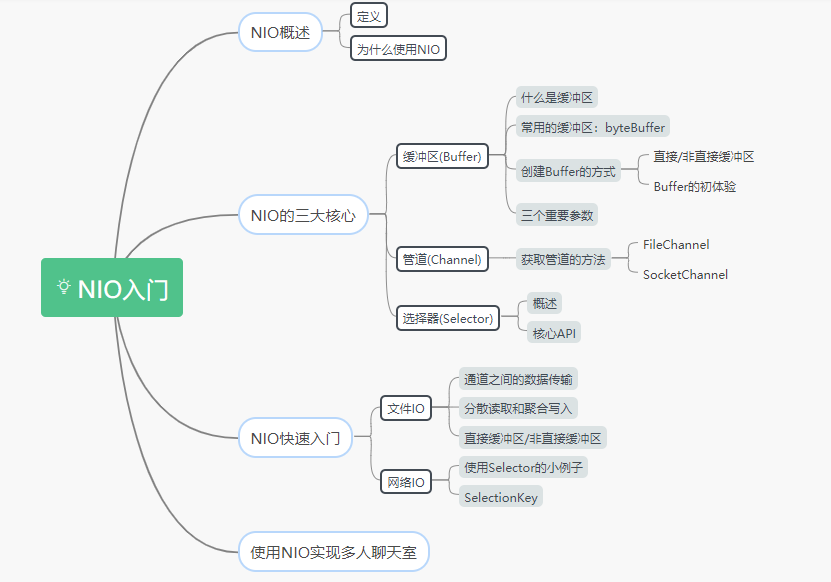

NIO从入门到踹门
===============

### 思维导图 



思维导图

> 学如逆水行舟，不进则退

NIO概述
=======

### 1.1 定义 

**java.nio**全称**java non-blocking IO**，是指**JDK1.4及以上**版本里提供的新api（New IO），为所有的原始类型（boolean类型除外）提供**缓存支持的数据容器**，使用它可以提供**非阻塞式**的高伸缩性网络(来源于百度百科)。

### 1.2 为什么使用NIO 

在上面的描述中提到，是在JDK1.4以上的版本才提供NIO，那在之前使用的是什么呢？答案很简单，就是**BIO**(阻塞式IO)，也就是我们常用的IO流。

BIO的问题其实不用多说了，因为在使用BIO时，主线程会进入阻塞状态，这就非常影响程序的性能，**不能充分利用机器资源**。但是这样就会有人提出疑问了，那我**使用多线程**不就可以了吗？

但是在高并发的情况下，会创建很多线程，线程会占用内存，线程之间的切换也会浪费资源开销。

而NIO**只有在连接/通道真正有读写事件**发生时(**事件驱动**)，**才会进行读写**，就大大地减少了系统的开销。不必为每一个连接都创建一个线程，也不必去维护多个线程。

**避免了多个线程之间的上下文切换**，导致资源的浪费。

### 2 NIO的三大核心 

  NIO的核心 |  对应的类或接口 |  应用  |          作用
  -----------| ---------------- |--------------- |----------
  缓冲区   |   Buffer     |      文件IO/网络IO  | 存储数据
  通道     |   Channel    |      文件IO/网络IO  | 运输
  选择器   |   Selector   |      网络IO         | 控制器

### 2.1.1 什么是缓冲区 

我们先看以下这张类图，可以看到`Buffer`有七种类型。

)


`Buffer`是一个内存块。在`NIO`中，所有的数据都是用`Buffer`处理，有读写两种模式。所以NIO和传统的IO的区别就体现在这里。传统IO是面向`Stream`流，`NIO`而是面向缓冲区(`Buffer`)。

### 2.1.2 常用的类型ByteBuffer 

一般我们常用的类型是`ByteBuffer`，把数据转成字节进行处理。实质上是一个`byte[]`数组。
```java

    public abstract class ByteBuffer extends Buffer implements Comparable<ByteBuffer>{
        //存储数据的数组
        final byte[] hb;
        //构造器方法
        ByteBuffer(int mark, int pos, int lim, int cap, byte[] hb, int offset) {
            super(mark, pos, lim, cap);
            //初始化数组
            this.hb = hb;
            this.offset = offset;
        }
    }
```

### 2.1.3 创建Buffer的方式 

主要分成两种：JVM堆内内存块Buffer、堆外内存块Buffer。

创建堆内内存块(非直接缓冲区)的方法是：
```java

    //创建堆内内存块HeapByteBuffer
    ByteBuffer byteBuffer1 = ByteBuffer.allocate(1024);

    String msg = "java技术爱好者";
    //包装一个byte[]数组获得一个Buffer，实际类型是HeapByteBuffer
    ByteBuffer byteBuffer2 = ByteBuffer.wrap(msg.getBytes());
```

创建堆外内存块(直接缓冲区)的方法：
```java

    //创建堆外内存块DirectByteBuffer
    ByteBuffer byteBuffer3 = ByteBuffer.allocateDirect(1024);
```

### 2.1.3.1 

### HeapByteBuffer与DirectByteBuffer 

其实根据类名就可以看出，`HeapByteBuffer`所创建的字节缓冲区就是在JVM堆中的，即JVM内部所维护的字节数组。而`DirectByteBuffer`是**直接操作操作系统本地代码**创建的**内存缓冲数组**。

`DirectByteBuffer`的使用场景：

1.  java程序与本地磁盘、socket传输数据

2.  大文件对象，可以使用。不会受到堆内存大小的限制。

3.  不需要频繁创建，生命周期较长的情况，能重复使用的情况。

`HeapByteBuffer`的使用场景：

除了以上的场景外，其他情况还是建议使用`HeapByteBuffer`，没有达到一定的量级，实际上使用`DirectByteBuffer`是体现不出优势的。

### 2.1.3.2 Buffer的初体验 

接下来，使用`ByteBuffer`做一个小例子，熟悉一下：
```java

        public static void main(String[] args) throws Exception {
            String msg = "java技术爱好者，起飞！";
            //创建一个固定大小的buffer(返回的是HeapByteBuffer)
            ByteBuffer byteBuffer = ByteBuffer.allocate(1024);
            byte[] bytes = msg.getBytes();
            //写入数据到Buffer中
            byteBuffer.put(bytes);
            //切换成读模式，关键一步
            byteBuffer.flip();
            //创建一个临时数组，用于存储获取到的数据
            byte[] tempByte = new byte[bytes.length];
            int i = 0;
            //如果还有数据，就循环。循环判断条件
            while (byteBuffer.hasRemaining()) {
                //获取byteBuffer中的数据
                byte b = byteBuffer.get();
                //放到临时数组中
                tempByte[i] = b;
                i++;
            }
            //打印结果
            System.out.println(new String(tempByte));//java技术爱好者，起飞！
        }
```

这上面有一个`flip()`方法是很重要的。意思是切换到读模式。上面已经提到**缓存区是双向的**，**既可以往缓冲区写入数据，也可以从缓冲区读取数据**。但是不能同时进行，需要切换。那么这个切换模式的本质是什么呢？

### 2.1.4 三个重要参数 
```java

    //位置，默认是从第一个开始
    private int position = 0;
    //限制，不能读取或者写入的位置索引
    private int limit;
    //容量，缓冲区所包含的元素的数量
    private int capacity;
```

那么我们以上面的例子，一句一句代码进行分析：
```java

    String msg = "java技术爱好者，起飞！";
    //创建一个固定大小的buffer(返回的是HeapByteBuffer)
    ByteBuffer byteBuffer = ByteBuffer.allocate(1024);
```

当创建一个缓冲区时，参数的值是这样的：

)


)


当执行到`byteBuffer.put(bytes)`，当`put()`进入多少数据，position就会增加多少，参数就会发生变化：

)

)

接下来关键一步`byteBuffer.flip()`，会发生如下变化：

)

)

`flip()`方法的源码如下：
```java
        public final Buffer flip() {
            limit = position;
            position = 0;
            mark = -1;
            return this;
        }
```

为什么要这样赋值呢？因为下面有一句循环条件判断：
```java
    byteBuffer.hasRemaining();
    public final boolean hasRemaining() {
        //判断position的索引是否小于limit。
        //所以可以看出limit的作用就是记录写入数据的位置，那么当读取数据时，就知道读到哪个位置
        return position < limit;
    }
```

接下来就是在`while`循环中`get()`读取数据，读取完之后。

)

)

最后当`position`等于`limit`时，循环判断条件不成立，就跳出循环，读取完毕。

所以可以看出实质上`capacity`容量大小是不变的，实际上是通过控制`position`和`limit`的值来控制读写的数据。

### 2.2 管道(Channel) 

首先我们看一下Channel有哪些子类：

)

常用的Channel有这四种：

> FileChannel，读写文件中的数据。
> SocketChannel，通过TCP读写网络中的数据。
> ServerSockectChannel，监听新进来的TCP连接，像Web服务器那样。对每一个新进来的连接都会创建一个SocketChannel。
> DatagramChannel，通过UDP读写网络中的数据。

**Channel本身并不存储数据，只是负责数据的运输**。必须要和`Buffer`一起使用。

### 2.2.1.1 FileChannel 

FileChannel的获取方式，下面举个文件复制拷贝的例子进行说明：

)

首先准备一个\"1.txt\"放在项目的根目录下，然后编写一个main方法：
```java

        public static void main(String[] args) throws Exception {
            //获取文件输入流
            File file = new File("1.txt");
            FileInputStream inputStream = new FileInputStream(file);
            //从文件输入流获取通道
            FileChannel inputStreamChannel = inputStream.getChannel();
            //获取文件输出流
            FileOutputStream outputStream = new FileOutputStream(new File("2.txt"));
            //从文件输出流获取通道
            FileChannel outputStreamChannel = outputStream.getChannel();
            //创建一个byteBuffer，小文件所以就直接一次读取，不分多次循环了
            ByteBuffer byteBuffer = ByteBuffer.allocate((int)file.length());
            //把输入流通道的数据读取到缓冲区
            inputStreamChannel.read(byteBuffer);
            //切换成读模式
            byteBuffer.flip();
            //把数据从缓冲区写入到输出流通道
            outputStreamChannel.write(byteBuffer);
            //关闭通道
            outputStream.close();
            inputStream.close();
            outputStreamChannel.close();
            inputStreamChannel.close();
        }
```

执行后，我们就获得一个\"2.txt\"。执行成功。

)

以上的例子，可以用一张示意图表示，是这样的：

)

### 2.2.1.2 SocketChannel 

接下来我们学习获取`SocketChannel`的方式。

还是一样，我们通过一个例子来快速上手：
```java

        public static void main(String[] args) throws Exception {
            //获取ServerSocketChannel
            ServerSocketChannel serverSocketChannel = ServerSocketChannel.open();
            InetSocketAddress address = new InetSocketAddress("127.0.0.1", 6666);
            //绑定地址，端口号
            serverSocketChannel.bind(address);
            //创建一个缓冲区
            ByteBuffer byteBuffer = ByteBuffer.allocate(1024);
            while (true) {
                //获取SocketChannel
                SocketChannel socketChannel = serverSocketChannel.accept();
                while (socketChannel.read(byteBuffer) != -1){
                    //打印结果
                    System.out.println(new String(byteBuffer.array()));
                    //清空缓冲区
                    byteBuffer.clear();
                }
            }
        }
```

然后运行main()方法，我们可以通过`telnet`命令进行连接测试：

)

通过上面的例子可以知道，通过`ServerSocketChannel.open()`方法可以获取服务器的通道，然后绑定一个地址端口号，接着`accept()`方法可获得一个`SocketChannel`通道，也就是客户端的连接通道。

最后配合使用`Buffer`进行读写即可。

这就是一个简单的例子，实际上上面的例子是阻塞式的。要做到非阻塞还需要使用选择器`Selector`。

### 2.3 选择器(Selector) 

`Selector`翻译成**选择器**，有些人也会翻译成**多路复用器**，实际上指的是同一样东西。

只有网络IO才会使用选择器，文件IO是不需要使用的。

选择器可以说是NIO的核心组件，它可以监听通道的状态，来实现异步非阻塞的IO。换句话说，也就是事件驱动。以此实现**单线程管理多个Channel**的目的。

)


### 2.3.1 核心API 

  API方法名   |      作用
  ----------------- |-------------------------------------------------
  Selector.open()  | 打开一个选择器。
  select()         | 选择一组键，其相应的通道已为 I/O 操作准备就绪。
  selectedKeys()   | 返回此选择器的已选择键集。

以上的API会在后面的例子用到，先有个印象。

NIO快速入门
===========

### 3.1.1 通道间的数据传输 

这里主要介绍两个通道与通道之间数据传输的方式：

`transferTo()`：把源通道的数据传输到目的通道中。
```java

        public static void main(String[] args) throws Exception {
            //获取文件输入流
            File file = new File("1.txt");
            FileInputStream inputStream = new FileInputStream(file);
            //从文件输入流获取通道
            FileChannel inputStreamChannel = inputStream.getChannel();
            //获取文件输出流
            FileOutputStream outputStream = new FileOutputStream(new File("2.txt"));
            //从文件输出流获取通道
            FileChannel outputStreamChannel = outputStream.getChannel();
            //创建一个byteBuffer，小文件所以就直接一次读取，不分多次循环了
            ByteBuffer byteBuffer = ByteBuffer.allocate((int) file.length());
            //把输入流通道的数据读取到输出流的通道
            inputStreamChannel.transferTo(0, byteBuffer.limit(), outputStreamChannel);
            //关闭通道
            outputStream.close();
            inputStream.close();
            outputStreamChannel.close();
            inputStreamChannel.close();
        }    
```

`transferFrom()`：把来自源通道的数据传输到目的通道。
```java

        public static void main(String[] args) throws Exception {
            //获取文件输入流
            File file = new File("1.txt");
            FileInputStream inputStream = new FileInputStream(file);
            //从文件输入流获取通道
            FileChannel inputStreamChannel = inputStream.getChannel();
            //获取文件输出流
            FileOutputStream outputStream = new FileOutputStream(new File("2.txt"));
            //从文件输出流获取通道
            FileChannel outputStreamChannel = outputStream.getChannel();
            //创建一个byteBuffer，小文件所以就直接一次读取，不分多次循环了
            ByteBuffer byteBuffer = ByteBuffer.allocate((int) file.length());
            //把输入流通道的数据读取到输出流的通道
            outputStreamChannel.transferFrom(inputStreamChannel,0,byteBuffer.limit());
            //关闭通道
            outputStream.close();
            inputStream.close();
            outputStreamChannel.close();
            inputStreamChannel.close();
        }
```

### 3.1.2 分散读取和聚合写入 

我们先看一下FileChannel的源码：
```java
    public abstract class FileChannel extends AbstractInterruptibleChannel
        implements SeekableByteChannel, GatheringByteChannel, ScatteringByteChannel {   
    }
```

从源码中可以看出实现了GatheringByteChannel,
ScatteringByteChannel接口。也就是支持分散读取和聚合写入的操作。怎么使用呢，请看以下例子：

我们写一个main方法来实现复制1.txt文件，文件内容是：
```
    abcdefghijklmnopqrstuvwxyz//26个字母
```

代码如下：
```java
        public static void main(String[] args) throws Exception {
            //获取文件输入流
            File file = new File("1.txt");
            FileInputStream inputStream = new FileInputStream(file);
            //从文件输入流获取通道
            FileChannel inputStreamChannel = inputStream.getChannel();
            //获取文件输出流
            FileOutputStream outputStream = new FileOutputStream(new File("2.txt"));
            //从文件输出流获取通道
            FileChannel outputStreamChannel = outputStream.getChannel();
            //创建三个缓冲区，分别都是5
            ByteBuffer byteBuffer1 = ByteBuffer.allocate(5);
            ByteBuffer byteBuffer2 = ByteBuffer.allocate(5);
            ByteBuffer byteBuffer3 = ByteBuffer.allocate(5);
            //创建一个缓冲区数组
            ByteBuffer[] buffers = new ByteBuffer[]{byteBuffer1, byteBuffer2, byteBuffer3};
            //循环写入到buffers缓冲区数组中，分散读取
            long read;
            long sumLength = 0;
            while ((read = inputStreamChannel.read(buffers)) != -1) {
                sumLength += read;
                Arrays.stream(buffers)
                        .map(buffer -> "posstion=" + buffer.position() + ",limit=" + buffer.limit())
                        .forEach(System.out::println);
                //切换模式
                Arrays.stream(buffers).forEach(Buffer::flip);
                //聚合写入到文件输出通道
                outputStreamChannel.write(buffers);
                //清空缓冲区
                Arrays.stream(buffers).forEach(Buffer::clear);
            }
            System.out.println("总长度:" + sumLength);
            //关闭通道
            outputStream.close();
            inputStream.close();
            outputStreamChannel.close();
            inputStreamChannel.close();
        }
```

打印结果：
```
    posstion=5,limit=5
    posstion=5,limit=5
    posstion=5,limit=5

    posstion=5,limit=5
    posstion=5,limit=5
    posstion=1,limit=5

    总长度:26
```

可以看到循环了两次。第一次循环时，三个缓冲区都读取了5个字节，总共读取了15，也就是读满了。还剩下11个字节，于是第二次循环时，前两个缓冲区分配了5个字节，最后一个缓冲区给他分配了1个字节，刚好读完。总共就是26个字节。

这就是分散读取，聚合写入的过程。

使用场景就是可以**使用一个缓冲区数组，自动地根据需要去分配缓冲区的大小。可以减少内存消耗**。网络IO也可以使用，这里就不写例子演示了。

### 3.1.3 非直接/直接缓冲区 

非直接缓冲区的创建方式：
```
    static ByteBuffer allocate(int capacity)
```

直接缓冲区的创建方式：
```
    static ByteBuffer allocateDirect(int capacity)
```

非直接/直接缓冲区的区别示意图：

)

)

从示意图中我们可以发现，最大的不同在于直接缓冲区不需要再把文件内容copy到物理内存中。这就大大地提高了性能。其实在介绍Buffer时，我们就有接触到这个概念。直接缓冲区是堆外内存，在本地文件IO效率会更高一点。

接下来我们来对比一下效率，以一个136 MB的视频文件为例：
```java
    public static void main(String[] args) throws Exception {
        long starTime = System.currentTimeMillis();
        //获取文件输入流
        File file = new File("D:\\小电影.mp4");//文件大小136 MB
        FileInputStream inputStream = new FileInputStream(file);
        //从文件输入流获取通道
        FileChannel inputStreamChannel = inputStream.getChannel();
        //获取文件输出流
        FileOutputStream outputStream = new FileOutputStream(new File("D:\\test.mp4"));
        //从文件输出流获取通道
        FileChannel outputStreamChannel = outputStream.getChannel();
        //创建一个直接缓冲区
        ByteBuffer byteBuffer = ByteBuffer.allocateDirect(5 * 1024 * 1024);
        //创建一个非直接缓冲区
        //ByteBuffer byteBuffer = ByteBuffer.allocate(5 * 1024 * 1024);
        //写入到缓冲区
        while (inputStreamChannel.read(byteBuffer) != -1) {
            //切换读模式
            byteBuffer.flip();
            outputStreamChannel.write(byteBuffer);
            byteBuffer.clear();
        }
        //关闭通道
        outputStream.close();
        inputStream.close();
        outputStreamChannel.close();
        inputStreamChannel.close();
        long endTime = System.currentTimeMillis();
        System.out.println("消耗时间：" + (endTime - starTime) + "毫秒");
    }
```

结果：

直接缓冲区的消耗时间：283毫秒

非直接缓冲区的消耗时间：487毫秒

### 3.2 网络IO 

其实NIO的主要用途是网络IO，在NIO之前java要使用网络编程就只有用`Socket`。而`Socket`是阻塞的，显然对于高并发的场景是不适用的。所以NIO的出现就是解决了这个痛点。

主要思想是把Channel通道注册到Selector中，通过Selector去监听Channel中的事件状态，这样就不需要阻塞等待客户端的连接，从主动等待客户端的连接，变成了通过事件驱动。没有监听的事件，服务器可以做自己的事情。

### 3.2.1 使用Selector的小例子 

接下来趁热打铁，我们来做一个服务器接受客户端消息的例子：

首先服务端代码：
```java
    public class NIOServer {
        public static void main(String[] args) throws Exception {
            //打开一个ServerSocketChannel
            ServerSocketChannel serverSocketChannel = ServerSocketChannel.open();
            InetSocketAddress address = new InetSocketAddress("127.0.0.1", 6666);
            //绑定地址
            serverSocketChannel.bind(address);
            //设置为非阻塞
            serverSocketChannel.configureBlocking(false);
            //打开一个选择器
            Selector selector = Selector.open();
            //serverSocketChannel注册到选择器中,监听连接事件
            serverSocketChannel.register(selector, SelectionKey.OP_ACCEPT);
            //循环等待客户端的连接
            while (true) {
                //等待3秒，（返回0相当于没有事件）如果没有事件，则跳过
                if (selector.select(3000) == 0) {
                    System.out.println("服务器等待3秒，没有连接");
                    continue;
                }
                //如果有事件selector.select(3000)>0的情况,获取事件
                Set<SelectionKey> selectionKeys = selector.selectedKeys();
                //获取迭代器遍历
                Iterator<SelectionKey> it = selectionKeys.iterator();
                while (it.hasNext()) {
                    //获取到事件
                    SelectionKey selectionKey = it.next();
                    //判断如果是连接事件
                    if (selectionKey.isAcceptable()) {
                        //服务器与客户端建立连接，获取socketChannel
                        SocketChannel socketChannel = serverSocketChannel.accept();
                        //设置成非阻塞
                        socketChannel.configureBlocking(false);
                        //把socketChannel注册到selector中，监听读事件，并绑定一个缓冲区
                        socketChannel.register(selector, SelectionKey.OP_READ, ByteBuffer.allocate(1024));
                    }
                    //如果是读事件
                    if (selectionKey.isReadable()) {
                        //获取通道
                        SocketChannel socketChannel = (SocketChannel) selectionKey.channel();
                        //获取关联的ByteBuffer
                        ByteBuffer buffer = (ByteBuffer) selectionKey.attachment();
                        //打印从客户端获取到的数据
                        socketChannel.read(buffer);
                        System.out.println("from 客户端：" + new String(buffer.array()));
                    }
                    //从事件集合中删除已处理的事件，防止重复处理
                    it.remove();
                }
            }
        }
    }
```

客户端代码：
```java
    public class NIOClient {
        public static void main(String[] args) throws Exception {
            SocketChannel socketChannel = SocketChannel.open();
            InetSocketAddress address = new InetSocketAddress("127.0.0.1", 6666);
            socketChannel.configureBlocking(false);
            //连接服务器
            boolean connect = socketChannel.connect(address);
            //判断是否连接成功
            if(!connect){
                //等待连接的过程中
                while (!socketChannel.finishConnect()){
                    System.out.println("连接服务器需要时间，期间可以做其他事情...");
                }
            }
            String msg = "hello java技术爱好者！";
            ByteBuffer byteBuffer = ByteBuffer.wrap(msg.getBytes());
            //把byteBuffer数据写入到通道中
            socketChannel.write(byteBuffer);
            //让程序卡在这个位置，不关闭连接
            System.in.read();
        }
    }
```
接下来启动服务端，然后再启动客户端，我们可以看到控制台打印以下信息：
```
    服务器等待3秒，没有连接
    服务器等待3秒，没有连接
    from 客户端：hello java技术爱好者！                       
    服务器等待3秒，没有连接
    服务器等待3秒，没有连接
```
通过这个例子我们引出以下知识点。

### 3.2.2 SelectionKey 

在`SelectionKey`类中有四个常量表示四种事件，来看源码：
```java
    public abstract class SelectionKey {
        //读事件
        public static final int OP_READ = 1 << 0; //2^0=1
        //写事件
        public static final int OP_WRITE = 1 << 2; // 2^2=4
        //连接操作,Client端支持的一种操作
        public static final int OP_CONNECT = 1 << 3; // 2^3=8
        //连接可接受操作,仅ServerSocketChannel支持
        public static final int OP_ACCEPT = 1 << 4; // 2^4=16
    }
```
附加的对象(可选)，把通道注册到选择器中时可以附加一个对象。
```java
    public final SelectionKey register(Selector sel, int ops, Object att)
```
从`selectionKey`中获取附件对象可以使用`attachment()`方法
```java
    public final Object attachment() {
        return attachment;
    }
```
### 4 使用NIO实现多人聊天室 

接下来进行一个实战例子，用NIO实现一个多人运动版本的聊天室。

服务端代码：
```java
    public class GroupChatServer {

        private Selector selector;

        private ServerSocketChannel serverSocketChannel;

        public static final int PORT = 6667;

        //构造器初始化成员变量
        public GroupChatServer() {
            try {
                //打开一个选择器
                this.selector = Selector.open();
                //打开serverSocketChannel
                this.serverSocketChannel = ServerSocketChannel.open();
                //绑定地址，端口号
                this.serverSocketChannel.bind(new InetSocketAddress("127.0.0.1", PORT));
                //设置为非阻塞
                serverSocketChannel.configureBlocking(false);
                //把通道注册到选择器中
                serverSocketChannel.register(selector, SelectionKey.OP_ACCEPT);
            } catch (Exception e) {
                e.printStackTrace();
            }
        }

        /**
         * 监听，并且接受客户端消息，转发到其他客户端
         */
        public void listen() {
            try {
                while (true) {
                    //获取监听的事件总数
                    int count = selector.select(2000);
                    if (count > 0) {
                        Set<SelectionKey> selectionKeys = selector.selectedKeys();
                        //获取SelectionKey集合
                        Iterator<SelectionKey> it = selectionKeys.iterator();
                        while (it.hasNext()) {
                            SelectionKey key = it.next();
                            //如果是获取连接事件
                            if (key.isAcceptable()) {
                                SocketChannel socketChannel = serverSocketChannel.accept();
                                //设置为非阻塞
                                socketChannel.configureBlocking(false);
                                //注册到选择器中
                                socketChannel.register(selector, SelectionKey.OP_READ);
                                System.out.println(socketChannel.getRemoteAddress() + "上线了~");
                            }
                            //如果是读就绪事件
                            if (key.isReadable()) {
                                //读取消息，并且转发到其他客户端
                                readData(key);
                            }
                            it.remove();
                        }
                    } else {
                        System.out.println("等待...");
                    }
                }
            } catch (Exception e) {
                e.printStackTrace();
            }
        }

        //获取客户端发送过来的消息
        private void readData(SelectionKey selectionKey) {
            SocketChannel socketChannel = null;
            try {
                //从selectionKey中获取channel
                socketChannel = (SocketChannel) selectionKey.channel();
                //创建一个缓冲区
                ByteBuffer byteBuffer = ByteBuffer.allocate(1024);
                //把通道的数据写入到缓冲区
                int count = socketChannel.read(byteBuffer);
                //判断返回的count是否大于0，大于0表示读取到了数据
                if (count > 0) {
                    //把缓冲区的byte[]转成字符串
                    String msg = new String(byteBuffer.array());
                    //输出该消息到控制台
                    System.out.println("from 客户端：" + msg);
                    //转发到其他客户端
                    notifyAllClient(msg, socketChannel);
                }
            } catch (Exception e) {
                try {
                    //打印离线的通知
                    System.out.println(socketChannel.getRemoteAddress() + "离线了...");
                    //取消注册
                    selectionKey.cancel();
                    //关闭流
                    socketChannel.close();
                } catch (IOException e1) {
                    e1.printStackTrace();
                }
            }
        }

        /**
         * 转发消息到其他客户端
         * msg 消息
         * noNotifyChannel 不需要通知的Channel
         */
        private void notifyAllClient(String msg, SocketChannel noNotifyChannel) throws Exception {
            System.out.println("服务器转发消息~");
            for (SelectionKey selectionKey : selector.keys()) {
                Channel channel = selectionKey.channel();
                //channel的类型实际类型是SocketChannel，并且排除不需要通知的通道
                if (channel instanceof SocketChannel && channel != noNotifyChannel) {
                    //强转成SocketChannel类型
                    SocketChannel socketChannel = (SocketChannel) channel;
                    //通过消息，包裹获取一个缓冲区
                    ByteBuffer byteBuffer = ByteBuffer.wrap(msg.getBytes());
                    socketChannel.write(byteBuffer);
                }
            }
        }

        public static void main(String[] args) throws Exception {
            GroupChatServer chatServer = new GroupChatServer();
            //启动服务器，监听
            chatServer.listen();
        }
    }
```
客户端代码：
```java
    public class GroupChatClinet {

        private Selector selector;

        private SocketChannel socketChannel;

        private String userName;

        public GroupChatClinet() {
            try {
                //打开选择器
                this.selector = Selector.open();
                //连接服务器
                socketChannel = SocketChannel.open(new InetSocketAddress("127.0.0.1", GroupChatServer.PORT));
                //设置为非阻塞
                socketChannel.configureBlocking(false);
                //注册到选择器中
                socketChannel.register(selector, SelectionKey.OP_READ);
                //获取用户名
                userName = socketChannel.getLocalAddress().toString().substring(1);
                System.out.println(userName + " is ok~");
            } catch (Exception e) {
                e.printStackTrace();
            }
        }

        //发送消息到服务端
        private void sendMsg(String msg) {
            msg = userName + "说：" + msg;
            try {
                socketChannel.write(ByteBuffer.wrap(msg.getBytes()));
            } catch (Exception e) {
                e.printStackTrace();
            }
        }

        //读取服务端发送过来的消息
        private void readMsg() {
            try {
                int count = selector.select();
                if (count > 0) {
                    Iterator<SelectionKey> iterator = selector.selectedKeys().iterator();
                    while (iterator.hasNext()) {
                        SelectionKey selectionKey = iterator.next();
                        //判断是读就绪事件
                        if (selectionKey.isReadable()) {
                            SocketChannel channel = (SocketChannel) selectionKey.channel();
                            //创建一个缓冲区
                            ByteBuffer byteBuffer = ByteBuffer.allocate(1024);
                            //从服务器的通道中读取数据到缓冲区
                            channel.read(byteBuffer);
                            //缓冲区的数据，转成字符串，并打印
                            System.out.println(new String(byteBuffer.array()));
                        }
                        iterator.remove();
                    }
                }
            } catch (Exception e) {
                e.printStackTrace();
            }
        }

        public static void main(String[] args) throws Exception {
            GroupChatClinet chatClinet = new GroupChatClinet();
            //启动线程，读取服务器转发过来的消息
            new Thread(() -> {
                while (true) {
                    chatClinet.readMsg();
                    try {
                        Thread.sleep(3000);
                    } catch (Exception e) {
                        e.printStackTrace();
                    }
                }
            }).start();
            //主线程发送消息到服务器
            Scanner scanner = new Scanner(System.in);
            while (scanner.hasNextLine()) {
                String msg = scanner.nextLine();
                chatClinet.sendMsg(msg);
            }
        }
    }
```
先启动服务端的main方法，再启动两个客户端的main方法：

)

然后使用两个客户端开始聊天了\~

)

)

以上就是使用NIO**实现多人聊天室**的例子，同学们可以看着我这个例子自己完成一下。要多写代码才好理解这些概念。

---
**免责声明：**

本公博客部分分享的资料来自网络收集和整理，所有文字和图片版权归属于原作者所有，且仅代表作者个人观点，与**本博客**无关，文章仅供读者学习交流使用，并请自行核实相关内容，如文章内容涉及侵权，请联系后台管理员删除。
