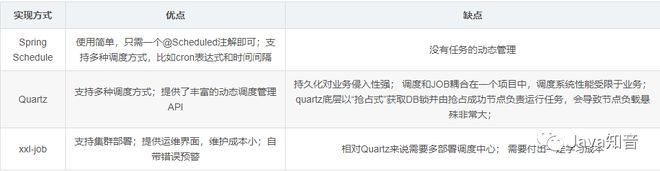

# 目录

-   初识Quartz

-   Quartz基础使用

    -   基于时间间隔的定时任务

    -   基于Cron表达式的定时任务

-   Quartz解读

    -   Job

    -   Trigger

    -   Scheduler

-   Quartz进阶使用

    -   多触发器的定时任务

    -   Job中注入Bean

    -   Quartz的持久化

最近在工作遇到了定时任务场景，因此特地对定时任务相关知识进行了调研，记录在此，后文中使用的代码已经上传到Github：https://github.com/ThinkMugz/springboot-demo-major，需要的伙伴儿自取。

本文主要有以下内容：

-   Quartz的基本认知和源码初探

-   Quartz的基本使用

-   Quartz的进阶使用，包括Job中注入Mapper层、Quartz的持久化

在Java领域，有很多定时任务框架，这里简单对比一下目前比较流行的三款：




-   Quartz文档：https://www.w3cschool.cn/quartz\_doc/

-   xxl-job博客：https://www.cnblogs.com/xuxueli/p/5021979.html

## 一 . 初识Quartz

如果你的定时任务没有分布式需求，但需要对任务有一定的动态管理，例如任务的启动、暂停、恢复、停止和触发时间修改，那么Quartz非常适合你。

Quartz是Java定时任务领域一个非常优秀的框架，由OpenSymphony（一个开源组织）开发，这个框架进行了优良地解耦设计，整个模块可以分为三大部分：

-   **Job**：顾名思义，指待定时执行的具体工作内容；

-   **Trigger**：触发器，指定运行参数，包括运行次数、运行开始时间和技术时间、运行时长等；

-   **Scheduler**：调度器，将Job和Trigger组装起来，使定时任务被真正执行；

)
下面这个图简略地描述了三者之间的关系：

-   一个JobDetail（Job的实现类）可以绑定多个Trigger，但一个Trigger只能绑定一个JobDetail；

-   每个JobDetail和Trigger通过group和name来标识唯一性；

-   一个Scheduler可以调度多组JobDetail和Trigger。


)

为了便于理解和记忆，可以把这套设计机制与工厂车间相关联：

-   **Job**：把Job比作车间要生产的一类产品，例如汽车、电脑等。

-   **Trigger**：trigger可以理解为一条生产线，一条生产线只能生产一类产品，但一类产品可以由多条生产线生产。

-   **Scheduler**：Scheduler则可以理解为车间主任，指挥调度着车间内的生产任务（Scheduler内置线程池，线程池内的工作线程即为车间工人，每个工人承担着一组任务的真正执行）。


)

## 二. Quartz基础使用

`Quartz提供了丰富的API，下面我们在Springboot中使用Quartz完成一些简单的demo。`

### 基于时间间隔的定时任务

基于时间间隔和时间长度实现定时任务，借助SimpleTrigger，例如这个场景------每隔2s在控制台输出线程名和当前时间，持续30s。

#### a.导入依赖：

```pom
<!-- quartz任务-->
  <dependency>
    <groupId>org.springframework.boot</groupId>
    <artifactId>spring-boot-starter-quartz</artifactId>
    <version>2.7.3</version>
  </dependency>
```

#### b.新建Job，实现我们想要定时执行的任务：
```java
import org.quartz.Job;
import org.quartz.JobExecutionContext;
import java.time.LocalDateTime;
import java.time.format.DateTimeFormatter;

/**
 * 功能描述
 *
 * @author ASUS
 * @version 1.0
 * @Date 2022/9/10
 */
public class SimpleJob implements Job {
    @Override
    public void execute(JobExecutionContext jobExecutionContext) {
        // 创建一个事件，下面仅创建一个输出语句作演示
        System.out.println(Thread.currentThread().getName() + "--"
                + DateTimeFormatter.ofPattern("yyyy-MM-dd HH:mm:ss").format(LocalDateTime.now()));
    }
}
```

#### c.创建Scheduler和Trigger，执行定时任务：
```java
import org.junit.jupiter.api.Test;
import org.quartz.*;
import org.quartz.impl.StdSchedulerFactory;
import java.util.concurrent.TimeUnit;

/**
 * 功能描述
 *
 * @author ASUS
 * @version 1.0
 * @Date 2022/9/10
 */
public class SimpleQuartzTest {
    /*
     * 基于时间间隔的定时任务
     */
    @Test
    public void simpleTest() throws SchedulerException, InterruptedException {
        // 1、创建Scheduler（调度器）
        SchedulerFactory schedulerFactory = new StdSchedulerFactory();
        Scheduler scheduler = schedulerFactory.getScheduler();
        // 2、创建JobDetail实例，并与SimpleJob类绑定(Job执行内容)
        JobDetail jobDetail = JobBuilder.newJob(SimpleJob.class)
                .withIdentity("job1", "group1")
                .build();
        // 3、构建Trigger（触发器），定义执行频率和时长
        Trigger trigger = TriggerBuilder.newTrigger()
                // 指定group和name，这是唯一身份标识
                .withIdentity("trigger-1", "trigger-group")
                .startNow()  //立即生效
                .withSchedule(SimpleScheduleBuilder.simpleSchedule()
                        .withIntervalInSeconds(2) //每隔2s执行一次
                        .repeatForever())  // 永久执行
                .build();
        //4、将Job和Trigger交给Scheduler调度
        scheduler.scheduleJob(jobDetail, trigger);
        // 5、启动Scheduler
        scheduler.start();
        // 休眠，决定调度器运行时间，这里设置30s
        TimeUnit.SECONDS.sleep(30);
        // 关闭Scheduler
        scheduler.shutdown();
    }
}
```
启动测试方法后，控制台观察现象即可。注意到这么一句日志：Using thread
pool \'org.quartz.simpl.SimpleThreadPool\' - with 10
threads.，这说明Scheduler确实是内置了10个线程的线程池，通过打印线程名也印证了这一点。

另外要尤其注意的是，我们之所以通过TimeUnit.SECONDS.sleep(30);设置休眠，是因为定时任务是交由线程池异步执行的，而测试方法运行结束，主线程随之结束导致定时任务也不再执行了，所以需要设置休眠hold住主线程。在真实项目中，项目的进程是一直存活的，因此不需要设置休眠时间。

这其中的区别可以参考

` https://github.com/ThinkMugz/springboot-demo-major。`

### 基于Cron表达式的定时任务

基于Cron表达式的定时任务demo如下：
```java
/*
     * 基于cron表达式的定时任务
     */
    @Test
    public void cronTest() throws SchedulerException, InterruptedException {
        // 1、创建Scheduler（调度器）
        SchedulerFactory schedulerFactory = new StdSchedulerFactory();
        Scheduler scheduler = schedulerFactory.getScheduler();
        // 2、创建JobDetail实例，并与SimpleJob类绑定
        JobDetail jobDetail = JobBuilder.newJob(SimpleJob.class)
                .withIdentity("job-1", "job-group").build();
        // 3、构建Trigger（触发器），定义执行频率和时长
        CronTrigger cronTrigger = TriggerBuilder.newTrigger()
                .withIdentity("trigger-1", "trigger-group")
                .startNow()  //立即生效
                .withSchedule(CronScheduleBuilder.cronSchedule("* 30 10 ? * 1/5 *"))
                .build();

        //4、执行
        scheduler.scheduleJob(jobDetail, cronTrigger);
        scheduler.start();
        // 休眠，决定调度器运行时间，这里设置30s
        TimeUnit.SECONDS.sleep(30);
        // 关闭Scheduler
        scheduler.shutdown();
    }
```

## 三 .  Quartz解读

整个Quartz体系涉及的类及之间的关系如下图所示：


)

-   **JobDetail**：Job接口的实现类，由JobBuilder将具体定义任务的类包装而成。

-    **Trigger**：触发器，定义定时任务的触发规则，包括执行间隔、时长等，使用    TriggerBuilder创建，JobDetail和Trigger可以一对多，反之不可。触发器可以拥有多种状态。

-   **Scheduler**：调度器，将Job和Trigger组装起来，使定时任务被真正执行；是Quartz的核心，提供了大量API。

-   **JobDataMap**：集成Map，通过键值对为JobDetail存储一些额外信息。

-   **JobStore**：用来存储任务和触发器相关的信息，例如任务名称、数量、状态等等。Quartz
    中有两种存储任务的方式，一种在在内存（RAMJobStore），一种是在数据库（JDBCJobStore）。

###  Job

Job是一个接口，只有一个方法execute()，我们创建具体的任务类时要继承Job并重写execute()方法，使用JobBuilder将具体任务类包装成一个JobDetail（使用了建造者模式）交给Scheduler管理。每个JobDetail由name和group作为其唯一身份标识。

-   JobDataMap中可以包含不限量的（序列化的）数据对象，在job实例执行的时候，可以使用其中的数据。

-   JobDataMap继承Map，可通过键值对为JobDetail存储一些额外信息。

### Trigger

Trigger有四类实现，分别如下：

-   **SimpleTrigger**：简单触发器，支持定义任务执行的间隔时间，执行次数的规则有两种，一是定义重复次数，二是定义开始时间和结束时间。如果同时设置了结束时间与重复次数，先结束的会覆盖后结束的，以先结束的为准。

-   **CronTrigger**：基于Cron表达式的触发器。

-   **CalendarIntervalTrigger**：基于日历的触发器，比简单触发器更多时间单位，且能智能区分大小月和平闰年。

-   **DailyTimeIntervalTrigger**：基于日期的触发器，如每天的某个时间段。

Trigger是有状态的：NONE,NORMAL,PAUSED,COMPLETE,ERROR,BLOCKED，状态之间转换关系：


)
COMPLETE状态比较特殊，我在实际操作中发现，当Trigger长时间暂停后（具体时长不太确定）再恢复，状态就会变为COMPLETE，这种状态下无法再次启动该触发器。

###  Scheduler

调度器，是 Quartz的指挥官，由StdSchedulerFactory产生，它是单例的。Scheduler中提供了Quartz中最重要的
API，默认是实现类是StdScheduler。

Scheduler中主要的API大概分为三种：

-   **操作Scheduler本身**：例如start、shutdown等；

-   **操作Job**：例如：addJob、pauseJob、pauseJobs、resumeJob、resumeJobs、getJobKeys、getJobDetail等

-   **操作Trigger**：例如pauseTrigger、resumeTrigger等

这些API使用非常简单，源码中也有完善的注释，这里不再赘述。

## 四 . Quartz进阶使用

除了基本使用外，Quartz还有一些较为复杂的应用场景。

### 多触发器的定时任务

前文提过，一个JobDetail可以绑定多个触发器，这种场景还是有一些注意点的：

-   首先，要通过storeDurably()方法将JobDetail设置为孤立后保存存储（没有触发器指向该作业的情况）；

-   Scheduler通过addJob()将给定的作业添加到计划程序中-没有关联的触发器。作业将处于"休眠"状态，直到使用触发器或调度程序对其进行调度；

-   触发器通过forJob(JobDetail
    jobDetail)指定要绑定的JobDetail，scheduleJob()方法只传入触发器，触发后将自动执行addJob过的绑定JobDetail。
```java
import com.quartz.demo.schedule.SimpleJob;
import org.junit.jupiter.api.Test;
import org.quartz.*;
import org.quartz.impl.StdSchedulerFactory;
import java.util.concurrent.TimeUnit;

public class MultiQuartzTest {

    @Test
    public void multiJobTest() throws SchedulerException, InterruptedException {
        // 1、创建Scheduler（调度器）
        SchedulerFactory schedulerFactory = new StdSchedulerFactory();
        Scheduler scheduler = schedulerFactory.getScheduler();
        // 2、创建JobDetail实例，与执行内容类SimpleJob绑定，注意要设置 .storeDurably()，否则报错
        JobDetail jobDetail = JobBuilder.newJob(SimpleJob.class)
                .withIdentity("job1", "job-group")
                .storeDurably()
                .build();

        // 3、分别构建Trigger实例
        Trigger trigger = TriggerBuilder.newTrigger().withIdentity("trigger1", "trigger-group")
                .startNow()//立即生效
                .forJob(jobDetail)
                .withSchedule(SimpleScheduleBuilder
                        .simpleSchedule()
                        .withIntervalInSeconds(2) //每隔3s执行一次
                        .repeatForever()) // 永久循环
                .build();
        Trigger trigger2 = TriggerBuilder.newTrigger().withIdentity("trigger2", "trigger-group")
                .startNow()//立即生效
                .forJob(jobDetail)
                .withSchedule(SimpleScheduleBuilder.simpleSchedule()
                        .withIntervalInSeconds(3) //每隔5s执行一次
                        .repeatForever()).build(); // 永久循环
        //4、调度器中添加job
        scheduler.addJob(jobDetail, false);
        scheduler.scheduleJob(trigger);
        scheduler.scheduleJob(trigger2);
        // 启动调度器
        scheduler.start();
        // 休眠任务执行时长
        TimeUnit.SECONDS.sleep(20);
        scheduler.shutdown();
    }
}
```

### Job中注入Bean

有时候，我们要在定时任务中操作数据库，但Job中无法直接注入数据层，解决这种问题，有两种解决方案。

#### 方案一：借助JobDataMap

在构建JobDetail时，可以将数据放入JobDataMap，基本类型的数据通过usingJobData方法直接放入，mapper这种类型数据手动put进去：
```java
@Autowired
private PersonMapper personMapper;

// 构建定时任务
JobDetail jobDetail = JobBuilder.newJob(MajorJob.class)
        .withIdentity(jobName, jobGroupName)
        .usingJobData("jobName", "QuartzDemo")
        .build();
// 将mapper放入jobDetail的jobDataMap中
jobDetail.getJobDataMap().put("personMapper", personMapper);
```
在job的执行过程中，可以从JobDataMap中取出数据，如下示例：
```java
import com.quartz.demo.entity.Person;
import com.quartz.demo.mapper.PersonMapper;
import org.quartz.Job;
import org.quartz.JobDataMap;
import org.quartz.JobExecutionContext;

import java.time.LocalDateTime;
import java.time.format.DateTimeFormatter;
import java.util.List;

public class MajorJob implements Job {
    @Override
    public void execute(JobExecutionContext jobExecutionContext) {
        JobDataMap dataMap = jobExecutionContext.getJobDetail().getJobDataMap();
        String jobName = dataMap.getString("jobName");
        PersonMapper personMapper = (PersonMapper) dataMap.get("personMapper");
        // 这样就可以执行mapper层方法了
        List<Person> personList = personMapper.queryList();

        System.out.println(Thread.currentThread().getName() + "--"
                + DateTimeFormatter.ofPattern("yyyy-MM-dd HH:mm:ss").format(LocalDateTime.now()) + "--"
                + jobName + "--" + personList);
    }
}
```

这个方案相对简单，但在持久化中会遇到mapper的序列化问题：

> java.io.NotSerializableException: Unable to serialize JobDataMap for
> insertion into database because the value of property \'personMapper\'
> is not serializable: org.mybatis.spring.SqlSessionTemplate

#### 方案二：静态工具类

- 创建工具类SpringContextJobUtil，实现ApplicationContextAware接口
```java
import org.springframework.beans.BeansException;
import org.springframework.context.ApplicationContext;
import org.springframework.context.ApplicationContextAware;
import org.springframework.stereotype.Component;

import java.util.Locale;

@Component
public class SpringContextJobUtil implements ApplicationContextAware {
    private static ApplicationContext context;

    @Override
    @SuppressWarnings("static-access")
    public void setApplicationContext(ApplicationContext contex) throws BeansException {
        this.context = contex;
    }

    /**
     * 根据name获取bean
     *
     * @param beanName name
     * @return bean对象
     */
    public static Object getBean(String beanName) {
        return context.getBean(beanName);
    }

    public static String getMessage(String key) {
        return context.getMessage(key, null, Locale.getDefault());
    }
}
```
- mapper类上打上\@Service注解，并赋予其name：
```java
@Service("personMapper")
public interface PersonMapper {
    @Select("select id,name,age,sex,address,sect,skill,power,create_time createTime,modify_time modifyTime from mytest.persons")
    List<Person> queryList();
}
```
- Job中通过SpringContextJobUtil的getBean获取mapper的bean：
```java
public class MajorJob implements Job {
    @Override
    public void execute(JobExecutionContext jobExecutionContext) {
        JobDataMap dataMap = jobExecutionContext.getJobDetail().getJobDataMap();
        String jobName = dataMap.getString("jobName");

        PersonMapper personMapper = (PersonMapper) SpringContextJobUtil.getBean("personMapper");
        List<Person> personList = personMapper.queryList();

        System.out.println(Thread.currentThread().getName() + "--"
                + DateTimeFormatter.ofPattern("yyyy-MM-dd HH:mm:ss").format(LocalDateTime.now()) + "--"
                + jobName + "--" + personList);
    }
}
```
推荐使用这个方法。

###  Quartz的持久化

定时任务的诸多要素，如任务名称、数量、状态、运行频率、运行时间等，是要存储起来的。JobStore，就是用来存储任务和触发器相关的信息的。

Quartz中有两种存储任务的方式，一种在在内存（RAMJobStore），一种是在数据库（JDBCJobStore）。

Quartz默认的JobStore是RAMJobstore，也就是把任务和触发器信息运行的信息存储在内存中，用到了HashMap、TreeSet、HashSet等等数据结构，如果程序崩溃或重启，所有存储在内存中的数据都会丢失。所以我们需要把这些数据持久化到磁盘。

实现Quartz的持久化并不困难，按下列步骤操作即可：

#### 添加相关依赖：
```pom
<dependency>
    <groupId>com.mchange</groupId>
    <artifactId>c3p0</artifactId>
    <version>0.9.5.2</version>
</dependency>
```
#### 编写配置：
```java
import org.quartz.Scheduler;
import org.quartz.ee.servlet.QuartzInitializerListener;
import org.springframework.beans.factory.config.PropertiesFactoryBean;
import org.springframework.context.annotation.Bean;
import org.springframework.context.annotation.Configuration;
import org.springframework.core.io.ClassPathResource;
import org.springframework.scheduling.quartz.SchedulerFactoryBean;
import java.io.IOException;
import java.util.Properties;

/**
 * @author muguozheng
 * @version 1.0.0
 * @createTime 2022/4/19 18:46
 * @description Quartz配置
 */
@Configuration
public class SchedulerConfig {
    /**
     * 读取quartz.properties,将值初始化
     *
     * @return Properties
     * @throws IOException io
     */
    @Bean
    public Properties quartzProperties() throws IOException {
        PropertiesFactoryBean propertiesFactoryBean = new PropertiesFactoryBean();
        propertiesFactoryBean.setLocation(new ClassPathResource("/quartz.properties"));
        propertiesFactoryBean.afterPropertiesSet();
        return propertiesFactoryBean.getObject();
    }

    /**
     * 将配置文件的数据加载到SchedulerFactoryBean中
     *
     * @return SchedulerFactoryBean
     * @throws IOException io
     */
    @Bean
    public SchedulerFactoryBean schedulerFactoryBean() throws IOException {
        SchedulerFactoryBean schedulerFactoryBean = new SchedulerFactoryBean();
        schedulerFactoryBean.setQuartzProperties(quartzProperties());
        return schedulerFactoryBean;
    }

    /**
     * 初始化监听器
     *
     * @return QuartzInitializerListener
     */
    @Bean
    public QuartzInitializerListener executorListener() {
        return new QuartzInitializerListener();
    }

    /**
     * 获得Scheduler对象
     *
     * @return Scheduler
     * @throws IOException io
     */
    @Bean
    public Scheduler scheduler() throws IOException {
        return schedulerFactoryBean().getScheduler();
    }
}

```
#### 创建quartz.properties配置文件
```properties
# 实例化ThreadPool时，使用的线程类为SimpleThreadPool
org.quartz.threadPool.class=org.quartz.simpl.SimpleThreadPool
# 并发个数
org.quartz.threadPool.threadCount=10
# 优先级
org.quartz.threadPool.threadPriority=3
org.quartz.threadPool.threadsInheritContextClassLoaderOfInitializingThread=true
org.quartz.jobStore.misfireThreshold=5000
# 持久化使用的类
org.quartz.jobStore.class=org.quartz.impl.jdbcjobstore.JobStoreTX
# 数据库中表的前缀
org.quartz.jobStore.tablePrefix=QRTZ_
# 数据源命名
org.quartz.jobStore.dataSource=qzDS
# qzDS 数据源
org.quartz.dataSource.qzDS.driver=com.mysql.jdbc.Driver
org.quartz.dataSource.qzDS.URL=jdbc:mysql://localhost:3306/mytest?useUnicode=true&characterEncoding=UTF-8
org.quartz.dataSource.qzDS.user=root
org.quartz.dataSource.qzDS.password=root
org.quartz.dataSource.qzDS.maxConnections=10
```
#### 创建Quartz持久化数据的表

数据表初始化sql放置在External
Libraries的org/quartz/impl/jdbcjobstore中，直接用其初始化相关表即可。要注意的是，用来放置这些表的库要与quartz.properties的库一致。

```
DROP TABLE IF EXISTS QRTZ_FIRED_TRIGGERS;
DROP TABLE IF EXISTS QRTZ_PAUSED_TRIGGER_GRPS;
DROP TABLE IF EXISTS QRTZ_SCHEDULER_STATE;
DROP TABLE IF EXISTS QRTZ_LOCKS;
DROP TABLE IF EXISTS QRTZ_SIMPLE_TRIGGERS;
DROP TABLE IF EXISTS QRTZ_SIMPROP_TRIGGERS;
DROP TABLE IF EXISTS QRTZ_CRON_TRIGGERS;
DROP TABLE IF EXISTS QRTZ_BLOB_TRIGGERS;
DROP TABLE IF EXISTS QRTZ_TRIGGERS;
DROP TABLE IF EXISTS QRTZ_JOB_DETAILS;
DROP TABLE IF EXISTS QRTZ_CALENDARS;


CREATE TABLE `QRTZ_CALENDARS` (
  `SCHED_NAME` varchar(120) COLLATE utf8mb4_unicode_ci NOT NULL,
  `CALENDAR_NAME` varchar(200) COLLATE utf8mb4_unicode_ci NOT NULL,
  `CALENDAR` blob NOT NULL,
  PRIMARY KEY (`SCHED_NAME`,`CALENDAR_NAME`)
) ENGINE=InnoDB DEFAULT CHARSET=utf8mb4 COLLATE=utf8mb4_unicode_ci;


CREATE TABLE `QRTZ_FIRED_TRIGGERS` (
  `SCHED_NAME` varchar(120) COLLATE utf8mb4_unicode_ci NOT NULL,
  `ENTRY_ID` varchar(95) COLLATE utf8mb4_unicode_ci NOT NULL,
  `TRIGGER_NAME` varchar(200) COLLATE utf8mb4_unicode_ci NOT NULL,
  `TRIGGER_GROUP` varchar(200) COLLATE utf8mb4_unicode_ci NOT NULL,
  `INSTANCE_NAME` varchar(200) COLLATE utf8mb4_unicode_ci NOT NULL,
  `FIRED_TIME` bigint NOT NULL,
  `SCHED_TIME` bigint NOT NULL,
  `PRIORITY` int NOT NULL,
  `STATE` varchar(16) COLLATE utf8mb4_unicode_ci NOT NULL,
  `JOB_NAME` varchar(200) COLLATE utf8mb4_unicode_ci DEFAULT NULL,
  `JOB_GROUP` varchar(200) COLLATE utf8mb4_unicode_ci DEFAULT NULL,
  `IS_NONCONCURRENT` varchar(1) COLLATE utf8mb4_unicode_ci DEFAULT NULL,
  `REQUESTS_RECOVERY` varchar(1) COLLATE utf8mb4_unicode_ci DEFAULT NULL,
  PRIMARY KEY (`SCHED_NAME`,`ENTRY_ID`),
  KEY `IDX_QRTZ_FT_TRIG_INST_NAME` (`SCHED_NAME`,`INSTANCE_NAME`),
  KEY `IDX_QRTZ_FT_INST_JOB_REQ_RCVRY` (`SCHED_NAME`,`INSTANCE_NAME`,`REQUESTS_RECOVERY`),
  KEY `IDX_QRTZ_FT_J_G` (`SCHED_NAME`,`JOB_NAME`,`JOB_GROUP`),
  KEY `IDX_QRTZ_FT_JG` (`SCHED_NAME`,`JOB_GROUP`),
  KEY `IDX_QRTZ_FT_T_G` (`SCHED_NAME`,`TRIGGER_NAME`,`TRIGGER_GROUP`),
  KEY `IDX_QRTZ_FT_TG` (`SCHED_NAME`,`TRIGGER_GROUP`)
) ENGINE=InnoDB DEFAULT CHARSET=utf8mb4 COLLATE=utf8mb4_unicode_ci;


CREATE TABLE `QRTZ_JOB_DETAILS` (
  `SCHED_NAME` varchar(120) COLLATE utf8mb4_unicode_ci NOT NULL,
  `JOB_NAME` varchar(200) COLLATE utf8mb4_unicode_ci NOT NULL,
  `JOB_GROUP` varchar(200) COLLATE utf8mb4_unicode_ci NOT NULL,
  `DESCRIPTION` varchar(250) COLLATE utf8mb4_unicode_ci DEFAULT NULL,
  `JOB_CLASS_NAME` varchar(250) COLLATE utf8mb4_unicode_ci NOT NULL,
  `IS_DURABLE` varchar(1) COLLATE utf8mb4_unicode_ci NOT NULL,
  `IS_NONCONCURRENT` varchar(1) COLLATE utf8mb4_unicode_ci NOT NULL,
  `IS_UPDATE_DATA` varchar(1) COLLATE utf8mb4_unicode_ci NOT NULL,
  `REQUESTS_RECOVERY` varchar(1) COLLATE utf8mb4_unicode_ci NOT NULL,
  `JOB_DATA` blob,
  PRIMARY KEY (`SCHED_NAME`,`JOB_NAME`,`JOB_GROUP`),
  KEY `IDX_QRTZ_J_REQ_RECOVERY` (`SCHED_NAME`,`REQUESTS_RECOVERY`),
  KEY `IDX_QRTZ_J_GRP` (`SCHED_NAME`,`JOB_GROUP`)
) ENGINE=InnoDB DEFAULT CHARSET=utf8mb4 COLLATE=utf8mb4_unicode_ci;


CREATE TABLE `QRTZ_LOCKS` (
  `SCHED_NAME` varchar(120) COLLATE utf8mb4_unicode_ci NOT NULL,
  `LOCK_NAME` varchar(40) COLLATE utf8mb4_unicode_ci NOT NULL,
  PRIMARY KEY (`SCHED_NAME`,`LOCK_NAME`)
) ENGINE=InnoDB DEFAULT CHARSET=utf8mb4 COLLATE=utf8mb4_unicode_ci;


CREATE TABLE `QRTZ_PAUSED_TRIGGER_GRPS` (
  `SCHED_NAME` varchar(120) COLLATE utf8mb4_unicode_ci NOT NULL,
  `TRIGGER_GROUP` varchar(200) COLLATE utf8mb4_unicode_ci NOT NULL,
  PRIMARY KEY (`SCHED_NAME`,`TRIGGER_GROUP`)
) ENGINE=InnoDB DEFAULT CHARSET=utf8mb4 COLLATE=utf8mb4_unicode_ci;


CREATE TABLE `QRTZ_SCHEDULER_STATE` (
  `SCHED_NAME` varchar(120) COLLATE utf8mb4_unicode_ci NOT NULL,
  `INSTANCE_NAME` varchar(200) COLLATE utf8mb4_unicode_ci NOT NULL,
  `LAST_CHECKIN_TIME` bigint NOT NULL,
  `CHECKIN_INTERVAL` bigint NOT NULL,
  PRIMARY KEY (`SCHED_NAME`,`INSTANCE_NAME`)
) ENGINE=InnoDB DEFAULT CHARSET=utf8mb4 COLLATE=utf8mb4_unicode_ci;


CREATE TABLE `QRTZ_TRIGGERS` (
  `SCHED_NAME` varchar(120) COLLATE utf8mb4_unicode_ci NOT NULL,
  `TRIGGER_NAME` varchar(200) COLLATE utf8mb4_unicode_ci NOT NULL,
  `TRIGGER_GROUP` varchar(200) COLLATE utf8mb4_unicode_ci NOT NULL,
  `JOB_NAME` varchar(200) COLLATE utf8mb4_unicode_ci NOT NULL,
  `JOB_GROUP` varchar(200) COLLATE utf8mb4_unicode_ci NOT NULL,
  `DESCRIPTION` varchar(250) COLLATE utf8mb4_unicode_ci DEFAULT NULL,
  `NEXT_FIRE_TIME` bigint DEFAULT NULL,
  `PREV_FIRE_TIME` bigint DEFAULT NULL,
  `PRIORITY` int DEFAULT NULL,
  `TRIGGER_STATE` varchar(16) COLLATE utf8mb4_unicode_ci NOT NULL,
  `TRIGGER_TYPE` varchar(8) COLLATE utf8mb4_unicode_ci NOT NULL,
  `START_TIME` bigint NOT NULL,
  `END_TIME` bigint DEFAULT NULL,
  `CALENDAR_NAME` varchar(200) COLLATE utf8mb4_unicode_ci DEFAULT NULL,
  `MISFIRE_INSTR` smallint DEFAULT NULL,
  `JOB_DATA` blob,
  PRIMARY KEY (`SCHED_NAME`,`TRIGGER_NAME`,`TRIGGER_GROUP`),
  KEY `IDX_QRTZ_T_J` (`SCHED_NAME`,`JOB_NAME`,`JOB_GROUP`),
  KEY `IDX_QRTZ_T_JG` (`SCHED_NAME`,`JOB_GROUP`),
  KEY `IDX_QRTZ_T_C` (`SCHED_NAME`,`CALENDAR_NAME`),
  KEY `IDX_QRTZ_T_G` (`SCHED_NAME`,`TRIGGER_GROUP`),
  KEY `IDX_QRTZ_T_STATE` (`SCHED_NAME`,`TRIGGER_STATE`),
  KEY `IDX_QRTZ_T_N_STATE` (`SCHED_NAME`,`TRIGGER_NAME`,`TRIGGER_GROUP`,`TRIGGER_STATE`),
  KEY `IDX_QRTZ_T_N_G_STATE` (`SCHED_NAME`,`TRIGGER_GROUP`,`TRIGGER_STATE`),
  KEY `IDX_QRTZ_T_NEXT_FIRE_TIME` (`SCHED_NAME`,`NEXT_FIRE_TIME`),
  KEY `IDX_QRTZ_T_NFT_ST` (`SCHED_NAME`,`TRIGGER_STATE`,`NEXT_FIRE_TIME`),
  KEY `IDX_QRTZ_T_NFT_MISFIRE` (`SCHED_NAME`,`MISFIRE_INSTR`,`NEXT_FIRE_TIME`),
  KEY `IDX_QRTZ_T_NFT_ST_MISFIRE` (`SCHED_NAME`,`MISFIRE_INSTR`,`NEXT_FIRE_TIME`,`TRIGGER_STATE`),
  KEY `IDX_QRTZ_T_NFT_ST_MISFIRE_GRP` (`SCHED_NAME`,`MISFIRE_INSTR`,`NEXT_FIRE_TIME`,`TRIGGER_GROUP`,`TRIGGER_STATE`),
  CONSTRAINT `QRTZ_TRIGGERS_ibfk_1` FOREIGN KEY (`SCHED_NAME`, `JOB_NAME`, `JOB_GROUP`) REFERENCES `QRTZ_JOB_DETAILS` (`SCHED_NAME`, `JOB_NAME`, `JOB_GROUP`)
) ENGINE=InnoDB DEFAULT CHARSET=utf8mb4 COLLATE=utf8mb4_unicode_ci;


CREATE TABLE `QRTZ_BLOB_TRIGGERS` (
  `SCHED_NAME` varchar(120) COLLATE utf8mb4_unicode_ci NOT NULL,
  `TRIGGER_NAME` varchar(200) COLLATE utf8mb4_unicode_ci NOT NULL,
  `TRIGGER_GROUP` varchar(200) COLLATE utf8mb4_unicode_ci NOT NULL,
  `BLOB_DATA` blob,
  PRIMARY KEY (`SCHED_NAME`,`TRIGGER_NAME`,`TRIGGER_GROUP`),
  KEY `SCHED_NAME` (`SCHED_NAME`,`TRIGGER_NAME`,`TRIGGER_GROUP`),
  CONSTRAINT `QRTZ_BLOB_TRIGGERS_ibfk_1` FOREIGN KEY (`SCHED_NAME`, `TRIGGER_NAME`, `TRIGGER_GROUP`) REFERENCES `QRTZ_TRIGGERS` (`SCHED_NAME`, `TRIGGER_NAME`, `TRIGGER_GROUP`)
) ENGINE=InnoDB DEFAULT CHARSET=utf8mb4 COLLATE=utf8mb4_unicode_ci;


CREATE TABLE `QRTZ_CRON_TRIGGERS` (
  `SCHED_NAME` varchar(120) COLLATE utf8mb4_unicode_ci NOT NULL,
  `TRIGGER_NAME` varchar(200) COLLATE utf8mb4_unicode_ci NOT NULL,
  `TRIGGER_GROUP` varchar(200) COLLATE utf8mb4_unicode_ci NOT NULL,
  `CRON_EXPRESSION` varchar(120) COLLATE utf8mb4_unicode_ci NOT NULL,
  `TIME_ZONE_ID` varchar(80) COLLATE utf8mb4_unicode_ci DEFAULT NULL,
  PRIMARY KEY (`SCHED_NAME`,`TRIGGER_NAME`,`TRIGGER_GROUP`),
  CONSTRAINT `QRTZ_CRON_TRIGGERS_ibfk_1` FOREIGN KEY (`SCHED_NAME`, `TRIGGER_NAME`, `TRIGGER_GROUP`) REFERENCES `QRTZ_TRIGGERS` (`SCHED_NAME`, `TRIGGER_NAME`, `TRIGGER_GROUP`)
) ENGINE=InnoDB DEFAULT CHARSET=utf8mb4 COLLATE=utf8mb4_unicode_ci;


CREATE TABLE `QRTZ_SIMPLE_TRIGGERS` (
  `SCHED_NAME` varchar(120) COLLATE utf8mb4_unicode_ci NOT NULL,
  `TRIGGER_NAME` varchar(200) COLLATE utf8mb4_unicode_ci NOT NULL,
  `TRIGGER_GROUP` varchar(200) COLLATE utf8mb4_unicode_ci NOT NULL,
  `REPEAT_COUNT` bigint NOT NULL,
  `REPEAT_INTERVAL` bigint NOT NULL,
  `TIMES_TRIGGERED` bigint NOT NULL,
  PRIMARY KEY (`SCHED_NAME`,`TRIGGER_NAME`,`TRIGGER_GROUP`),
  CONSTRAINT `QRTZ_SIMPLE_TRIGGERS_ibfk_1` FOREIGN KEY (`SCHED_NAME`, `TRIGGER_NAME`, `TRIGGER_GROUP`) REFERENCES `QRTZ_TRIGGERS` (`SCHED_NAME`, `TRIGGER_NAME`, `TRIGGER_GROUP`)
) ENGINE=InnoDB DEFAULT CHARSET=utf8mb4 COLLATE=utf8mb4_unicode_ci;


CREATE TABLE `QRTZ_SIMPROP_TRIGGERS` (
  `SCHED_NAME` varchar(120) COLLATE utf8mb4_unicode_ci NOT NULL,
  `TRIGGER_NAME` varchar(200) COLLATE utf8mb4_unicode_ci NOT NULL,
  `TRIGGER_GROUP` varchar(200) COLLATE utf8mb4_unicode_ci NOT NULL,
  `STR_PROP_1` varchar(512) COLLATE utf8mb4_unicode_ci DEFAULT NULL,
  `STR_PROP_2` varchar(512) COLLATE utf8mb4_unicode_ci DEFAULT NULL,
  `STR_PROP_3` varchar(512) COLLATE utf8mb4_unicode_ci DEFAULT NULL,
  `INT_PROP_1` int DEFAULT NULL,
  `INT_PROP_2` int DEFAULT NULL,
  `LONG_PROP_1` bigint DEFAULT NULL,
  `LONG_PROP_2` bigint DEFAULT NULL,
  `DEC_PROP_1` decimal(13,4) DEFAULT NULL,
  `DEC_PROP_2` decimal(13,4) DEFAULT NULL,
  `BOOL_PROP_1` varchar(1) COLLATE utf8mb4_unicode_ci DEFAULT NULL,
  `BOOL_PROP_2` varchar(1) COLLATE utf8mb4_unicode_ci DEFAULT NULL,
  PRIMARY KEY (`SCHED_NAME`,`TRIGGER_NAME`,`TRIGGER_GROUP`),
  CONSTRAINT `QRTZ_SIMPROP_TRIGGERS_ibfk_1` FOREIGN KEY (`SCHED_NAME`, `TRIGGER_NAME`, `TRIGGER_GROUP`) REFERENCES `QRTZ_TRIGGERS` (`SCHED_NAME`, `TRIGGER_NAME`, `TRIGGER_GROUP`)
) ENGINE=InnoDB DEFAULT CHARSET=utf8mb4 COLLATE=utf8mb4_unicode_ci;

```

---

**免责声明：**

本公博客部分分享的资料来自网络收集和整理，所有文字和图片版权归属于原作者所有，且仅代表作者个人观点，与**本博客**无关，文章仅供读者学习交流使用，并请自行核实相关内容，如文章内容涉及侵权，请联系后台管理员删除。

