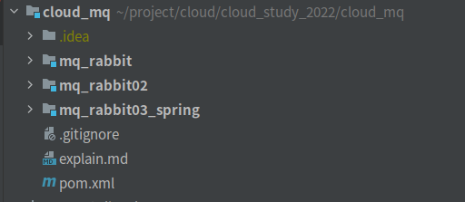
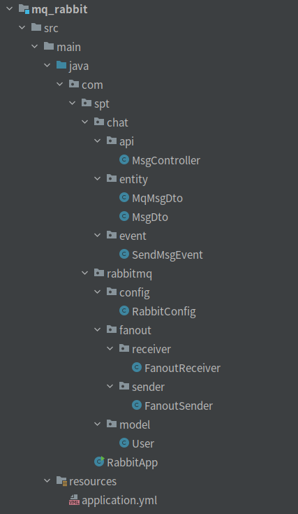
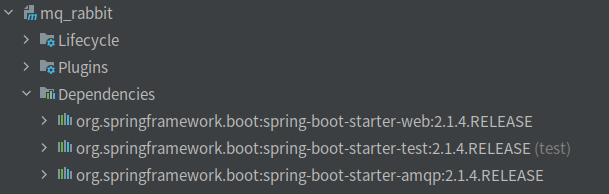
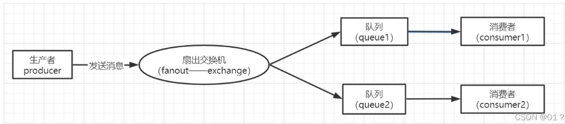
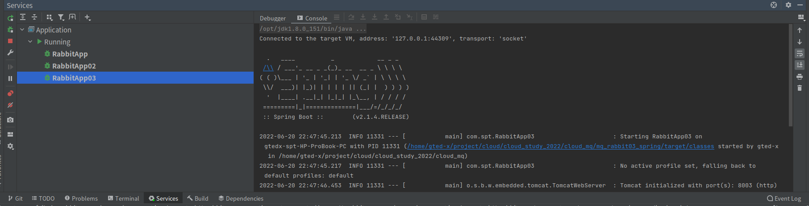
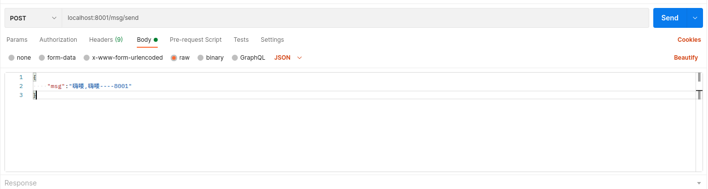
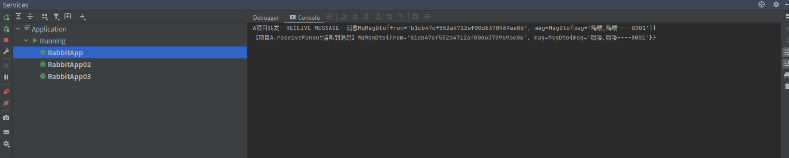
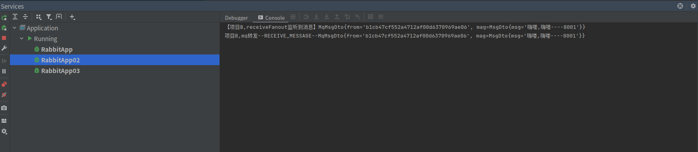
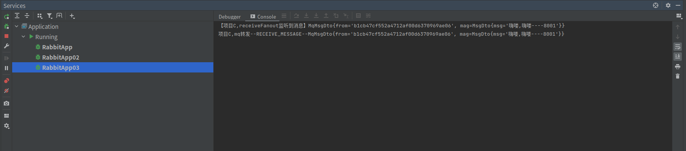

# 一.项目结构
## 1.1项目结构图

## 1.2 父pom文件
``` pom
<?xml version="1.0" encoding="UTF-8"?>

<project xmlns="http://maven.apache.org/POM/4.0.0" xmlns:xsi="http://www.w3.org/2001/XMLSchema-instance"
         xsi:schemaLocation="http://maven.apache.org/POM/4.0.0 http://maven.apache.org/xsd/maven-4.0.0.xsd">
    <modelVersion>4.0.0</modelVersion>

    <groupId>com.spt</groupId>
    <artifactId>cloud_mq</artifactId>
    <packaging>pom</packaging>
    <version>1.0-SNAPSHOT</version>
    <modules>
        <module>mq_rabbit</module>
        <module>mq_rabbit02</module>
        <module>mq_rabbit03_spring</module>
    </modules>

    <name>cloud_mq</name>
    <!-- FIXME change it to the project's website -->
    <url>http://www.example.com</url>

    <properties>
        <project.build.sourceEncoding>UTF-8</project.build.sourceEncoding>
        <maven.compiler.source>1.7</maven.compiler.source>
        <maven.compiler.target>1.7</maven.compiler.target>
    </properties>

    <!--  因为是总项目 所以用dependencyManagement来管理  因为其他的子项目就不会来管理版本了了 可以直接引用 -->
    <dependencyManagement>
        <dependencies>
            <!-- springboot的依赖-->
            <dependency>
                <groupId>org.springframework.boot</groupId>
                <artifactId>spring-boot-dependencies</artifactId>
                <version>2.1.4.RELEASE</version>
                <type>pom</type>
                <scope>import</scope>
            </dependency>
        </dependencies>
    </dependencyManagement>

    <build>
        <plugins>
            <plugin>
                <groupId>org.springframework.boot</groupId>
                <artifactId>spring-boot-maven-plugin</artifactId>
            </plugin>
        </plugins>
    </build>
</project>


```
## 1.3 子模块结构图

## 1.4 子模块pom文件
```pom
<?xml version="1.0" encoding="UTF-8"?>

<project xmlns="http://maven.apache.org/POM/4.0.0" xmlns:xsi="http://www.w3.org/2001/XMLSchema-instance"
  xsi:schemaLocation="http://maven.apache.org/POM/4.0.0 http://maven.apache.org/xsd/maven-4.0.0.xsd">
  <modelVersion>4.0.0</modelVersion>
  <parent>
    <artifactId>cloud_mq</artifactId>
    <groupId>com.spt</groupId>
    <version>1.0-SNAPSHOT</version>
  </parent>

  <artifactId>mq_rabbit</artifactId>
  <name>mq_rabbit</name>
  <!-- FIXME change it to the project's website -->
  <url>http://www.example.com</url>

  <properties>
    <project.build.sourceEncoding>UTF-8</project.build.sourceEncoding>
    <maven.compiler.source>1.7</maven.compiler.source>
    <maven.compiler.target>1.7</maven.compiler.target>
  </properties>

  <dependencies>
    <dependency>
      <groupId>org.springframework.boot</groupId>
      <artifactId>spring-boot-starter-web</artifactId>
    </dependency>

    <dependency>
      <groupId>org.springframework.boot</groupId>
      <artifactId>spring-boot-starter-test</artifactId>
      <scope>test</scope>
    </dependency>

    <dependency>
      <groupId>org.springframework.boot</groupId>
      <artifactId>spring-boot-starter-amqp</artifactId>
    </dependency>

  </dependencies>

  <build>
    <plugins>
      <plugin>
        <groupId>org.springframework.boot</groupId>
        <artifactId>spring-boot-maven-plugin</artifactId>
      </plugin>
    </plugins>
  </build>
</project>

```
## 1.5 子模块配置文件
```yml
server:
  port: 8001

spring:
  application:
    name: spirng-boot-rabbitmq
  rabbitmq:
    host: 127.0.0.1
    port: 5672
    password: admin
    username: admin
    virtualHost: /
```
>参数解释
 
 - **host** : rabbitMQ服务的地址
 - **port** : rabbitMQ服务的端口 (5672为mq应用访问端口,15672为web访问端口)
 - **password** : 密码
 - **username** : 用户名
 - **virtualHost** : 虚拟消息服务器 (每个VirtualHost相当于一个相对独立的RabbitMQ服务器；每个VirtualHost之间是相互隔离的，exchange、queue、message不能互通。 )

 # 二.springBoot整合rabbitMQ
 ## 2.1 引入依赖
 ``` pom
    <dependency>
      <groupId>org.springframework.boot</groupId>
      <artifactId>spring-boot-starter-amqp</artifactId>
    </dependency>
 ```
 - 父模块引入spring-boot-dependencies确定版本后,子模块不写版本号,会使用默认版本

## 2.2 配置MQ
```java
@Configuration
public class RabbitConfig {
    //fanout
    public static final String FANOUT_QUEUE1 = "fanout.queue1";
    public static final String FANOUT_EXCHANGE = "fanout.exchange";

    /**
     * Fanout模式
     * Fanout 就是我们熟悉的广播模式或者订阅模式，给Fanout交换机发送消息，绑定了这个交换机的所有队列都收到这个消息。
     * @return
     */
    @Bean
    public Queue fanoutQueue1() {
        return new Queue(FANOUT_QUEUE1);
    }

    @Bean
    public FanoutExchange fanoutExchange() {
        return new FanoutExchange(FANOUT_EXCHANGE);
    }

    @Bean
    public Binding fanoutBinding1() {
        return BindingBuilder.bind(fanoutQueue1()).to(fanoutExchange());
    }
}
```
- 这里使用了rabbitMQ的fanout模式:

> **Fanout** :  这种类型非常简单。正如从名称中猜到的那样，它是将接收到的所有消息广播到它知道的 所有队列中。系统中默认有些exchange 类型
## 2.3 发送者和接受者
### 发送者代码:
```java
@Component
public class FanoutSender {

    public static String MSG_FROM;

    static {
        MSG_FROM = UUID.randomUUID().toString().replace("-", "");
    }

    @Autowired
    private AmqpTemplate rabbitTemplate;

    public void send(User user) {
        this.rabbitTemplate.convertAndSend(RabbitConfig.FANOUT_EXCHANGE, "", user);
    }

    public void sendMsg(MqMsgDto msg) {
        this.rabbitTemplate.convertAndSend(RabbitConfig.FANOUT_EXCHANGE, "", msg);
    }
}
```
### 接收者代码:
```java
@Component
public class FanoutReceiver {
    // queues是指要监听的队列的名字
    @RabbitListener(queues = RabbitConfig.FANOUT_QUEUE1)
    public void receiveTopic1(MqMsgDto msg) {
        System.out.println("【项目A,receiveFanout监听到消息】" + msg);
        if (!MSG_FROM.equals(msg.getFrom())) {
            //mq转发--RECEIVE_MESSAGE--
            System.out.println("项目A,mq转发--RECEIVE_MESSAGE--" + msg);
        }
    }
}
```
- 请注意 **MSG_FROM** 该静态变量是一个标识,标识消息从哪个应用发出,在接收消息时,判断消息是否为"自己"发出的,是:不转发,否:转发

## 2.4 具体业务类
### api : 
```java
@RestController
public class MsgController {

    @Autowired
    private SendMsgEvent sender;

    @PostMapping(value = "/msg/send")
    private void snedMsg(@RequestBody MsgDto msg) {
        MqMsgDto mqMsg = new MqMsgDto(MSG_FROM, msg);
        sender.setMsg(mqMsg);
    }
}
```
### 消息数据类
```java
public class MsgDto implements Serializable {

    private String msg;

    public String getMsg() {
        return msg;
    }

    public void setMsg(String msg) {
        this.msg = msg;
    }

    public MsgDto(String msg) {
        this.msg = msg;
    }

    public MsgDto() {
    }

    @Override
    public String toString() {
        return "MsgDto{" +
                "msg='" + msg + '\'' +
                '}';
    }
}
```
### MQ数据传输类
```java
public class MqMsgDto implements Serializable {

    private String from;
    private MsgDto mag;

    public String getFrom() {
        return from;
    }

    public void setFrom(String from) {
        this.from = from;
    }

    public MsgDto getMag() {
        return mag;
    }

    public void setMag(MsgDto mag) {
        this.mag = mag;
    }

    public MqMsgDto(String from, com.spt.chat.entity.MsgDto mag) {
        this.from = from;
        this.mag = mag;
    }

    @Override
    public String toString() {
        return "MqMsgDto{" +
                "from='" + from + '\'' +
                ", mag=" + mag +
                '}';
    }
}
```
业务类:
```java
@Component
public class SendMsgEvent {

    @Autowired
    FanoutSender msgSender;

    public void setMsg(MqMsgDto msg){
        //转发RECEIVE_MESSAGE
        System.out.println("A项目转发--RECEIVE_MESSAGE--消息"+msg);
        //将消息发送只mq
        msgSender.sendMsg(msg);
    }
}
```
至此,springBoot整合MQ部分完毕
# 三.运行&结果
> 同样的方式,创建子模块:mq_rabbit02,mq_rabbit03  (记得修改yml文件哟~~)
## 3.1 运行
#### 运行项目


#### 发送消息


## 3.2 结果
>  localhost:8001/msg/send请求到服务mq_rabbit上,mq_rabbit发送消息,监听消息,判断是"自己"发的后,不转发


> mq_rabbit02,监听消息,判断消息不是"自己"发的后,转发


> mq_rabbit03,监听消息,判断消息不是"自己"发的后,转发


