什么是中台系统？它是如何诞生的？它长什么模样？我们为什么需要它？一串串的问题不禁浮现在我们的脑海，今天我们就带着这些问题，一起走进中台。

　**　1、中台诞生**

　　任何一个软件系统都是通过帮助客户解决问题来实现价值的。针对不同的需求会建立不同的软件项目。

　　这些软件项目包含客户端的应用和后台管理配置的应用。久而久之就形成了固定的"前台"和"后台"系统，而且大家都在乐此不疲地开发着类似的业务系统。

　　但是，时间一长大家就发现了，这些系统中有一些部分大同小异，在做第二个项目的时候并不用将所有的功能重写，可以把之前项目中那些共有的模块拿出来，稍作修改就可以在新项目中应用了。这就是中台的雏形。

　　**转动的齿轮**

　　抽象和解耦是软件开发铁律，同样也适用于中台系统。中台系统就是将"后台"系统中那些针对技术，业务，组织的通用"模块/服务"从原来固定的项目中抽离出来，并且使之能够成为一个自治的服务提供给更多的"前台"使用。

　　中台就是"前台"和"后台"之间联动的齿轮，也是：

　　调节器：前台业务变化快，后台系统相对比较稳定，中台就是他们中间的速度调节器。

　　加速器：新业务上马，接入中台即刻享受服务，不用 0 开始。

　　稳定器：前台业务多如牛毛，后台数据排山倒海，而中台提供各式各样的接口对接两者使用户享受稳定可靠的服务。

　　

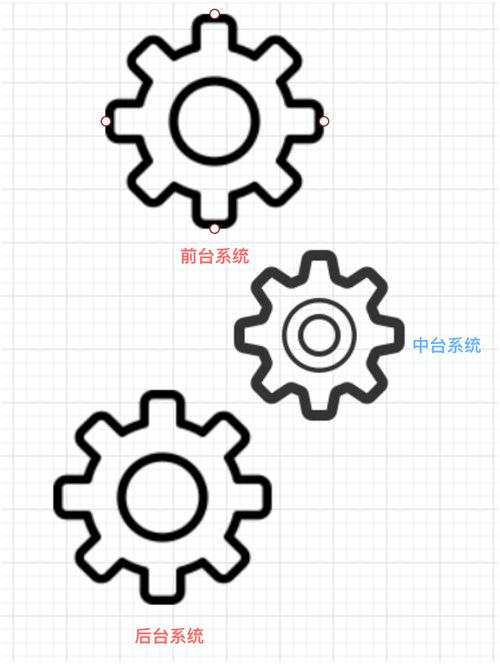

　　"中台系统"犹如齿轮，带动"前，后台系统"飞速转动

　**　2、中台的分类**

　　中台是一种能力的抽象，这种能力可以是业务能力，技术能力，数据能力甚至是组织能力。我们可以从不同的维度对其进行分类。

　　
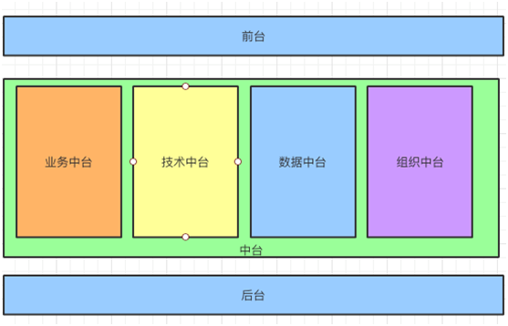

　　中台分为如下几类：

　　业务中台

　　技术中台

　　数据中台

　　组织中台

　**　①业务中台**

　　业务是根本，特别是用户的核心业务。对于中台来说需要针对业务进行颗粒度划分。例如：客户服务，结算中心，订单中心。

　　如果业务发生变化需要对上述服务进行拆解，例如：将结算中心拆解成支付服务和核销服务。

　　这样的分类和拆解是为了更好的支持前台，给前台业务提供更多的可能性，从而为用户组合出更多的使用场景。

　　这类平台的提供者一般在某一个行业深耕多年，积累大量的行业知识。

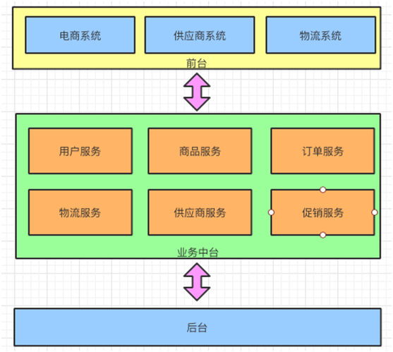

　　业务中台：根据业务对服务进行划分

　　**②技术中台**

　　作为技术人员接触过最多的就是技术中台，通常我们会将服务进行拆解通过微服务的方式重新组织。

　　每个微服务都是自我治理的，通过服务注册，服务网关，服务跟踪的方式让他们形成一个整体。

　　技术中台的划分通常分为两个维度，第一个是基础服务，这些服务针对整个系统来说相对通用，如：日志服务，安全服务等等。

　　第二个就是业务服务，这些服务都针对每个业务模块做划分，通常这些服务会根据业务的变化或者增量进行更新或者横向扩展。

　　这类平台的提供者，一般都是科技型企业，涉及过多个行业，对基础组件和模块的应用得心应手，往往他们设计出来的中台架构性能和可靠性方面比较优秀。

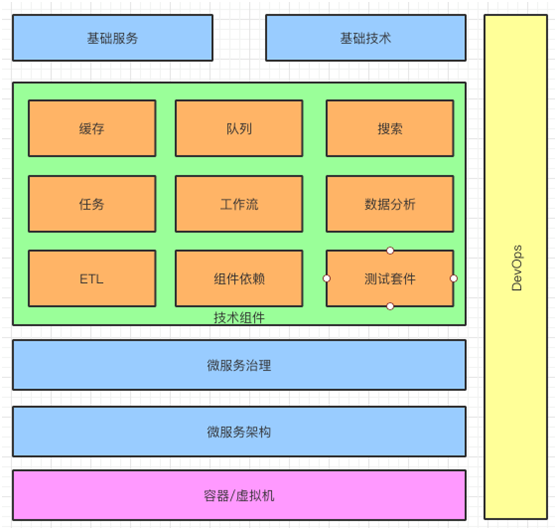

　　技术中台：利用微服务，DevOps 给前台提供支撑

　**　③数据中台**

　　数据的获取通常需要经过数据采集，数据清洗/过滤，数据存储，数据归档几个步骤，最后才能通过数据服务的形式展现给用户。

　　特别是针对客户端来说，同时通过数据中台提供的服务来获取数据的。数据中台会根据不同的业务场景，生成不同的数据服务，满足客户的需要。

　　提供类似平台的企业进入 IT
信息化的时间比较早，积累了一大批数据，通过对数据的整合和分析可以助力业务发展。

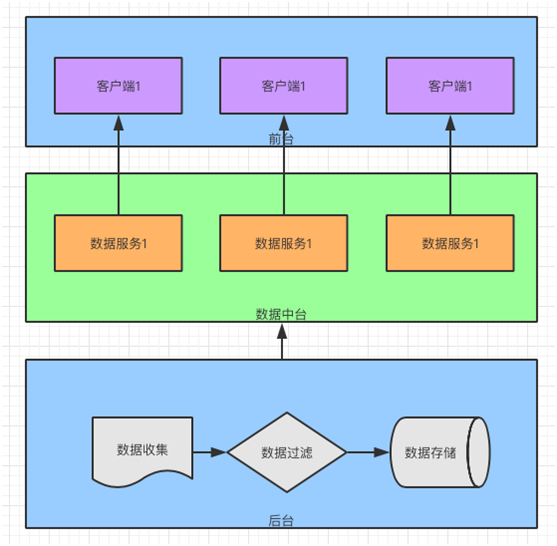

　　数据中台：让前端不用关心数据处理过程，只专注于"数据服务"

　　**④组织中台**

　　中台是需要人来实现的，如何组织好这些人就显得尤为重要了。如果要谈谈组织中台，那么就要先说说下面几种组织结构。

　　职能型：每个部门各司其职，虽然都是一个老板管，但是部门之间的界限明确。

　　每次有了项目就从各个部门抽调人员，当项目完成以后人员都回到各自的部门当中。

　　如果再有新的项目就再次抽调。这种方式沟通成本高，责权不清，出现问题以后容易踢皮球，对用户需求的反应相对较慢。

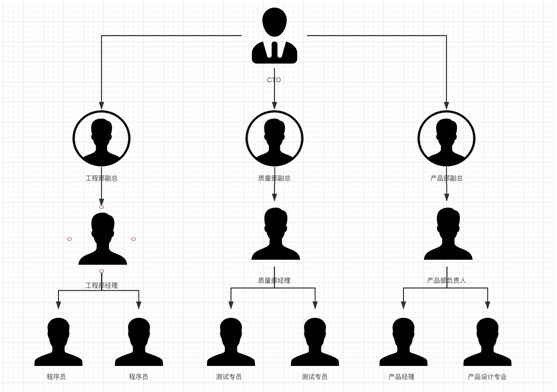

　　职能型：根据职能对组织进行划分

　　矩阵型：随着互联网的兴起，矩阵型的组织结构也悄然兴起。把人员从原来的部门中完全剥离出来成立专门的项目，并且指定项目经理。

　　人员汇报的线路也从原来的部门经理换成了项目经理。而项目经理又对 CTO
直接负责，这样的结构相对简单，实用性较强，避开了职能型组织结构的一些缺点。

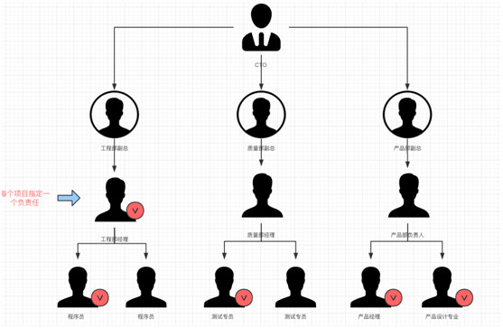

　　矩阵型：从职能部门中抽取合适的人形成独立的组织

　　产品型：随着产品意识的不断提升，人们不再拘泥于之前的矩阵型组织结构了，于是加入了产品和产品经理，更重要的是把客户也纳入到组织当中。

　　让客户参与产品决策，验收测试，增加用户的参与感，做到产品为客户所用。用户自己设计，测试出来的产品他想说不好都难。

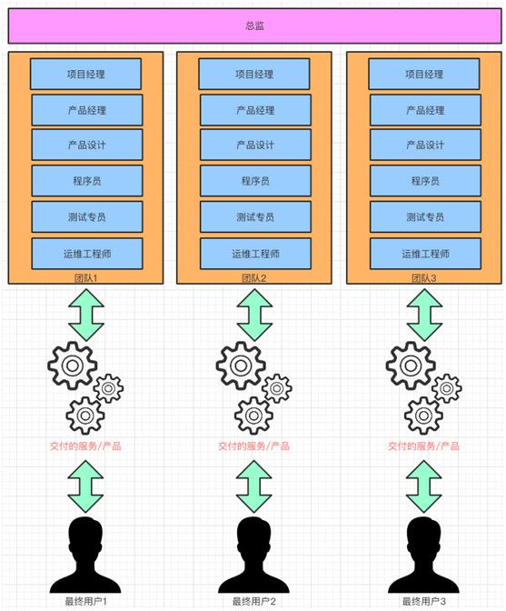

　　产品型：在职能型的基础上，让组织围绕产品和用户工作

　　随着组织中台的不断发展，我们的组织结构也慢慢从职能型向矩阵型，产品型进行过渡。

　　**3、中台的生命周期**

　　任何事物都有自身的运转规律，中台系统也不例外。首先我们需要满足使用者在某种场景中的需求，通过对需求的转化我们知道需要通过哪些功能或者系统来实现。

　　这些功能或者系统是否已经在中台系统中存在？如果存在是否需要进行优化或者拆分，如果不存在是否做成可以有通用性的模块？

　　在定义了以上几点以后，再进行设计，编码调试，集成测试。最后，发布给客户去验证业务的可行性。

　　如果发现问题再回到需求的原点重新走一次上面的过程，周而复始，直到满足客户的需求为止。

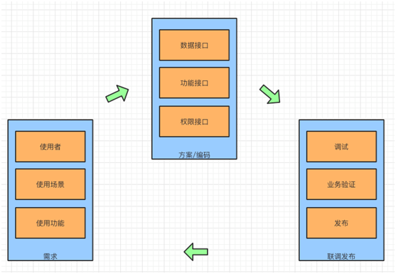

　　"需求"，"实施"，"验证"不断循环，直到满足用户的需求

　**　4、中台的作用**

　　大家既然对中台有了一定的了解，那我们再从两个维度来看看中台的作用。虽然上面已经介绍了很多关乎作用的例子，但是我们还是希望从两个维度来归纳总结一下。

**　　①快速切入市场**

　　在中台出现之前，我们进入每个行业是比较困难的。在了解业务的基础上需要搭建基础的业务模块。

　　现在不需要了，有了中台策略的加持即使对一些行业不太了解也能够从容应对。

　　在 BAT
中已经有染指汽车制造，航空航天等专业性很强的行业了，靠的就是中台能力的输出。\
      **②专业人员融入系统**

　　有了中台系统，那么就离不开行业中的专业人员。行业中的专业人员，协助中台系统打磨各个业务模块，通过
PASS 平台打造行业自身的应用。让业务和技术更好的融合，产生化学作用。

　　**③定义平台规则**

　　现在阿里的钉钉就把用户，服务提供商，经销商都拉到了一个平台上了。通过阿里平台的能力，将钉钉打造成企业服务的中台，让多方从中受益。

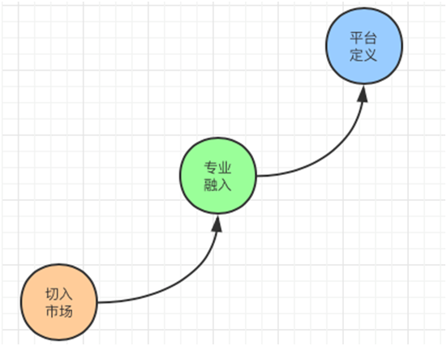

　　业务方面：通过满足市场需求，提高专业化程度，打造平台战略，逐步升级

**　　5、技术方面的作用**\
**        ①服务重用**

　　不要重复造轮子是我们始终面对的问题，中台的初衷就是抽离通用的部分，让更多人能够享受他们。

　　**②服务进化**\
技术会跟随业务的进化而进化，每一次进化都是一次技术的沉淀。以前这些技术进化是不可见的，现在新的项目也可以通过中台系统享受这些技术的进化。

　　**③快速响应**\
由于中台系统针对服务进行颗粒化处理，让每个服务都有独立性，可以针对业务的需求对服务进行横向扩展，从而提高服务的响应时间。

　**　④数据积累**

　　长年累月的数据积累，特别是对业务数据的积累，能够帮助我们带来商业价值。

　　**⑤提高效率**

　　不用从无到有去搭建整个项目架构，也大大缩短了给用户的交付时间，高效的组织结构也促进了交付质量，提高了用户的满意度。

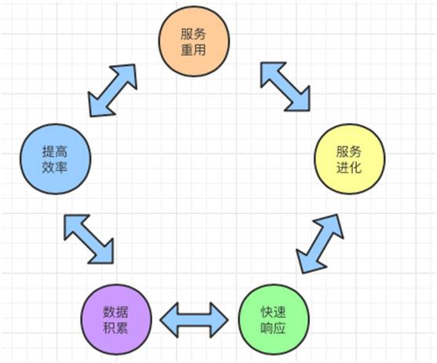

　　技术方面：服务重用，服务进化，快速响应，数据积累，提高效率相辅相成

**　　6、如何建立自己公司的中台**

　　不管是阿里的"中台，前台"战略，还是华为的"平台炮火支撑精兵作战"战略，仿佛都离我们很远。

　　有人说："中台系统就是大公司的事情，我们做好自己手上的项目就好了。"这话对也不对！

　　中台系统确实需要具备一定规模以后才能产生，只有项目足够多，行业足够丰富，资源充足的情况下可以实行。

　　这些都是中小公司无法做到的，但是，作为我们可以利用中台策略的思维来优化我们的开发，产品，项目甚至是组织。

　　从业务方面，我们是否能够把自己专精行业的业务进行一个模块划分，让用户可以自由选择需要的业务模块，提高我们业务适配的灵活性。

　　从技术方面，我们是否能够总结一下哪些模块，服务可以从系统中解耦出来成为单独的服务，甚至可以单独部署做到真正的自治。以后搭建技术框架的时候就好像搭积木一样方便可靠。

　　从组织方面，由康威定理可以得出什么样的组织结构直接影响这个组织结构生产的软件。

　　我们是否还在遵循传统的职能型的方式在推进项目。是否可以考虑以客户为中心的开发模式，让开发人员更加贴近客户，为客户创造价值。

　　中台对于个体来说意味着什么？

　　前面提到了中台的定义，中台的作用以及对中小公司的思考。那么对于我们个人而言中台又意味着什么呢？我们可以在其中做些什么呢？这里我分享一下自己的想法。

　　如果说淘宝网整个就看成一个大中台来说，它提供了各式各样的服务，接口，数据，为商家和消费者创造交易的环境。那么我们把淘宝网可以看成一个"面"。

　　那么对于商家来说，他需要利用一些营销工具，聘请一些模特拍照，利用一些物流信息为自己送货。商家可以看成一条"线"。

　　那些提供营销工具，拍照服务，物流服务的供应商就可以看成"点"。

　　对于我们而言，可能无法成为"面"，但是可以通过"面"的支持去做"线"和"点"。

　　再把眼界扩大一点，到微信小程序，支付宝小程序，钉钉应用，都是有发挥空间的。

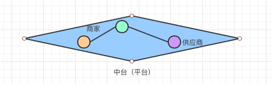

　　供应商，商家，平台，构成"点"，"线"，"面"的有机整体

**　　7、总结**

　　中台是 IT
信息化过程中经验总结的产物，他是前人归纳总结出来的方法论，也是解决问题的思路。

　　它把这些经验和方法从具体的场景中抽离出来，为的是服务于更多的场景。

　　我们可以从业务，技术，数据，组织多个维度来看待它。它不仅仅可以应用到企业，对个人的发展也是有帮助的。

　　转载说明：本文转载自：51CTO、架构师技术联盟等，如有侵权请联系相关工作人员。

